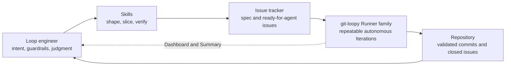
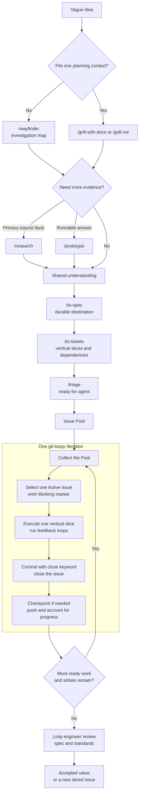

# git-loopy

## Intro to git-loopy

**git-loopy** is a GitHub Copilot SDK framework for **loop engineering**: turning
well-shaped issues into bounded, observable, autonomous software delivery. It
orchestrates a Runner family around one shared Wrapper contract. The Python
reference runner is available now; shell, PowerShell, and Rust Orchestrators are
planned.

Models can produce code quickly, but an unstructured prompt-to-code process loses
intent, overruns useful context, and hides whether the result is actually good.
git-loopy exists to make that work explicit and reviewable: durable domain
language, acceptance-tested issues, one Active issue per Iteration, repository
feedback loops, progress accounting, strikes, Checkpoints, pushed commits, and
human judgment.

The framework implements the Ralph loop technique, but the product, command, and
on-disk brand are **git-loopy**. Run it as `git-loopy` or the equivalent git
subcommand, `git loopy`. See the [skills setup](docs/skills-setup.md), the
[detailed workflow](docs/workflow.md), and the [Runner family
reference](docs/runners.md) to adopt it.

## Loop engineer

The **loop engineer** is the human who designs, triages, and supervises the loop.
They own intent, domain language, issue slicing, acceptance criteria, guardrails,
and final judgment. git-loopy owns repeatable execution.

This role matters because the leverage point is moving. The scarce skill is no
longer producing every line by hand; it is creating a system in which an agent can
make small, verifiable moves without drifting from the goal. A strong loop
engineer gives each Iteration enough context to succeed, makes failure visible,
and judges the result rather than outsourcing accountability.

## The skills and their purpose

The vendored [skills](.copilot/skills/) are small, composable disciplines rather
than one monolithic process. Use only the skills the work needs; run
`/setup-agent-skills` once before the rest.

### Shape intent and gather evidence

| Skill | Purpose |
| --- | --- |
| [`/intake`](.copilot/skills/intake/SKILL.md) | Capture messy requests and supporting material as a grill-ready brief. |
| [`/grill-me`](.copilot/skills/grill-me/SKILL.md) | Interview a human until a general plan or design has no hidden decision branches. |
| [`/batch-grill-me`](.copilot/skills/batch-grill-me/SKILL.md) | Ask all unresolved interview questions in rounds when a serial grill would be too slow. |
| [`/grill-with-docs`](.copilot/skills/grill-with-docs/SKILL.md) | Grill a repository change while sharpening `CONTEXT.md` and recording non-obvious decisions in ADRs. |
| [`/grilling`](.copilot/skills/grilling/SKILL.md) | Supply the reusable interview discipline behind the grilling workflows. |
| [`/wayfinder`](.copilot/skills/wayfinder/SKILL.md) | Map work too large or unclear for one planning session into linked investigation tickets. |
| [`/research`](.copilot/skills/research/SKILL.md) | Resolve factual uncertainty from high-trust primary sources and save cited findings in the repository. |
| [`/prototype`](.copilot/skills/prototype/SKILL.md) | Build a throwaway logic or UI artifact when a runnable answer is cheaper than more discussion. |
| [`/domain-modeling`](.copilot/skills/domain-modeling/SKILL.md) | Sharpen the project's shared language and capture architectural decisions. |
| [`/handoff`](.copilot/skills/handoff/SKILL.md) | Compact a human-driven session so another agent can resume it without reconstructing the thread. |
| [`/to-questionnaire`](.copilot/skills/to-questionnaire/SKILL.md) | Turn unresolved decisions into a questionnaire for the person who can answer them. |

### Turn intent into delivered work

| Skill | Purpose |
| --- | --- |
| [`/to-spec`](.copilot/skills/to-spec/SKILL.md) | Synthesize the agreed destination into a durable spec on the configured issue tracker. |
| [`/to-tickets`](.copilot/skills/to-tickets/SKILL.md) | Slice a plan or spec into dependency-aware tracer-bullet tickets sized for focused execution. |
| [`/triage`](.copilot/skills/triage/SKILL.md) | Verify issue readiness and move executable work into the `ready-for-agent` Pool. |
| [`/implement`](.copilot/skills/implement/SKILL.md) | Drive one human-selected spec or ticket through implementation, TDD, review, and commit. |
| [`/tdd`](.copilot/skills/tdd/SKILL.md) | Build one behavior at a time with a red-to-green vertical slice at a public seam. |
| [`/diagnosing-bugs`](.copilot/skills/diagnosing-bugs/SKILL.md) | Reproduce, minimize, hypothesize, instrument, fix, and regression-test a difficult bug. |
| [`/codebase-design`](.copilot/skills/codebase-design/SKILL.md) | Design deep modules with small interfaces at clean, testable seams. |
| [`/improve-codebase-architecture`](.copilot/skills/improve-codebase-architecture/SKILL.md) | Find module-deepening opportunities and grill through a selected architectural change. |
| [`/code-review`](.copilot/skills/code-review/SKILL.md) | Review a diff in fresh contexts against both repository standards and the originating spec. |
| [`/resolving-merge-conflicts`](.copilot/skills/resolving-merge-conflicts/SKILL.md) | Resolve merge or rebase conflicts hunk by hunk from each side's documented intent. |

### Set up and extend the workflow

| Skill | Purpose |
| --- | --- |
| [`/setup-agent-skills`](.copilot/skills/setup-agent-skills/SKILL.md) | Configure the repository's issue tracker, triage labels, and domain-document layout. |
| [`/find-skills`](.copilot/skills/find-skills/SKILL.md) | Discover an installable skill when the current catalog does not cover a task. |
| [`/teach`](.copilot/skills/teach/SKILL.md) | Teach a concept over multiple sessions using the repository as a stateful workspace. |
| [`/writing-great-skills`](.copilot/skills/writing-great-skills/SKILL.md) | Apply the vocabulary and design principles that make skills predictable. |
| [`/skill-creator`](.copilot/skills/skill-creator/SKILL.md) | Create, edit, evaluate, and improve agent skills. |
| [`/playwright-cli`](.copilot/skills/playwright-cli/SKILL.md) | Exercise browser behavior, capture screenshots, and automate web interactions. |
| [`/microsoft-docs`](.copilot/skills/microsoft-docs/SKILL.md) | Ground Microsoft technology questions in official documentation. |
| [`/microsoft-foundry`](.copilot/skills/microsoft-foundry/SKILL.md) | Deploy, evaluate, optimize, and operate Microsoft Foundry agents. |

## The complete loop workflow, start to finish

1. **Start with the vague idea.** Use `/intake` when the request is still a pile
   of notes. Use `/grill-with-docs` for repository or domain work and `/grill-me`
   for a general plan. If planning itself is too large for one useful context,
   use `/wayfinder` to turn the fog into a shared map of investigation tickets.
2. **Buy evidence where discussion is not enough.** Use `/research` for factual
   questions and `/prototype` for behavior or visual questions. Feed the evidence
   back into the grill instead of guessing.
3. **Record the destination.** Keep the shared vocabulary in `CONTEXT.md`, record
   consequential decisions in `docs/adr/`, and run `/to-spec` once the human and
   agent agree on the outcome.
4. **Create the route.** Run `/to-tickets` to produce small vertical slices with
   explicit acceptance criteria and blocking edges. Each ticket should fit inside
   one focused execution context.
5. **Open the execution gate.** `/triage` checks that a ticket is actionable and
   applies `ready-for-agent`. That label is an explicit human decision, not a
   guess made by the runner.
6. **Start the Run.** Launch `git-loopy`. At the start of an Iteration, the
   Orchestrator collects the current Pool, and the agent selects exactly one
   Active issue and emits its Working marker.
7. **Complete one Iteration.** The agent reads the issue and domain docs, works in
   vertical slices, and runs the repository's feedback loops. It commits with a
   close keyword and closes the issue. The Orchestrator captures leftover work in
   a Checkpoint when necessary, pushes new commits, updates the Dashboard and
   Summary, and records a Strike when no meaningful progress occurred.
8. **Repeat, then judge.** The next Iteration receives a fresh Pool and context.
   The Run stops when work is exhausted, the configured limit is reached, or
   strikes trip the guardrail. The loop engineer reviews the pushed result against
   the spec and repository standards, accepts it, reopens it, or creates a new
   sliced issue. Closed issues and commits preserve the state between Iterations.

The [workflow guide](docs/workflow.md) expands this path. The
[concepts guide](docs/concepts.md) explains the context model, the [Wrapper
contract](docs/wrapper-contract.md) defines every Orchestrator's behavior, and
the [Python reference runner](git-loopy/python/README.md) documents the currently
available implementation. Licensed under the [MIT License](LICENSE).
