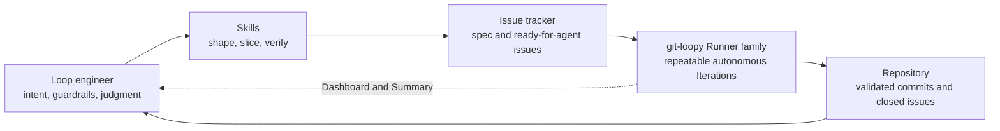
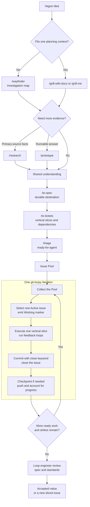

## Intro to Loop Engineering

**Loop Engineering** is when humans design, triage, orchestrate, and supervise agentic driven loops that follow software development fundamentals. They own intent, domain language, issue slicing, acceptance criteria, guardrails, and final judgment. git-loopy owns repeatable execution.

This role matters because the leverage point is moving. The scarce skill is no longer producing every line by hand; it is creating a system in which an agent can make small, verifiable moves without drifting from the goal. A strong loop engineer gives each Iteration enough context to succeed, makes failure visible, and judges the result rather than outsourcing accountability.

The core of most Loop Engineering implements concepts derived from Ralph Loops as the technique to autonomously assist with the ideation and completion of tasks revolving around a project development initiative.

## What is git-loopy?

**git-loopy** is a GitHub Copilot SDK framework for **loop engineering**: turning
well-shaped issues into bounded, observable, autonomous software delivery. It
orchestrates a Runner family around one shared Wrapper contract. The Python
reference runner and the shell and PowerShell ports are shippable phase-1 members
today, spanning Linux, macOS, and Windows; a Rust Orchestrator is planned.

Models can produce code quickly, but an unstructured prompt-to-code process loses
intent, overruns useful context, and hides whether the result is actually good.
git-loopy exists to make that work explicit and reviewable: durable domain
language, acceptance-tested issues, one Active issue per Iteration, repository
feedback loops, progress accounting, strikes, Checkpoints, pushed commits, and
human judgment.

```mermaid
flowchart LR
    Engineer["Loop engineer<br/>intent, guardrails, judgment"]
    Skills["Skills<br/>shape, slice, verify"]
    Tracker["Issue tracker<br/>spec and ready-for-agent issues"]
    Runner["git-loopy Runner family<br/>repeatable autonomous Iterations"]
    Repo["Repository<br/>validated commits and closed issues"]

    Engineer --> Skills --> Tracker --> Runner --> Repo --> Engineer
    Runner -. "Dashboard and Summary" .-> Engineer
```

## The skills and their purpose

These skills are small, composable disciplines rather than one monolithic
process. Use only the skills the work needs; run `/setup-agent-skills` once
before the rest.

The catalog's source of record is
[`bradcstevens/git-loopy-skills`](https://github.com/bradcstevens/git-loopy-skills)
— every skill below links there. `git-loopy init` installs that catalog from a
pinned revision into git-loopy's own config home and every Run refreshes the
install, so a git-loopy installation carries no skills of its own and reads
none from your repository
([ADR-0025](docs/adr/0025-installed-skill-catalog.md)). To type these as slash
commands yourself, install them into your agent with the catalog's own `skills`
CLI — see [`docs/skills-setup.md`](docs/skills-setup.md#13-also-give-copilot-cli-the-slash-commands).

### Shape intent and gather evidence

| Skill | Purpose |
| --- | --- |
| [`/grill-me`](https://github.com/bradcstevens/git-loopy-skills/tree/main/skills/grill-me) | Interview a human until a general plan or design has no hidden decision branches. |
| [`/batch-grill-me`](https://github.com/bradcstevens/git-loopy-skills/tree/main/skills/batch-grill-me) | Ask all unresolved interview questions in rounds when a serial grill would be too slow. |
| [`/grill-with-docs`](https://github.com/bradcstevens/git-loopy-skills/tree/main/skills/grill-with-docs) | Grill a repository change while sharpening `CONTEXT.md` and recording non-obvious decisions in ADRs. |
| [`/grilling`](https://github.com/bradcstevens/git-loopy-skills/tree/main/skills/grilling) | Supply the reusable interview discipline behind the grilling workflows. |
| [`/wayfinder`](https://github.com/bradcstevens/git-loopy-skills/tree/main/skills/wayfinder) | Map work too large or unclear for one planning session into linked investigation tickets. |
| [`/research`](https://github.com/bradcstevens/git-loopy-skills/tree/main/skills/research) | Resolve factual uncertainty from high-trust primary sources and save cited findings in the repository. |
| [`/prototype`](https://github.com/bradcstevens/git-loopy-skills/tree/main/skills/prototype) | Build a throwaway logic or UI artifact when a runnable answer is cheaper than more discussion. |
| [`/domain-modeling`](https://github.com/bradcstevens/git-loopy-skills/tree/main/skills/domain-modeling) | Sharpen the project's shared language and capture architectural decisions. |
| [`/handoff`](https://github.com/bradcstevens/git-loopy-skills/tree/main/skills/handoff) | Compact a human-driven session so another agent can resume it without reconstructing the thread. |
| [`/to-questionnaire`](https://github.com/bradcstevens/git-loopy-skills/tree/main/skills/to-questionnaire) | Turn unresolved decisions into a questionnaire for the person who can answer them. |

### Turn intent into delivered work

| Skill | Purpose |
| --- | --- |
| [`/to-spec`](https://github.com/bradcstevens/git-loopy-skills/tree/main/skills/to-spec) | Synthesize the agreed destination into a durable spec on the configured issue tracker. |
| [`/to-tickets`](https://github.com/bradcstevens/git-loopy-skills/tree/main/skills/to-tickets) | Slice a plan or spec into dependency-aware tracer-bullet tickets sized for focused execution. |
| [`/triage`](https://github.com/bradcstevens/git-loopy-skills/tree/main/skills/triage) | Verify issue readiness and move executable work into the `ready-for-agent` Pool. |
| [`/implement`](https://github.com/bradcstevens/git-loopy-skills/tree/main/skills/implement) | Drive one human-selected spec or ticket through implementation, TDD, review, and commit. |
| [`/tdd`](https://github.com/bradcstevens/git-loopy-skills/tree/main/skills/tdd) | Build one behavior at a time with a red-to-green vertical slice at a public seam. |
| [`/diagnosing-bugs`](https://github.com/bradcstevens/git-loopy-skills/tree/main/skills/diagnosing-bugs) | Reproduce, minimize, hypothesize, instrument, fix, and regression-test a difficult bug. |
| [`/codebase-design`](https://github.com/bradcstevens/git-loopy-skills/tree/main/skills/codebase-design) | Design deep modules with small interfaces at clean, testable seams. |
| [`/improve-codebase-architecture`](https://github.com/bradcstevens/git-loopy-skills/tree/main/skills/improve-codebase-architecture) | Find module-deepening opportunities and grill through a selected architectural change. |
| [`/code-review`](https://github.com/bradcstevens/git-loopy-skills/tree/main/skills/code-review) | Review a diff in fresh contexts against both repository standards and the originating spec. |
| [`/codebase-audit`](https://github.com/bradcstevens/git-loopy-skills/tree/main/skills/codebase-audit) | Audit a codebase line by line for junk files, dead code, and security holes before a push. |
| [`/resolving-merge-conflicts`](https://github.com/bradcstevens/git-loopy-skills/tree/main/skills/resolving-merge-conflicts) | Resolve merge or rebase conflicts hunk by hunk from each side's documented intent. |

### Set up and extend the workflow

| Skill | Purpose |
| --- | --- |
| [`/setup-agent-skills`](https://github.com/bradcstevens/git-loopy-skills/tree/main/skills/setup-agent-skills) | Configure the repository's issue tracker, triage labels, and domain-document layout. |
| [`/next`](https://github.com/bradcstevens/git-loopy-skills/tree/main/skills/next) | Route to the one action to take now, from the live state of the work. |
| [`/teach`](https://github.com/bradcstevens/git-loopy-skills/tree/main/skills/teach) | Teach a concept over multiple sessions using the repository as a stateful workspace. |
| [`/create-readme`](https://github.com/bradcstevens/git-loopy-skills/tree/main/skills/create-readme) | Write a project README from what the repository actually contains. |
| [`/writing-for-agents`](https://github.com/bradcstevens/git-loopy-skills/tree/main/skills/writing-for-agents) | Write documents agents read — skills, `AGENTS.md`, and their siblings. |
| [`/writing-great-skills`](https://github.com/bradcstevens/git-loopy-skills/tree/main/skills/writing-great-skills) | Apply the vocabulary and design principles that make skills predictable. |
| [`/playwright-cli`](https://github.com/bradcstevens/git-loopy-skills/tree/main/skills/playwright-cli) | Exercise browser behavior, capture screenshots, and automate web interactions. |
| [`/microsoft-docs`](https://github.com/bradcstevens/git-loopy-skills/tree/main/skills/microsoft-docs) | Ground Microsoft technology questions in official documentation. |
| [`/microsoft-code-reference`](https://github.com/bradcstevens/git-loopy-skills/tree/main/skills/microsoft-code-reference) | Look up Microsoft API references and verify SDK code against working samples. |
| [`/microsoft-foundry`](https://github.com/bradcstevens/git-loopy-skills/tree/main/skills/microsoft-foundry) | Deploy, evaluate, optimize, and operate Microsoft Foundry agents. |
| [`/azure-mcaps-resource-deployment`](https://github.com/bradcstevens/git-loopy-skills/tree/main/skills/azure-mcaps-resource-deployment) | Set tagging and API authentication for an MCAPS subscription that hosts Foundry resources. |

The GitHub Copilot CLI marketplace carries additional skills for work outside
this catalog; `npx skills find <query>` searches it.

## The complete loop workflow, start to finish

1. **Start with the vague idea.** Use `/grill-with-docs` for repository or domain
   work and `/grill-me` for a general plan. When the answers live in someone
   else's head, `/to-questionnaire` pulls them out in one pass. If planning
   itself is too large for one useful context, use `/wayfinder` to turn the fog
   into a shared map of investigation tickets.
2. **Buy evidence where discussion is not enough.** Use `/research` for factual
   questions and `/prototype` for behavior or visual questions. Feed the evidence
   back into the grill instead of guessing.
3. **Record the destination.** Keep the shared vocabulary in `CONTEXT.md`, record
   consequential decisions in `docs/adr/`, and run `/to-spec` once the human and
   agent agree on the outcome.
4. **Create the route.** Run `/to-tickets` to produce small vertical slices with
   explicit acceptance criteria and blocking edges. Each ticket should fit inside
   one focused execution context.
5. **Open the execution gate.** `/triage` checks that a ticket is actionable and
   applies `ready-for-agent`. That label is an explicit human decision, not a
   guess made by the runner.
6. **Start the Run.** Launch `git-loopy`. At the start of an Iteration, the
   Orchestrator collects the current Pool, and the agent selects exactly one
   Active issue and emits its Working marker.
7. **Complete one Iteration.** The agent reads the issue and domain docs, works in
   vertical slices, and runs the repository's feedback loops. It commits with a
   close keyword and closes the issue. The Orchestrator captures leftover work in
   a Checkpoint when necessary, pushes new commits, updates the Dashboard and
   Summary, and records a Strike when no meaningful progress occurred.
8. **Repeat, then judge.** The next Iteration receives a fresh Pool and context.
   The Run stops when work is exhausted, the configured limit is reached, or
   strikes trip the guardrail. The loop engineer reviews the pushed result against
   the spec and repository standards, accepts it, reopens it, or creates a new
   sliced issue. Closed issues and commits preserve the state between Iterations.

```mermaid
flowchart TD
    Idea["Vague idea"] --> Scope{"Fits one planning context?"}
    Scope -- "No" --> Wayfinder["/wayfinder<br/>investigation map"]
    Scope -- "Yes" --> Grill["/grill-with-docs or /grill-me"]
    Wayfinder --> Evidence{"Need more evidence?"}
    Grill --> Evidence
    Evidence -- "Primary-source facts" --> Research["/research"] --> Agreed["Shared understanding"]
    Evidence -- "Runnable answer" --> Prototype["/prototype"] --> Agreed
    Evidence -- "No" --> Agreed
    Agreed --> Spec["/to-spec<br/>durable destination"]
    Spec --> Tickets["/to-tickets<br/>vertical slices and dependencies"]
    Tickets --> Triage["/triage<br/>ready-for-agent"]
    Triage --> Pool["Issue Pool"]

    subgraph Iteration["One git-loopy Iteration"]
        Collect["Collect the Pool"] --> Select["Select one Active issue<br/>emit Working marker"]
        Select --> Execute["Execute one vertical slice<br/>run feedback loops"]
        Execute --> Close["Commit with close keyword<br/>close the issue"]
        Close --> Account["Checkpoint if needed<br/>push and account for progress"]
    end

    Pool --> Collect
    Account --> Continue{"More ready work<br/>and strikes remain?"}
    Continue -- "Yes" --> Collect
    Continue -- "No" --> Review["Loop engineer review<br/>spec and standards"]
    Review --> Value["Accepted value<br/>or a new sliced issue"]
```

The [workflow guide](docs/workflow.md) expands this path. The
[concepts guide](docs/concepts.md) explains the context model, the [Wrapper
contract](docs/wrapper-contract.md) defines every Orchestrator's behavior,
[`docs/skill-policy.md`](docs/skill-policy.md) covers the closed-world **Skill
policy** that decides which Skills a Run may load,
[`docs/parallel-mode.md`](docs/parallel-mode.md) covers **Parallel mode** — the
opt-in **Lanes** that work several `parallel-safe` issues at once — and
[`docs/runners.md`](docs/runners.md) documents the Runner family — the
[Python](git-loopy/python/README.md), [shell](git-loopy/shell/README.md), and
[PowerShell](git-loopy/powershell/README.md) Orchestrators available today.

## Acknowledgments

git-loopy's skill-driven workflow was inspired by [Matt Pocock's work on agent
skills](https://github.com/mattpocock). Several of his skills form the foundation
of the shape, slice, implement, and review workflow that this project builds into
a repeatable loop.

Licensed under the [MIT License](LICENSE).
