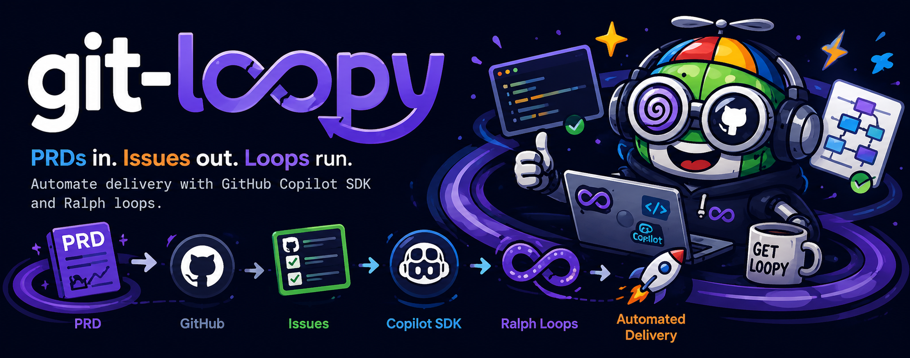
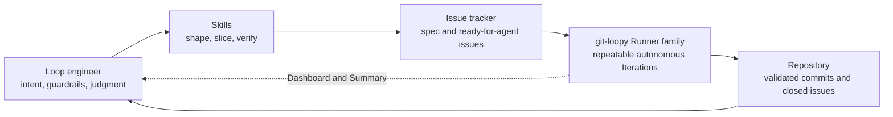
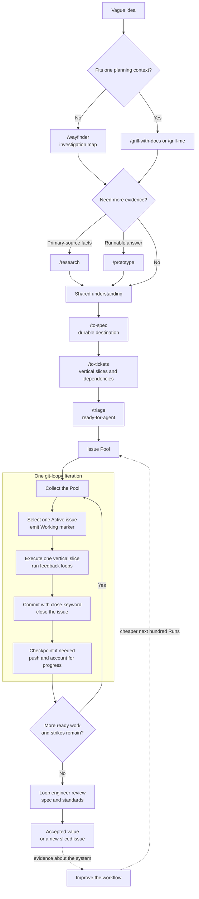

**git-loopy** is a framework for encoding your engineering knowledge into
repeatable workflows — and then running them, autonomously, against your issue
tracker, your repository, and your own feedback loops.

## Intro to Loop Engineering

**Loop engineering** is the practice of turning what a skilled engineer knows —
how work is shaped, sliced, built, verified, reviewed, and shipped — into a
system that executes that knowledge the same way every time. Humans keep intent,
domain language, acceptance criteria, guardrails, and final judgment. The
workflow keeps execution.

This matters because the leverage point has moved. The scarce skill is no longer
producing every line by hand; it is designing a system in which an agent can make
small, verifiable moves without drifting from the goal. A workflow you can trust
runs tens, hundreds, or thousands of times and compounds. A one-off agent
conversation ends when the terminal closes, and takes everything it learned with
it.

That is **meta-engineering**: engineers move up a level, from editing the
application to building — and improving — the system that repeatedly builds and
operates it. The software development lifecycle does not disappear at that level.
Planning, review, testing, isolation, integration, and release still hold; what
changes is who performs each step.

### Three actors, one workflow

Every step in a git-loopy workflow is owned by exactly one actor, chosen on
purpose:

| Actor | Owns | Why |
| --- | --- | --- |
| **Engineers** | Intent, domain language, issue slicing, acceptance criteria, final judgment | Accountable and reliable, but scarce and expensive |
| **Agents** | Reasoning, implementation, and flexible knowledge work | Capable, but probabilistic and token-hungry — they need guardrails |
| **Code** | Routing, state changes, validation, gates, accounting | Fast, repeatable, testable, and free of model cost |

The design rule follows directly: when a step can be made deterministic, code
owns it. An agent that can be told "the linter failed, here is the output" beats
an agent asked to double-check its own work.

> [!NOTE]
> An army of agents and subagents is not the goal. Sprawl burns tokens, hides
> intent, multiplies the ways poor output reaches your branch, and leaves you
> nothing durable to improve. git-loopy spends an agent where judgment is
> genuinely required and deterministic code everywhere else.

## What is git-loopy?

**git-loopy** is a GitHub Copilot SDK framework that runs the encoded workflow:
it turns well-shaped issues into bounded, observable, autonomous delivery. It
orchestrates a **Runner family** around one shared **Wrapper contract**. The
Python reference Orchestrator and the shell and PowerShell ports are shippable
phase-1 members today, spanning Linux, macOS, and Windows; the Rust Dashboard
core ships with them, and a Rust Orchestrator is planned.

Models produce code quickly, but an unstructured prompt-to-code process loses
intent, overruns useful context, and hides whether the result is actually good.
git-loopy makes that work explicit and reviewable: durable domain language,
acceptance-tested issues, one Active issue per Iteration, your repository's own
feedback loops as the gate, progress accounting, strikes, Checkpoints, pushed
commits, and human judgment at the end.


```mermaid
flowchart LR
    Engineer["Loop engineer<br/>intent, guardrails, judgment"]
    Skills["Skills<br/>shape, slice, verify"]
    Tracker["Issue tracker<br/>spec and ready-for-agent issues"]
    Runner["git-loopy Runner family<br/>repeatable autonomous Iterations"]
    Repo["Repository<br/>validated commits and closed issues"]

    Engineer --> Skills --> Tracker --> Runner --> Repo --> Engineer
    Runner -. "Dashboard and Summary" .-> Engineer
```

### From one loop to a software factory

A software factory is not one universal agent loop. It is a portfolio of
specialized workflows, selected by task type, risk, urgency, and price. git-loopy
gets you there one rung at a time — every capability below is optional until the
work needs it.

| Capability | What it gives you | Reference |
| --- | --- | --- |
| **Issue-driven Iterations** | One Active issue per Iteration, a fresh context each time, and durable state in commits and tracker history | [concepts](docs/concepts.md), [wrapper contract](docs/wrapper-contract.md) |
| **Your feedback loops as the gate** | The loops declared in `AGENTS.md` — lint, tests, builds — are what a change must survive, run by code and returned to the agent as evidence | [`AGENTS.md`](AGENTS.md) |
| **Task-type routing** | Seven task types (`planning`, `review`, `implementation`, `test`, `docs`, `chore`, `bugfix`) each route to their own model and reasoning effort, so a chore never pays feature prices | [customization](docs/customization.md) |
| **Measured routing** *(in progress)* | Routes calibrated from what Runs actually cost and deliver, rather than from a static opinion | [ADR-0027](docs/adr/0027-routing-is-calibrated-by-measurement.md) |
| **Parallel Lanes** | Opt-in worktree-isolated Lanes work several `parallel-safe` issues at once, with a serialized, bounded-green Integration stage | [parallel mode](docs/parallel-mode.md) |
| **Live Dashboard** | Per-Iteration activity, context fill, observed tokens, and billed cost while the Run is happening | [runners](docs/runners.md) |
| **Closed-world Skill policy** | Exactly the Skills a Run may load — no ambient context bloat from whatever is installed on the host | [skill policy](docs/skill-policy.md) |
| **Continuation guidance** | The one next action derived from the live state of the work, so a Workstream never stalls on "what now?" | [continuation contract](docs/continuation-contract.md) |

## Get started

**Prerequisites:** `git`, the [`copilot` CLI](https://github.com/github/copilot-cli),
[`gh`](https://cli.github.com) signed in, Python **≥ 3.11**, and
[`uv`](https://docs.astral.sh/uv/). Full list in
[`docs/skills-setup.md`](docs/skills-setup.md#prerequisites).

```bash
# Install the engine once, user-global.
uv tool install "git+https://github.com/bradcstevens/git-loopy#subdirectory=git-loopy/python"

# In the repository you want it to work on:
cd ~/code/my-project

# First-run setup: scope, model + reasoning effort, Skill policy, config.toml.
git-loopy init

# Start a Run.
git-loopy
```

Useful variations:

```bash
git-loopy 50                      # cap the Run at 50 Iterations
git-loopy --model claude-opus-5   # override the model for this Run
git-loopy --parallel 3            # opt into Parallel mode
git-loopy config list             # the effective settings a Run would use
```

> [!IMPORTANT]
> git-loopy gates every change on the feedback loops your repository declares in
> its `AGENTS.md` table. A repository that declares no runnable loop cannot be
> gated, and autonomous work has nothing to prove itself against. Declare the
> commands you already trust before your first Run.

Hosts without Python can run the [shell](git-loopy/shell/README.md) or
[PowerShell](git-loopy/powershell/README.md) Orchestrator instead — same
contract, same Dashboard.

## The skills and their purpose

These skills are small, composable disciplines rather than one monolithic
process. Use only the skills the work needs; run `/setup-agent-skills` once
before the rest.

The catalog's source of record is
[`bradcstevens/git-loopy-skills`](https://github.com/bradcstevens/git-loopy-skills)
— every skill below links there. `git-loopy init` installs that catalog from a
pinned revision into git-loopy's own config home and every Run refreshes the
install, so a git-loopy installation carries no skills of its own and reads
none from your repository
([ADR-0025](docs/adr/0025-installed-skill-catalog.md)). To type these as slash
commands yourself, install them into your agent with the catalog's own `skills`
CLI — see [`docs/skills-setup.md`](docs/skills-setup.md#13-also-give-copilot-cli-the-slash-commands).

### Shape intent and gather evidence

| Skill | Purpose |
| --- | --- |
| [`/grill-me`](https://github.com/bradcstevens/git-loopy-skills/tree/main/skills/grill-me) | Interview a human until a general plan or design has no hidden decision branches. |
| [`/batch-grill-me`](https://github.com/bradcstevens/git-loopy-skills/tree/main/skills/batch-grill-me) | Ask all unresolved interview questions in rounds when a serial grill would be too slow. |
| [`/grill-with-docs`](https://github.com/bradcstevens/git-loopy-skills/tree/main/skills/grill-with-docs) | Grill a repository change while sharpening `CONTEXT.md` and recording non-obvious decisions in ADRs. |
| [`/grilling`](https://github.com/bradcstevens/git-loopy-skills/tree/main/skills/grilling) | Supply the reusable interview discipline behind the grilling workflows. |
| [`/wayfinder`](https://github.com/bradcstevens/git-loopy-skills/tree/main/skills/wayfinder) | Map work too large or unclear for one planning session into linked investigation tickets. |
| [`/research`](https://github.com/bradcstevens/git-loopy-skills/tree/main/skills/research) | Resolve factual uncertainty from high-trust primary sources and save cited findings in the repository. |
| [`/prototype`](https://github.com/bradcstevens/git-loopy-skills/tree/main/skills/prototype) | Build a throwaway logic or UI artifact when a runnable answer is cheaper than more discussion. |
| [`/domain-modeling`](https://github.com/bradcstevens/git-loopy-skills/tree/main/skills/domain-modeling) | Sharpen the project's shared language and capture architectural decisions. |
| [`/handoff`](https://github.com/bradcstevens/git-loopy-skills/tree/main/skills/handoff) | Compact a human-driven session so another agent can resume it without reconstructing the thread. |
| [`/copilot-handoff`](https://github.com/bradcstevens/git-loopy-skills/tree/main/skills/copilot-handoff) | Hand the conversation to a fresh background Copilot CLI session that picks the work up immediately. |
| [`/loop-me`](https://github.com/bradcstevens/git-loopy-skills/tree/main/skills/loop-me) | Grill an operator into workflow specs for the automation they want this workspace to run. |
| [`/wait-what`](https://github.com/bradcstevens/git-loopy-skills/tree/main/skills/wait-what) | Ask for a re-pitch, in plain language and the project's own vocabulary, when an explanation did not land. |
| [`/to-questionnaire`](https://github.com/bradcstevens/git-loopy-skills/tree/main/skills/to-questionnaire) | Turn unresolved decisions into a questionnaire for the person who can answer them. |

### Turn intent into delivered work

| Skill | Purpose |
| --- | --- |
| [`/to-spec`](https://github.com/bradcstevens/git-loopy-skills/tree/main/skills/to-spec) | Synthesize the agreed destination into a durable spec on the configured issue tracker. |
| [`/to-tickets`](https://github.com/bradcstevens/git-loopy-skills/tree/main/skills/to-tickets) | Slice a plan or spec into dependency-aware tracer-bullet tickets sized for focused execution. |
| [`/triage`](https://github.com/bradcstevens/git-loopy-skills/tree/main/skills/triage) | Verify issue readiness and move executable work into the `ready-for-agent` Pool. |
| [`/implement`](https://github.com/bradcstevens/git-loopy-skills/tree/main/skills/implement) | Drive one human-selected spec or ticket through implementation, TDD, review, and commit. |
| [`/tdd`](https://github.com/bradcstevens/git-loopy-skills/tree/main/skills/tdd) | Build one behavior at a time with a red-to-green vertical slice at a public seam. |
| [`/diagnosing-bugs`](https://github.com/bradcstevens/git-loopy-skills/tree/main/skills/diagnosing-bugs) | Reproduce, minimize, hypothesize, instrument, fix, and regression-test a difficult bug. |
| [`/codebase-design`](https://github.com/bradcstevens/git-loopy-skills/tree/main/skills/codebase-design) | Design deep modules with small interfaces at clean, testable seams. |
| [`/improve-codebase-architecture`](https://github.com/bradcstevens/git-loopy-skills/tree/main/skills/improve-codebase-architecture) | Find module-deepening opportunities and grill through a selected architectural change. |
| [`/code-review`](https://github.com/bradcstevens/git-loopy-skills/tree/main/skills/code-review) | Review a diff in fresh contexts against both repository standards and the originating spec. |
| [`/codebase-audit`](https://github.com/bradcstevens/git-loopy-skills/tree/main/skills/codebase-audit) | Audit a codebase line by line for junk files, dead code, and security holes before a push. |
| [`/resolving-merge-conflicts`](https://github.com/bradcstevens/git-loopy-skills/tree/main/skills/resolving-merge-conflicts) | Resolve merge or rebase conflicts hunk by hunk from each side's documented intent. |
| [`/push`](https://github.com/bradcstevens/git-loopy-skills/tree/main/skills/push) | Publish finished work: stage the intended changes, commit, push, and open a pull request when one is needed. |

### Set up and extend the workflow

| Skill | Purpose |
| --- | --- |
| [`/setup-agent-skills`](https://github.com/bradcstevens/git-loopy-skills/tree/main/skills/setup-agent-skills) | Configure the repository's issue tracker, triage labels, and domain-document layout. |
| [`/wizard`](https://github.com/bradcstevens/git-loopy-skills/tree/main/skills/wizard) | Generate an interactive bash wizard for a manual procedure only a human can carry out. |
| [`/next`](https://github.com/bradcstevens/git-loopy-skills/tree/main/skills/next) | Route to the one action to take now, from the live state of the work. |
| [`/continuation`](https://github.com/bradcstevens/git-loopy-skills/tree/main/skills/continuation) | Present the guidance a Run published, reconciled from the durable Continuation records. |
| [`/teach`](https://github.com/bradcstevens/git-loopy-skills/tree/main/skills/teach) | Teach a concept over multiple sessions using the repository as a stateful workspace. |
| [`/create-readme`](https://github.com/bradcstevens/git-loopy-skills/tree/main/skills/create-readme) | Write a project README from what the repository actually contains. |
| [`/writing-for-agents`](https://github.com/bradcstevens/git-loopy-skills/tree/main/skills/writing-for-agents) | Write documents agents read — skills, `AGENTS.md`, and their siblings. |
| [`/writing-great-skills`](https://github.com/bradcstevens/git-loopy-skills/tree/main/skills/writing-great-skills) | Apply the vocabulary and design principles that make skills predictable. |
| [`/playwright-cli`](https://github.com/bradcstevens/git-loopy-skills/tree/main/skills/playwright-cli) | Exercise browser behavior, capture screenshots, and automate web interactions. |
| [`/microsoft-docs`](https://github.com/bradcstevens/git-loopy-skills/tree/main/skills/microsoft-docs) | Ground Microsoft technology questions in official documentation. |
| [`/microsoft-code-reference`](https://github.com/bradcstevens/git-loopy-skills/tree/main/skills/microsoft-code-reference) | Look up Microsoft API references and verify SDK code against working samples. |
| [`/microsoft-foundry`](https://github.com/bradcstevens/git-loopy-skills/tree/main/skills/microsoft-foundry) | Deploy, evaluate, optimize, and operate Microsoft Foundry agents. |

The GitHub Copilot CLI marketplace carries additional skills for work outside
this catalog; `npx skills find <query>` searches it.

## The complete workflow, start to finish

1. **Start with the vague idea.** Use `/grill-with-docs` for repository or domain
   work and `/grill-me` for a general plan. When the answers live in someone
   else's head, `/to-questionnaire` pulls them out in one pass. If planning
   itself is too large for one useful context, use `/wayfinder` to turn the fog
   into a shared map of investigation tickets.
2. **Buy evidence where discussion is not enough.** Use `/research` for factual
   questions and `/prototype` for behavior or visual questions. Feed the evidence
   back into the grill instead of guessing.
3. **Record the destination.** Keep the shared vocabulary in `CONTEXT.md`, record
   consequential decisions in `docs/adr/`, and run `/to-spec` once the human and
   agent agree on the outcome.
4. **Create the route.** Run `/to-tickets` to produce small vertical slices with
   explicit acceptance criteria and blocking edges. Each ticket should fit inside
   one focused execution context.
5. **Open the execution gate.** `/triage` checks that a ticket is actionable and
   applies `ready-for-agent`. That label is an explicit human decision, not a
   guess made by the runner.
6. **Start the Run.** Launch `git-loopy`. At the start of an Iteration, the
   Orchestrator collects the current Pool, and the agent selects exactly one
   Active issue and emits its Working marker.
7. **Complete one Iteration.** The agent reads the issue and domain docs, works in
   vertical slices, and runs the repository's feedback loops. It commits with a
   close keyword and closes the issue. The Orchestrator captures leftover work in
   a Checkpoint when necessary, pushes new commits, updates the Dashboard and
   Summary, and records a Strike when no meaningful progress occurred.
8. **Repeat, then judge.** The next Iteration receives a fresh Pool and context.
   The Run stops when work is exhausted, the configured limit is reached, or
   strikes trip the guardrail. The loop engineer reviews the pushed result against
   the spec and repository standards, accepts it, reopens it, or creates a new
   sliced issue. Closed issues and commits preserve the state between Iterations.
9. **Improve the workflow, not just the code.** Every red gate, wasted Iteration,
   and mis-routed task is evidence about the system. Fixing it there is what makes
   the next hundred Runs cheaper — the meta-engineering step that a one-off
   conversation never offers.


```mermaid
flowchart TD
    Idea["Vague idea"] --> Scope{"Fits one planning context?"}
    Scope -- "No" --> Wayfinder["/wayfinder<br/>investigation map"]
    Scope -- "Yes" --> Grill["/grill-with-docs or /grill-me"]
    Wayfinder --> Evidence{"Need more evidence?"}
    Grill --> Evidence
    Evidence -- "Primary-source facts" --> Research["/research"] --> Agreed["Shared understanding"]
    Evidence -- "Runnable answer" --> Prototype["/prototype"] --> Agreed
    Evidence -- "No" --> Agreed
    Agreed --> Spec["/to-spec<br/>durable destination"]
    Spec --> Tickets["/to-tickets<br/>vertical slices and dependencies"]
    Tickets --> Triage["/triage<br/>ready-for-agent"]
    Triage --> Pool["Issue Pool"]

    subgraph Iteration["One git-loopy Iteration"]
        Collect["Collect the Pool"] --> Select["Select one Active issue<br/>emit Working marker"]
        Select --> Execute["Execute one vertical slice<br/>run feedback loops"]
        Execute --> Close["Commit with close keyword<br/>close the issue"]
        Close --> Account["Checkpoint if needed<br/>push and account for progress"]
    end

    Pool --> Collect
    Account --> Continue{"More ready work<br/>and strikes remain?"}
    Continue -- "Yes" --> Collect
    Continue -- "No" --> Review["Loop engineer review<br/>spec and standards"]
    Review --> Value["Accepted value<br/>or a new sliced issue"]
    Value -. "evidence about the system" .-> Improve["Improve the workflow"]
    Improve -. "cheaper next hundred Runs" .-> Pool
```

## Documentation

| Guide | What it covers |
| --- | --- |
| [Workflow](docs/workflow.md) | The full path from vague idea to accepted value |
| [Concepts](docs/concepts.md) | The context model behind small issues and fresh Iterations |
| [Wrapper contract](docs/wrapper-contract.md) | The behavior every Orchestrator must implement |
| [Runner family](docs/runners.md) | The [Python](git-loopy/python/README.md), [shell](git-loopy/shell/README.md), and [PowerShell](git-loopy/powershell/README.md) Orchestrators |
| [Parallel mode](docs/parallel-mode.md) | Lanes, `parallel-safe`, and the Integration stage |
| [Skill policy](docs/skill-policy.md) | The closed world of Skills a Run may load |
| [Skills setup](docs/skills-setup.md) | Prerequisites and installing the skill catalog |
| [Customization](docs/customization.md) | Prompt, config, routing, and repository-specific defaults |
| [Continuation contract](docs/continuation-contract.md) | How the next action is derived from live state |
| [Decision records](docs/adr/) | Why the system is built the way it is |

## Acknowledgments

git-loopy's skill-driven workflow was inspired by [Matt Pocock's work on agent
skills](https://github.com/mattpocock). Several of his skills form the foundation
of the shape, slice, implement, and review workflow that this project builds into
a repeatable loop.

Licensed under the [MIT License](LICENSE).
