# Companion post: "When Do You Need An Agent Team?"

**Source:** Wanderloots (Callum) on Patreon, *When Do You Need An Agent Team? Choosing Your Hermes
Agent & Bot Workflow (Kanban Plugin Tips)*,
<https://www.patreon.com/wanderloots/posts/when-do-you-need-169987725>. Published
2026-09-22. Free to read. The attachment is `wanderloots_hermes_coordination_cheat_sheet.pdf`
(5 pages, "WANDERLOOTS / COORDINATION / v2").
**Captured** 2026-09-24.

These are research notes, mostly paraphrased, with short attributed quotes. The numbers and
the rubric are reproduced exactly. The figures are the post's own images, kept here for
reference and credited to Wanderloots. Read the original for the author's full wording.

Related: [video walkthrough](video-walkthrough.md) · [Hermes feature & settings
reference](hermes-ui-reference.md) · [index](README.md)

---

## Framing

The post opens from the video's premise that **one agent can already delegate**. So the real
question is whether reorganizing the work buys something worth the overhead. The post names
four candidate payoffs: better answers, less supervision, clearer handoffs, or work you can
come back to tomorrow.

The post has two parts:

1. **Part 1**: a decision guide for picking only the pieces a task needs.
2. **Part 2**: the experiment comparing four orchestration levels on one research task.

It links a members-only deep dive, *Agents, Loops & Graphs*
(<https://www.patreon.com/wanderloots/posts/agents-loops-169460723>), on scaling complexity
without scaling cost.

---

## Part 1: Choose the workflow your task needs

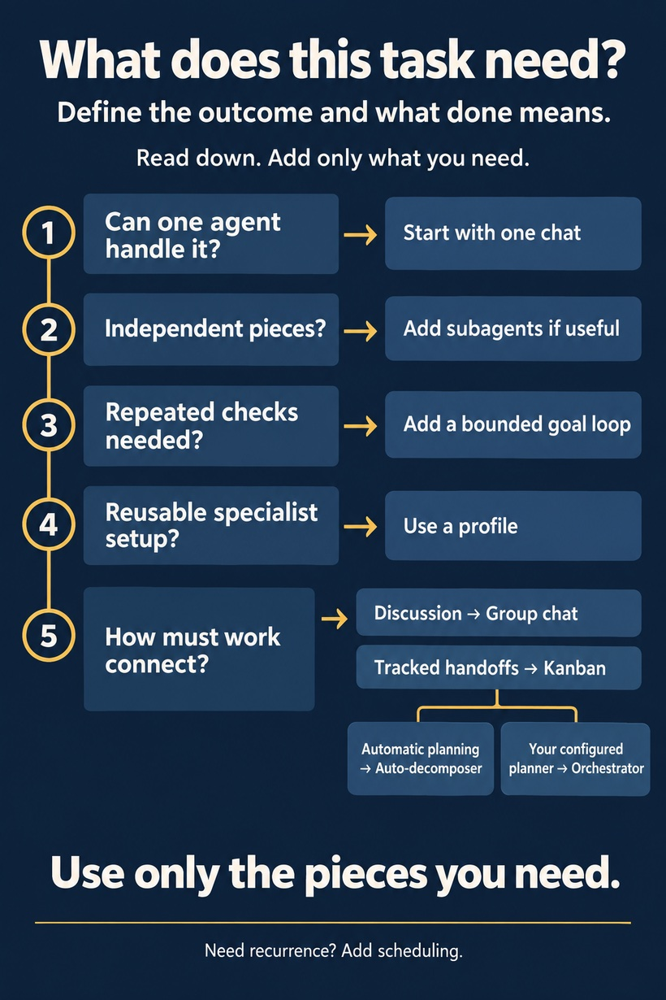

*Figure 1 is the post's decision ladder. Its heading is "What does this task need? Define the
outcome and what done means. Read down. Add only what you need." The steps are:*

| # | Question | Add |
|---|---|---|
| 1 | Can one agent handle it? | Start with one chat |
| 2 | Independent pieces? | Add subagents if useful |
| 3 | Repeated checks needed? | Add a bounded goal loop |
| 4 | Reusable specialist setup? | Use a profile |
| 5 | How must work connect? | Discussion → **Group chat**; Tracked handoffs → **Kanban**. Kanban then splits into *Automatic planning → Auto-decomposer* or *Your configured planner → Orchestrator* |

*Footer: "Use only the pieces you need." and "Need recurrence? Add scheduling."*

### Start with the outcome, not the agent count

- Before choosing any tool, finish the sentence **"This task is done when…"**. The post gives
  three examples:
  - **Email**: a sourced brief plus a reply ready for your approval.
  - **Article + notes**: a proposed entry connected to your existing knowledge.
  - **Code**: a working change with passing tests.
- Every workflow raises three separate questions: **who does the work, how is it checked, and
  what happens next.** Agents, loops, and graphs each answer a different part, and they can be
  combined.
- Stop adding structure once the task no longer needs it.
- **Quality and permission are separate checks.** Passing a quality bar does not authorize
  sending an email, changing files, or publishing. Decide which actions are allowed and which
  need your approval, then *verify* that the workflow actually stops at those boundaries.

### Q1: Can one agent finish it in one conversation?

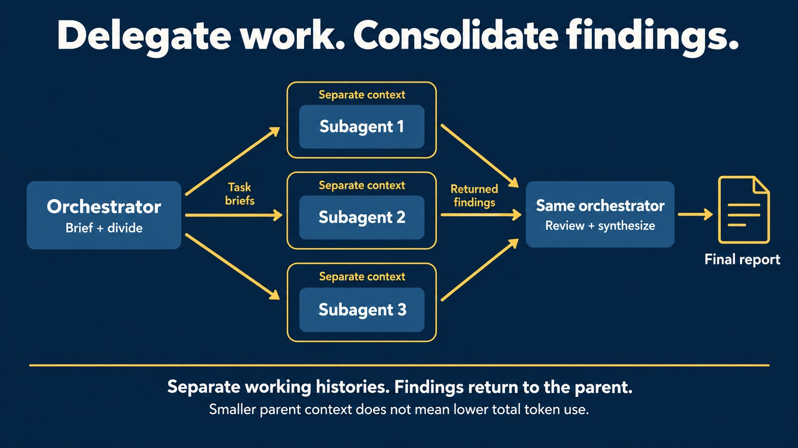

*Figure 2, "Delegate work. Consolidate findings.", shows the flow Orchestrator (Brief + divide)
→ "Task briefs" → Subagents 1–3, each in a "Separate context" box → "Returned findings" →
"Same orchestrator (Review + synthesize)" → Final report. Footer: "Separate working histories.
Findings return to the parent. Smaller parent context does not mean lower total token use."*

- **Start with direct chat.** A summary, comparison, or draft does not automatically need a
  team. Give the agent the material, your standards, and the output format you want.
- **Add subagent delegation** only where parts are genuinely independent. For example, one
  helper gathers evidence for a proposal while another checks risks. The lead writes each
  helper a bounded brief, collects their findings, and synthesizes the answer.
- **Context boundary:** a helper does *not* inherit the parent's conversation history. It
  needs the task, relevant background, limits, and the expected output. A fresh conversation
  still has tools and capabilities; it only lacks history.
- **Choose it when** several small investigations can report back to one accountable lead.
- **Stay simpler when** the work is tightly sequential, or when briefing and checking helpers
  costs more than doing the work directly.
- **Operational note:** turn on task delegation for the parent, then verify the *returned
  evidence*, not just that several agents ran. Delegation shrinks the source detail in the
  parent's context, but it does not shrink total token use across all agents.

### Q2: Does the task need repeated checking before it is done?

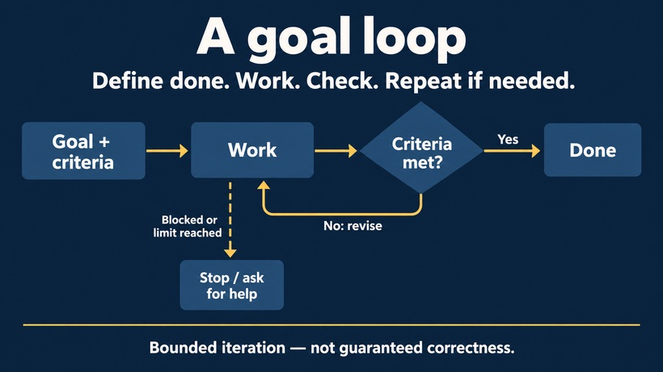

*Figure 3, "A goal loop: Define done. Work. Check. Repeat if needed.", shows Goal + criteria →
Work → ◇ "Criteria met?". Yes leads to Done. "No: revise" loops back to Work. A dashed branch
from Work, labeled "Blocked or limit reached", leads to "Stop / ask for help". Footer:
"Bounded iteration — not guaranteed correctness."*

- **Add a goal loop, not necessarily more agents.** The pattern is work → check → revise, with
  a clear completion condition *and* a stopping limit.
- Coding against a test command is the canonical example. Research can benefit too, but "keep
  researching until excellent" is hard to verify. Compare "support each recommendation with
  traceable evidence and flag unresolved disagreement", which can be checked.
- In chat, use `/goal`. On a board, turn on **goal mode** for the specific Kanban card that
  needs iteration. Either one differs from simply writing a goal into a helper's brief.
- **Choose it when** another check can meaningfully detect unfinished work.
- **Skip it when** a bounded answer is already good enough, or the criteria are vague.
- Check the evidence, set whatever execution limits are available, and watch the first run.
  **More turns don't guarantee correctness and don't enforce a dollar budget.**

### Q3: Does a specialist need a reusable setup?

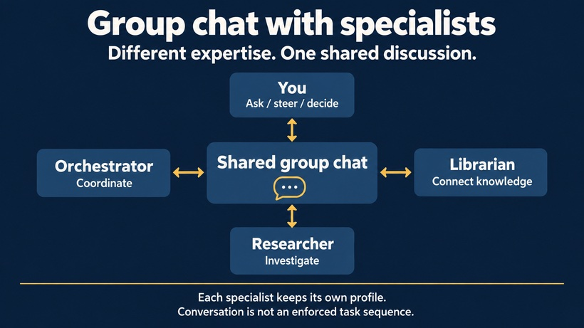

*Figure 4 (it appears under this heading in the post), "Group chat with specialists: Different
expertise. One shared discussion.", shows a central "Shared group chat" with two-way links to
You (Ask / steer / decide), Orchestrator (Coordinate), Librarian (Connect knowledge), and
Researcher (Investigate). Footer: "Each specialist keeps its own profile. Conversation is not
an enforced task sequence."*

- **Use a profile.** Think of it as a configured workstation: a role-appropriate model,
  selected tools, reusable skills, and saved memory. *Tools* provide capabilities, *skills*
  provide procedures, and *memory* keeps useful facts. The current task still needs a brief.
- A Researcher and a Librarian may need different sources, procedures, and access. That is a
  better reason for separate profiles than giving two agents different job titles.
- A profile is useful on its own. You don't need a team or a board to benefit from one.
- Match models to the work instead of assuming every step needs the most expensive model. Test
  lightweight workers against your quality bar, and **verify the actual configured model
  route**. Asking for a cheaper model in prose is not proof that it was used.

### Q4: Do those specialists need to discuss, or execute a tracked plan?

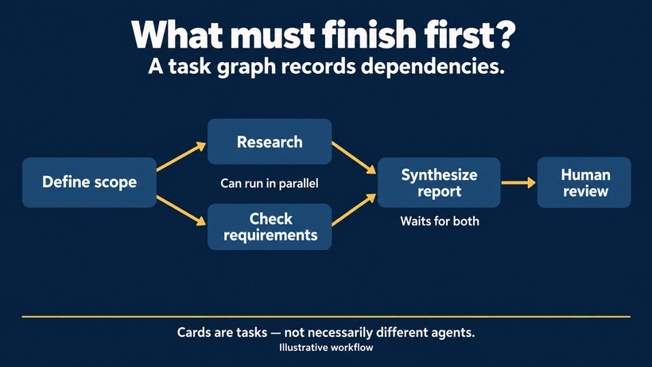

*Figure 5, "What must finish first? A task graph records dependencies.", shows Define scope
fanning out to Research and Check requirements ("Can run in parallel"). Both feed Synthesize
report ("Waits for both"), which leads to Human review. Footer: "Cards are tasks — not
necessarily different agents. Illustrative workflow."*

- **Group chat is for discussion.** A researcher, skeptic, and editor can challenge a framing
  while you supervise. Sharing a room does not merge their profiles or enforce handoffs.
- **Kanban is for tracked execution.** Pick it when research must finish before synthesis, a
  review must come before an action, a blocker needs a visible owner, or someone must inspect
  and resume the work later. One such requirement is enough to justify a board. There is no
  minimum team size.
- A group chat can settle the plan, and a board can then carry it out. The post's distinction
  is **"who can talk versus what must finish first."**
- Terms:
  - **Project**: groups related work.
  - **Board**: holds a task queue and its history.
  - **Workspace**: where a worker handles files.
  - The three are not interchangeable. Research does not need Git, but important output
    needs a retained destination.

### Q5: If you choose Kanban, who should plan?

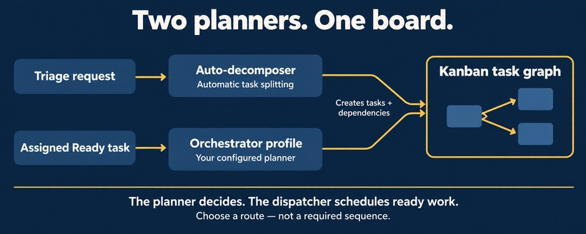

*Figure 6, "Two planners. One board.", shows two routes into the same "Kanban task graph":
Triage request → Auto-decomposer (Automatic task splitting), and Assigned Ready task →
Orchestrator profile (Your configured planner). Both "Creates tasks + dependencies". Footer:
"The planner decides. The dispatcher schedules ready work. Choose a route — not a required
sequence."*

| Route | Set-up steps | Check afterwards |
|---|---|---|
| **Auto-decomposition**: Hermes turns a broad request into a graph with minimal setup | Enable auto-decompose. Choose the auxiliary **decomposer model** and default **assignee**. Create the request in **Triage**. | Look for duplicated work, wrong assignments, and missing review points in the generated cards. |
| **Your own orchestrator profile**: its instructions, skills, and task-design rules matter | Turn auto-decompose **off**. Enable **Kanban tools** for the planner profile. Explicitly assign it a **Ready** planner card. | "Manual" means you deliberately chose and launched that planner. The agent still does the planning. |

- On either route: **the planner designs the work, the dispatcher starts eligible tasks, and
  workers execute.**
- Check the actual dependencies before trusting a later stage to wait.
- **Neither route is inherently cheaper.** A poor graph wastes work on either one.

### Applying the choices to the video's examples

| Example | Minimum | Add when… |
|---|---|---|
| **Email → reviewed reply** | One agent researches and drafts | Helpers for independent evidence gathering; a board when research, review, and follow-up need retained handoffs. *A good draft is not permission to send.* |
| **Article + notes → connected knowledge** | A Librarian profile proposes an entry | A Researcher when claims need investigating; linked stages when evidence review and curation review are separate. *Your notes are perspective, not verified source evidence.* |
| **Code → tested change** | One agent + meaningful tests | A goal loop for repair and rechecking; a board when implementation, integration, and independent review become separate dependent tasks. |

- If the only missing requirement is **"run this every weekday,"** consider **Cron**.
  Scheduling and multi-stage coordination are different needs. A scheduled run can use a board
  when both are required.
- **Suggested first test:** use public information, define the deliverable and checks, and
  keep sending, publishing, and destructive changes behind explicit approval. Run the smallest
  setup first. Add structure only to fix a failure you can name.

---

## Part 2: What happened when the options were tested

### 1. What was tested

- A **bounded research task**. The email, library, and coding workflows only illustrate where
  coordination *could* help; the experiment did not measure them.
- The shared research question in the report, paraphrased: research whether a multi-agent
  research system beats a single primary agent that delegates bounded work to subagents;
  decide whether delegation would improve the research; if so, choose subtasks, run them in
  parallel where useful, then synthesize a recommendation and a rollout plan.
- **Prompt phrasing differed across runs** so that subagents and goals could be allowed or
  disallowed per condition.
- **Date:** 2026-09-14. **Model:** `gpt-5.6-terra` in every recorded session. **Measured:**
  observed tokens, completion time, and reviewed output. Provider pricing and cheaper-model
  savings were not measured.

### The four orchestration methods

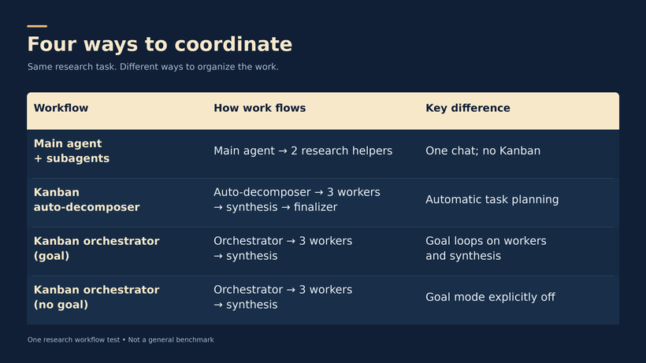

| Workflow | How work flows | Key difference | Notes from the post |
|---|---|---|---|
| **Main agent + subagents** | Main agent → 2 research helpers | One chat; no Kanban | The parent chose the split, launched 2 helpers, and synthesized. Tests whether a normal delegated conversation is already enough. |
| **Kanban auto-decomposer** | Auto-decomposer → 3 workers → synthesis → finalizer | Automatic task planning | A broad Triage request went through the auxiliary planner. The graph had 3 research workers, a synthesis task, and a root finalizer. |
| **Kanban orchestrator (goal)** | Orchestrator → 3 workers → synthesis | Goal loops on workers and synthesis | A deliberately launched planner **chose on its own** to enable goal mode on the workers and synthesis. That was the natural planning outcome, so goal mode was not the only variable changed. |
| **Kanban orchestrator (no goal)** | Orchestrator → 3 workers → synthesis | Goal mode explicitly off | The planner was told to set `goal_mode=false`. |

"Manual orchestration" does **not** mean the author wrote each worker card. It means a
configured agent was explicitly assigned to plan, instead of the auxiliary auto-decomposer.

### 2. Time and tokens

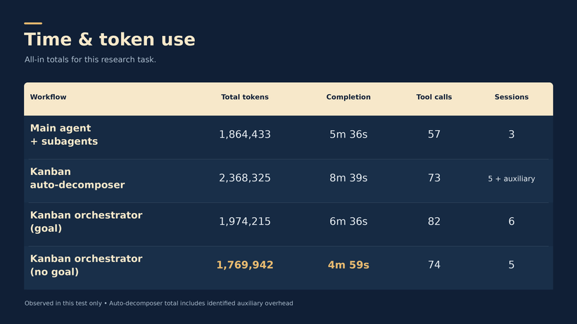

| Workflow | Total tokens (all-in) | Completion | Tool calls | Sessions |
|---|---:|---:|---:|---:|
| Main agent + subagents | 1,864,433 | 5m 36s | 57 | 3 |
| Kanban auto-decomposer | 2,368,325 | 8m 39s | 73 | 5 + auxiliary |
| Kanban orchestrator (goal) | 1,974,215 | 6m 36s | 82 | 6 |
| **Kanban orchestrator (no goal)** | **1,769,942** | **4m 59s** | 74 | 5 |

The no-goal orchestrator used the fewest tokens and finished fastest. The table below compares
the other three runs against it:

| vs | Tokens saved by no-goal run | Time saved |
|---|---:|---:|
| Main agent + subagents | 5.1% | 37 s |
| Auto-decomposer | 25.3% | 3m 40s |
| Orchestrator (goal) | 10.3% | 1m 37s |

Accounting caveats from the post:

- These are **all-in totals**, not how full the parent chat's context was. A main agent
  carrying short summaries can still add up to large total usage across workers and repeated
  calls.
- The auto-decomposer total includes about **492,669 tokens outside the Desktop/Kanban
  platform buckets**. That pattern is *consistent with* auxiliary planning, but Hermes'
  Insights view did not label the bucket. The total was observed; the attribution is partly
  inferred.
- The goal run had **6** profile sessions versus **5** for no-goal. That fits extra goal-mode
  activity, but does not prove the loops caused every difference.
- Chat delegation used the fewest tool calls (57 vs 74). **Fewer calls did not mean fewer
  tokens or a faster finish.**

### 3. Answer quality

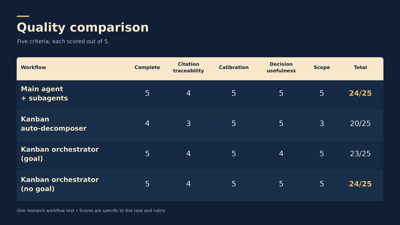

Four independent reviewers scored each final output on five criteria, each out of 5:

| Workflow | Complete | Citation traceability | Calibration | Decision usefulness | Scope | **Total** |
|---|:-:|:-:|:-:|:-:|:-:|:-:|
| Main agent + subagents | 5 | 4 | 5 | 5 | 5 | **24/25** |
| Kanban auto-decomposer | 4 | 3 | 5 | 5 | 3 | 20/25 |
| Kanban orchestrator (goal) | 5 | 4 | 5 | 4 | 5 | 23/25 |
| Kanban orchestrator (no goal) | 5 | 4 | 5 | 5 | 5 | **24/25** |

Reviewer notes, paraphrased:

- **Main + subagents (24):** actionable and well calibrated. The weakness was evidence
  presentation: the chat reply used numbered citation markers without an inline bibliography,
  although the fuller memo had better provenance.
- **Auto-decomposer (20):** a useful conditional recommendation, but weaker citation
  traceability and scope adherence. The final artifact did not show the task graph clearly.
  Decomposition itself did *not* fail: the board records show the workers, synthesis, and root
  finalizer were created.
- **Orchestrator + goal (23):** separated evidence from design judgment well. Some proposed
  operating gates lacked numeric thresholds, named owners, and a review cadence. The extra
  iteration did not raise the score.
- **Orchestrator, no goal (24):** clear worker contracts, trace requirements, evaluation gates,
  and rollback controls. Citations were traceable but lacked direct quotations or exact
  locators, so a claim-by-claim evidence ledger wasn't possible.

All four outputs reached **the same core recommendation**: start with one accountable lead, and
add specialist coordination only when the work needs it. They differed more in workflow
structure and evidence presentation than in the conclusion.

### 4. What can and cannot be concluded

**Observed:** the no-goal Kanban run had the best combination of time, total tokens, and
reviewed score. Chat delegation came close, tied on quality, and needed no board. Automatic
decomposition worked but carried the most overhead in this pilot. Goal loops showed no quality
advantage here.

**The author's practical reading:** don't add loops or bigger task graphs by default for a
short research answer. Use Kanban when durable coordination is itself valuable. Use goal loops
where repeated checking has a concrete purpose, such as passing tests or meeting explicit
acceptance criteria.

**Limitations the author lists:**

- **One run per condition.** There is no distribution and no estimate of repeatability.
- **Prior-context contamination.** The runs reused one profile and one board, and later Kanban
  workers could visibly see recent work from earlier conditions.
- **Prompts were not identical, and web results changed** between runs.
- **Scoring was not blind.** Reviewers knew the conditions, and there was no exhaustive
  external citation fact-check.

In the author's words, the differences are real observations, but their causes are "not
isolated well enough to generalize the ranking."

### Designing a stronger repeat

The author would repeat the experiment with:

- identical prompts
- isolated histories
- randomized run order
- repeated trials
- fixed model and tool policies
- blind review
- verified final attachments
- tracking of human corrections and citation support, not only speed

### Fill-in-the-blank test prompt (structure from the post)

```text
Outcome: [decision or deliverable].
Scope: [included/excluded work].
Done means: [observable checks].
Limits: [sources, length, available execution budget].
Approval required before: [external actions].
Deliver to: [retained attachment or shared location].
Use independent helpers only where they add value; preserve source evidence and uncertainties.
```

- Try a small public-information task first. Compare the result, the supervision it needed,
  and whether you can actually retrieve the output afterwards.
- **Count your own effort:** time spent briefing, correcting, and reviewing. A faster or
  lower-token run can still be worse if it takes more of your attention.
- The closing line: the goal is to "choose the least coordination that preserves what your
  work needs," not to build the biggest team.
- The author's poll for the next video: email → reviewed reply, article + notes → reviewed
  library entry, or code → testing + review.

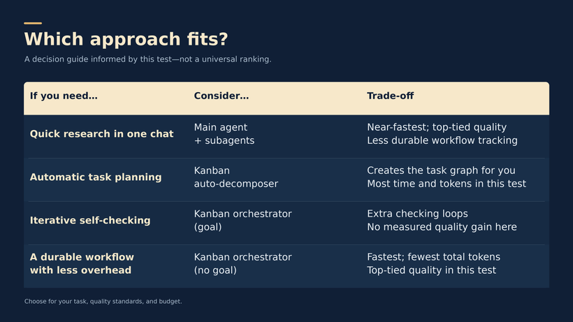

| If you need… | Consider… | Trade-off |
|---|---|---|
| Quick research in one chat | Main agent + subagents | Near-fastest; top-tied quality. Less durable workflow tracking. |
| Automatic task planning | Kanban auto-decomposer | Creates the task graph for you. Most time and tokens in this test. |
| Iterative self-checking | Kanban orchestrator (goal) | Extra checking loops. No measured quality gain here. |
| A durable workflow with less overhead | Kanban orchestrator (no goal) | Fastest; fewest total tokens. Top-tied quality in this test. |

*"Choose for your task, quality standards, and budget."*

---

## Attachment: Decision cheat sheet (PDF, 5 pages, v2)

PDF title "Hermes Coordination — Visual Cheat Sheet v2". Created 2026-09-18, 5 pages, ~1 MB,
footer "WANDERLOOTS / COORDINATION / v2". The copy from the post attachment and a separate copy
from the user's Downloads were checked page by page and are identical.

| Page | Title | Content |
|---|---|---|
| 1 | **Choose the missing capability.** "Start with one chat. Add structure only for a reason." | Three cards: **Parallel help**, Main agent + subagents ("Independent tasks; one lead synthesizes"); **Specialist discussion**, Group chat ("Named profiles compare perspectives"); **Durable handoffs**, Kanban ("Dependencies, review, blockers, history"). **Optional goal loop:** Work → Check → Done, "Revise if needed. Stop at limits or ask for help." **Two planning routes. One durable board:** Triage request → Auto-decomposer (*Auto-decompose ON*), and Ready planner card → Your orchestrator (*Auto-decompose OFF; assign planner + enable its Kanban tools*), both → **Task graph on board**. **Before you run:** Define done / Set limits / Name the output location. "Afterward: open the file. **A Done card is not proof of delivery.**" |
| 2 | **Four ways to coordinate** | Same table as Figure 7, plus *What actually changed*: "One chat used two helpers. Each Kanban route used three research workers. The automatic route also had a root finalizer." Goal condition: workers and synthesis had goal mode on. No-goal: the planner was told to set `goal_mode=false`. |
| 3 | **Time & token use** | Same table as Figure 8, plus *Observed winner: no-goal Kanban* (5.1% fewer tokens / 37 s faster than chat delegation; 25.3% / 3m 40s vs auto-decomposition). "Single-run observations, not dollar costs. Auxiliary-token attribution was partly inferred; later runs could see earlier findings." |
| 4 | **Quality comparison** | Same table as Figure 9, plus *A tie on reviewed quality, not proven equivalence*: "Four independent reviewers; five criteria. Review was not blind or a full external citation fact audit." |
| 5 | **Which approach fits?** | Same table as Figure 10, plus *Choose for the workflow, not the leaderboard*. **Delivery warning:** "Kanban history persisted, but final files were not verified as retained attachments. Only the chat report was confirmed as a durable file." |

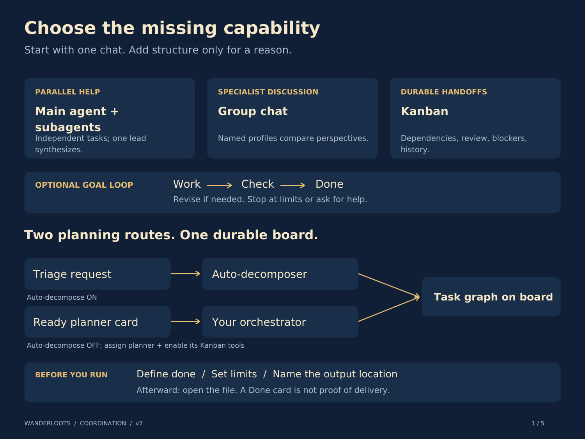
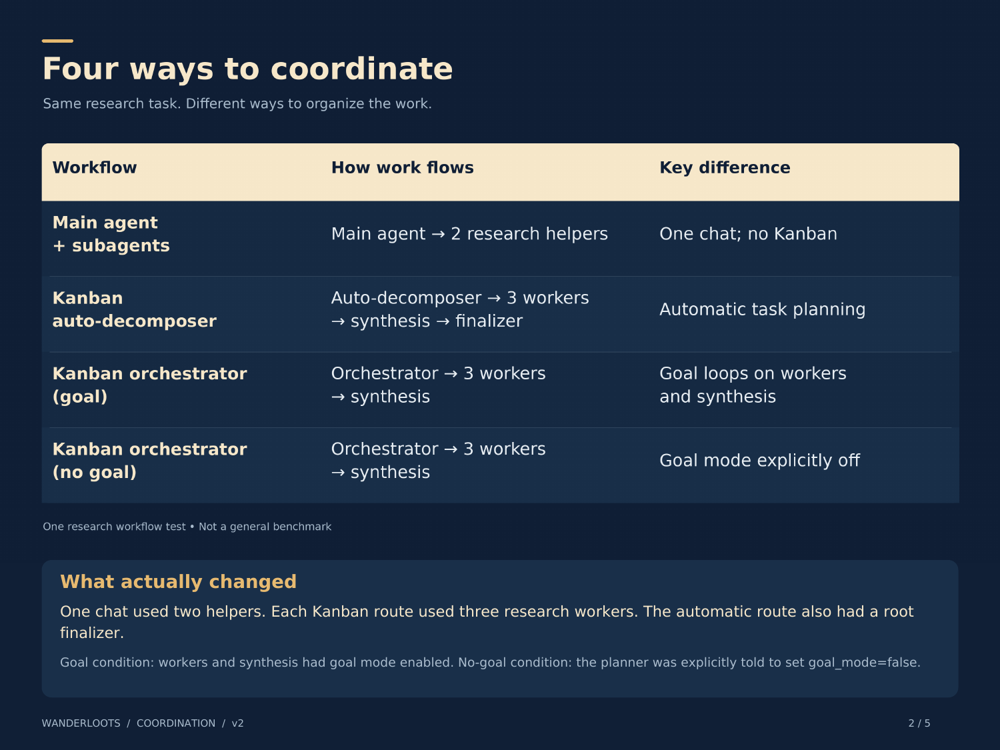
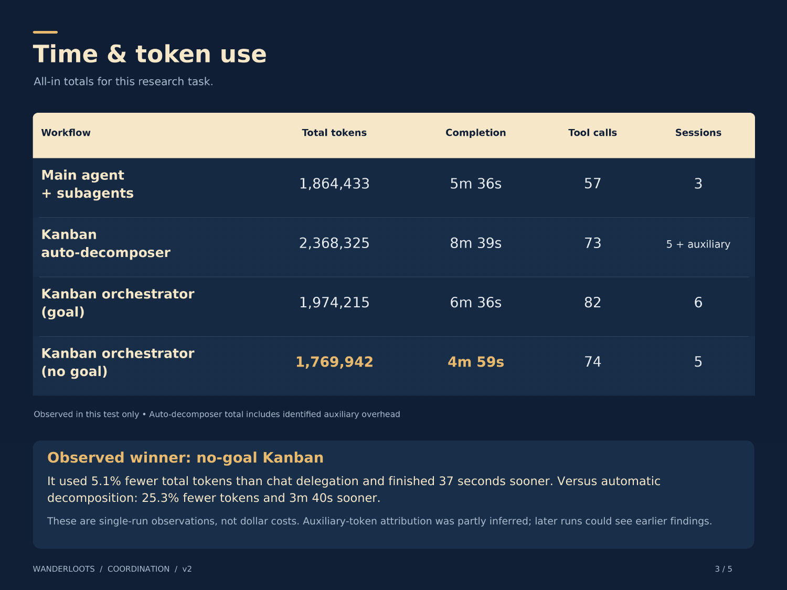
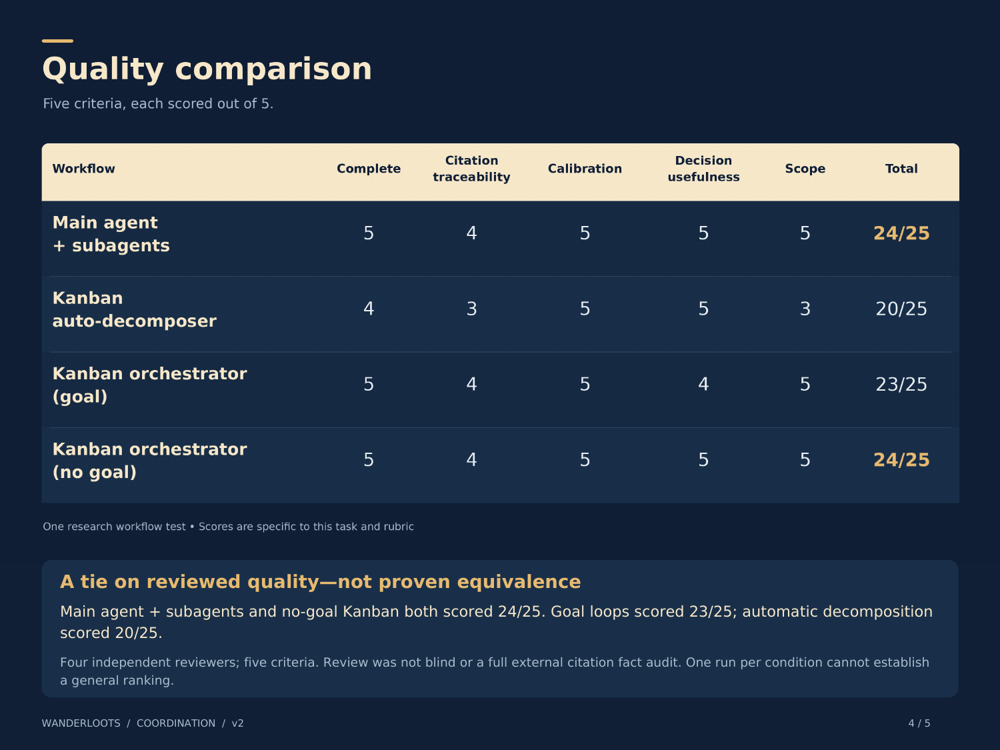
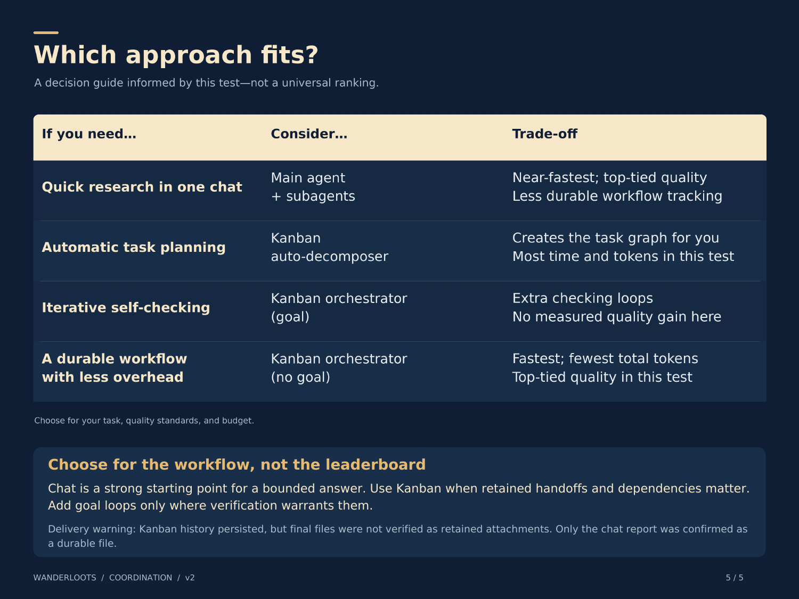

---

## Links in the post

- Hermes docs: [Kanban](https://hermes-agent.nousresearch.com/docs/user-guide/features/kanban) ·
  [Bot Mode](https://hermes-agent.nousresearch.com/docs/user-guide/bot-mode)
- [LLM Wiki Agentic Librarian Kit](https://www.patreon.com/wanderloots/posts/llm-wiki-kit-v2-168100131) (members)
- [Deep Dive on Agent Orchestration: Agents, Loops & Graphs](https://www.patreon.com/wanderloots/posts/agents-loops-169460723) (members)
