# Video walkthrough: "Subagents vs Agent Teams? Hermes Bots, Goal Loops & Kanban Graphs"

**Source:** Wanderloots (Callum), YouTube, <https://www.youtube.com/watch?v=GlW4N7p5KS8>.
Length 42:55. Published 2026-09-19. **Captured** 2026-09-24.

**Method:**

- Transcript from YouTube's English auto-captions.
- Frames selected with ffmpeg scene detection (303 cuts), plus gap-fill sampling every ~10 s
  and visual de-duplication (155 distinct frames). Every frame was read and its on-screen
  text transcribed; 77 informational frames are kept in [`images/video/`](images/video/).
- Talking-head, b-roll, and duplicate frames are omitted.
- Image filenames start with the timestamp where the frame appears. A few frames in chapters
  3–4 also appear in the cold-open montage (0:00–0:35).

**Product under test:** the Hermes Agent desktop app by Nous Research, version
`v0.21.3` (builds `5d59366`, `6bea68a`, `bb0c230` appear in the status bar). The session model
is `GPT-5.6-terra` at *Med*/*High* effort. `GPT-6-astra` appears as a frontier option.

The narration below is paraphrased. Quotes are short. See the [companion post](companion-post.md)
for the written guide and test data, and the [Hermes feature & settings
reference](hermes-ui-reference.md) for a consolidated catalogue of every UI surface shown.

---

## Chapters

| Time | Chapter | Section below |
|---|---|---|
| 0:00 | Subagents vs Teams? | [1](#1-cold-open-and-framing-000108) |
| 0:38 | Today's Outline & Goals | [1](#1-cold-open-and-framing-000108) |
| 1:08 | Agents, Loops & Graphs | [2](#2-agents-loops--graphs-108221) |
| 2:21 | Enabling Subagents | [3](#3-enabling-and-testing-subagent-delegation-221541) |
| 3:11 | Testing Subagent Delegation | [3](#3-enabling-and-testing-subagent-delegation-221541) |
| 5:41 | Comparing Delegation & Non-Delegation | [4](#4-delegation-vs-no-delegation-541805) |
| 8:05 | Goal Mode aka Loops | [5](#5-goal-mode-aka-loops-8051159) |
| 9:03 | Testing A Goal Loop | [5](#5-goal-mode-aka-loops-8051159) |
| 11:59 | Model Routing & Auxiliary Models | [6](#6-model-routing--auxiliary-models-11591358) |
| 13:58 | Reviewing The Goal Output | [7](#7-reviewing-the-goal-output-13581613) |
| 16:13 | Bot Mode & Intro To Graphs | [8](#8-bot-mode--intro-to-graphs-16131857) |
| 18:57 | Examples To Help Visualize Graphs | [9](#9-examples-to-help-visualize-graphs-18572227) |
| 22:27 | Kanban vs Delegated Subagents | [10](#10-kanban-vs-delegated-subagents-22272415) |
| 24:15 | Enabling Hermes Kanban | [11](#11-enabling-and-testing-hermes-kanban-24152639) |
| 25:48 | Testing Hermes Kanban | [11](#11-enabling-and-testing-hermes-kanban-24152639) |
| 26:39 | Dispatcher, Specifier & Auto-Decomposer | [12](#12-dispatcher-specifier--auto-decomposer-26392847) |
| 28:47 | Project Boards | [13](#13-project-boards-28472940) |
| 29:40 | Kanban Orchestration Settings | [14](#14-kanban-orchestration-settings-29403031) |
| 30:31 | Kanban Setup: Research Example | [15](#15-kanban-setup-research-example-30313220) |
| 32:20 | Running The Kanban Board | [16](#16-running-the-kanban-board-32203619) |
| 36:19 | Reviewing Kanban Results & Debrief | [17](#17-reviewing-kanban-results--debrief-36193810) |
| 38:10 | Orchestrator Decomposer (Manual, Not Auto) | [18](#18-orchestrator-decomposer-manual-not-auto-38104105) |
| 41:05 | Cost & Quality Comparison | [19](#19-cost--quality-comparison-41054204) |
| 42:04 | What's Next? | [20](#20-whats-next-4204end) |

---

## 1. Cold open and framing (0:00–1:08)

- **Cold-open montage.** It shows the Kanban "New task" estimate dropping from ~45k to ~18k
  tokens, bot/team chat lists, a running Kanban board, and an Agent / Loop / Graph slide.
- **The question.** One agent can already delegate to subagents, so what does an agent
  *team* add? Callum says it's the question he's asked most about multi-agent workflows.
- **His answer.** Sometimes one capable agent with subagents is enough. Sometimes a more
  structured workflow improves quality and efficiency. The process isn't Hermes-specific.
- **Levels covered in the video:**
  1. One agent with temporary helpers (subagents).
  2. Goal loops that check whether the work is actually done.
  3. Specialists with their own tools, skills, and memory ("bot mode").
  4. Kanban for managing complex agentic tasks.
- **Promised ending:** the same task run at each level and compared.

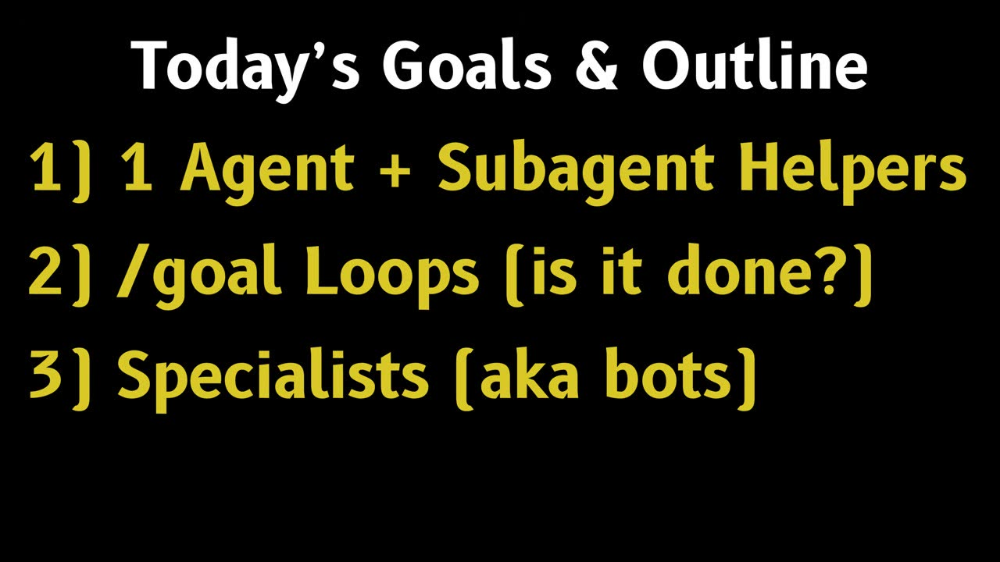
*0:48 outline: "1) 1 Agent + Subagent Helpers · 2) /goal Loops (is it done?) · 3) Specialists (aka bots)".*


*0:55 "The Five Levels of Orchestration" (staircase):*

| Level | Name | Description |
|---|---|---|
| 1 | Single agent | Baseline chatbot capability |
| 2 | Sub-agent delegation | Temporary helpers for broad tasks |
| 3 | Goal loops | Iterative, autonomous quality control |
| 4 | Specialist profiles | Persistent bots with custom memory/skills |
| 5 | Kanban task graphs | Durable, resume-able pipelines |

*Core insight on the slide: "Do not jump to Level 5. Start simple and scale coordination only
when task complexity actively demands it."*

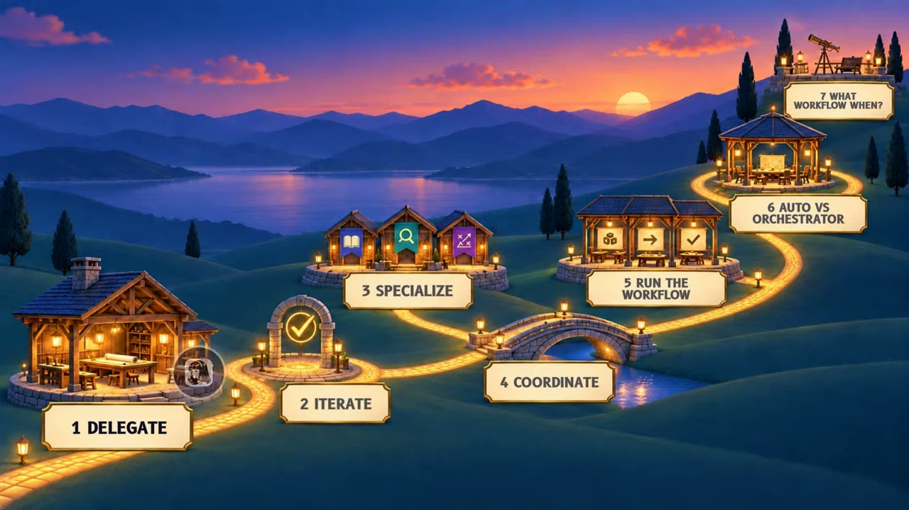
*The roadmap recurs through the video: 1 Delegate → 2 Iterate → 3 Specialize → 4 Coordinate →
5 Run the Workflow → 6 Auto vs Orchestrator → 7 What Workflow When?*

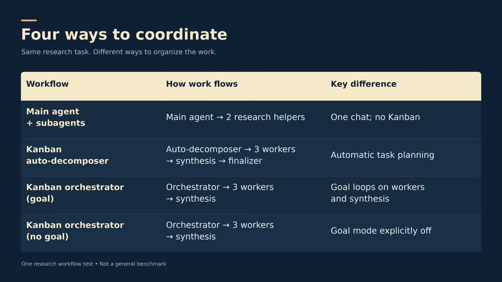
*2:14 previews the test design. Four workflows run on the same research task (full data in
[§19](#19-cost--quality-comparison-41054204)).*

- **Companion article.** Callum mentions a free companion article (written guide, tips, and
  test results), summarized in [companion-post.md](companion-post.md).

## 2. Agents, loops & graphs (1:08–2:21)

- **Three questions frame the whole video:**
  1. **Who does the work?** (agent)
  2. **How do they check it?** (loop)
  3. **What do they do next?** (graph)
- **Running scenario.** Information comes in: an email, or notes on an article destined for
  an LLM wiki. What action should be taken, how, and what does "done" look like? How can the
  agent handle it the same way every time, to the user's standard?
- **Build-up.** The video starts with a single agent orchestrating subagents and grows to a
  full task-graph system.

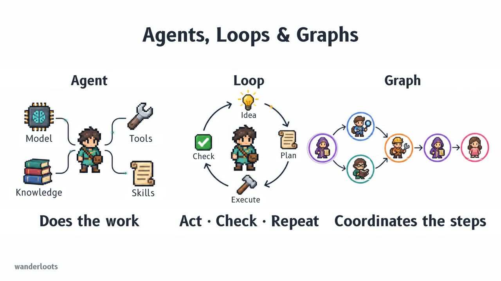
*The recurring concept slide:*

| Concept | Parts | Role |
|---|---|---|
| **Agent** | Model, Knowledge, Tools, Skills | "Does the work" |
| **Loop** | Idea → Plan → Execute → Check → (repeat) | "Act · Check · Repeat" |
| **Graph** | A chain of role nodes, one branching into two, converging, then passing down a line | "Coordinates the steps" |

## 3. Enabling and testing subagent delegation (2:21–5:41)

### Setup

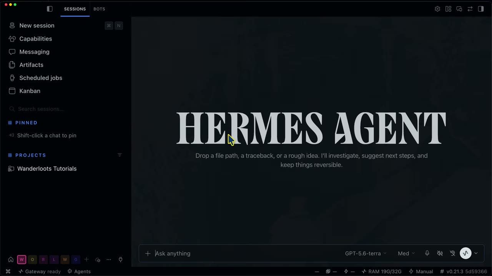
*2:26 home screen.*

- **Top tabs:** SESSIONS / BOTS.
- **Sidebar:** New session, Capabilities, Messaging, Artifacts, Scheduled jobs, Kanban, and a
  session search. Below that, PINNED ("Shift-click a chat to pin") and PROJECTS (Home,
  Wanderloots Tutorials).
- **Splash text:** "HERMES AGENT: Drop a file path, a traceback, or a rough idea. I'll
  investigate, suggest next steps, and keep things reversible."
- **Composer:** model `GPT-5.6-terra`, effort `Med`.
- **Status bar:** "Gateway ready", workspace `wanderloots`, "Agents".

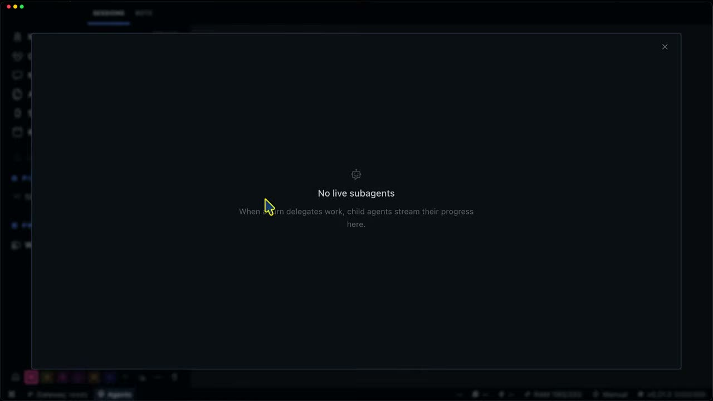
*2:39 the **open agents** control at the bottom-left opens a "No live subagents" panel: "When a
turn delegates work, child agents stream their progress here."*

- The single agent is a **parent** that can spawn **children** (subagents).
- **Turning delegation on:** go to **Capabilities → Tools**, search "delegation", and enable
  **Task Delegation** (`delegate_task`). It was off.


*The Tools view (shown again at 8:06).*

- **Tabs:** Skills 125, Tools 25, MCP, Plugins.
- **Profile selector:** "Configuring: wanderloots-tutorials".
- **The tool row:** Task Delegation / `delegate_task`, toggle **on**, usage ×1.
- **Footer:** "Changes apply to new sessions."

### The research prompt

The same question is reused throughout the video:

> How do I turn incoming information into something useful, an action I can take, or knowledge
> I can reuse, and what is the best strategy for that action system: a single agent with
> delegation capabilities, or a multi-agent team with different specialized agents? Where
> efficient to so, please delegate to subagents of lower reasoning.

(The on-screen prompt; the typo is original.)

### Running and steering subagents

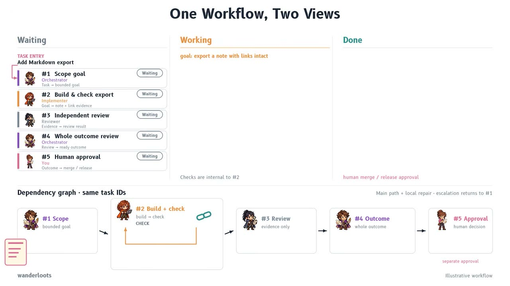
*The parent loads skill `agentic-librarian-research`. It notes "failed to load skill:
autonomous-ai-agents, 1 tool call failed". It then spawns **three subagents**, each on
`GPT-5.6-terra`:*

1. "Develop a concise, evidence-grounded framework for converting incoming infor…"
2. "Analyze the operating-model choice: a single orchestration agent with delegatio…"
3. "Independently propose a concrete end-to-end workflow for turning inbox inform…"

*The parent replies: "I'm researching the workflow and agent-architecture tradeoff with three
independent subagents; I'll synthesize a concrete recommendation when they return." Status bar:
`3 Subagents`, context `~18.3k/272k (~7%)`, 34 t/s, RAM 19G/32G.*

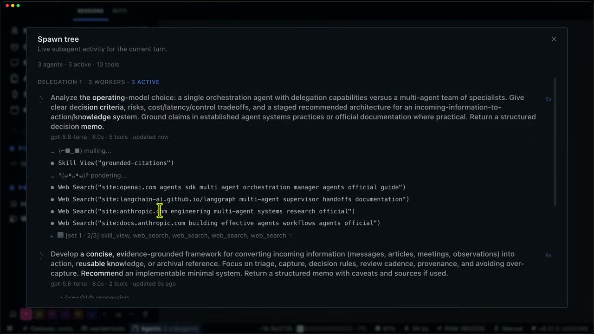
*3:45 the **Spawn tree** modal ("Live subagent activity for the current turn").*

- **Header:** "3 agents · 3 active · 10 tools", "DELEGATION 1 · 3 WORKERS · 3 ACTIVE".
- **Each worker shows** its full brief, model, elapsed time, and tool calls.
- **Example calls:** `Skill View("grounded-citations")`, then several `Web
  Search("site:openai.com agents sdk multi agent orchestration manager agents official
  guide")`-style queries against openai.com, langchain-ai.github.io/langgraph,
  anthropic.com, and docs.anthropic.com.

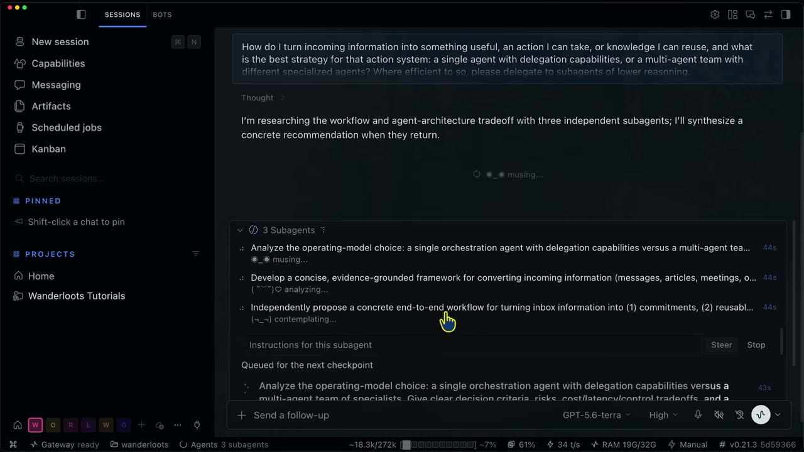
*4:10 **Steering** (new in this release): expand "3 Subagents", click one, and type in
"Instructions for this subagent" with **Steer** and **Stop** buttons. The message is "Queued
for the next checkpoint". Callum sends "make sure to please include citations". The steered
agent then switches to the `research-grounded-citations` skill.*

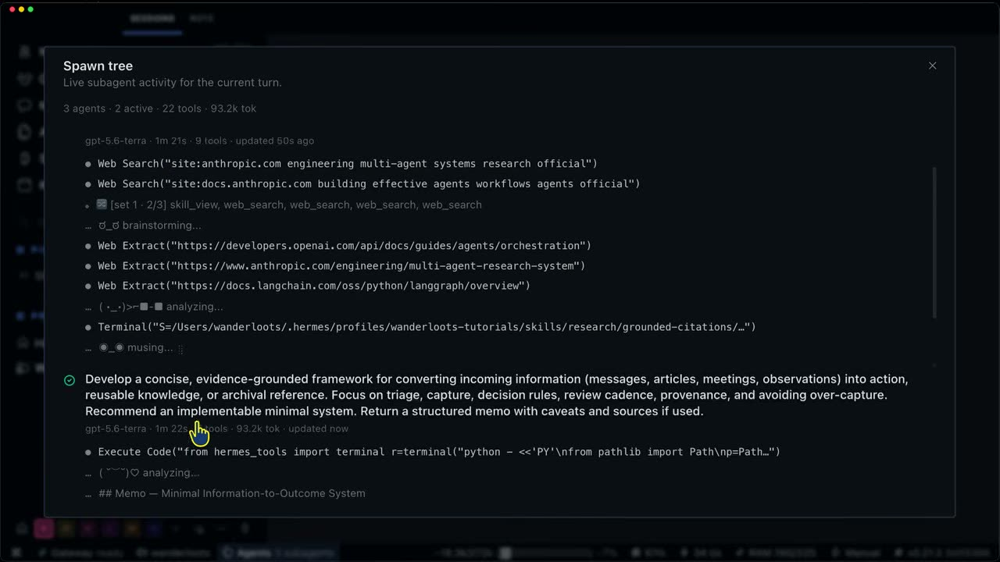
*4:30 the spawn tree later shows "3 agents · 2 active · 22 tools · 93.2k tok".*

- **Calls visible:** `Web Extract` against the OpenAI agents-orchestration guide, Anthropic's
  multi-agent research-system post, and LangGraph docs. One `Terminal(...)` call into the
  profile's `skills/research/grounded-citations/` folder. One `Execute Code("from hermes_tools
  import terminal ...")`.
- **Completion:** a finished worker gets a green check. Its output begins "## Memo — Minimal
  Information-to-Outcome System".

### The delegated answer

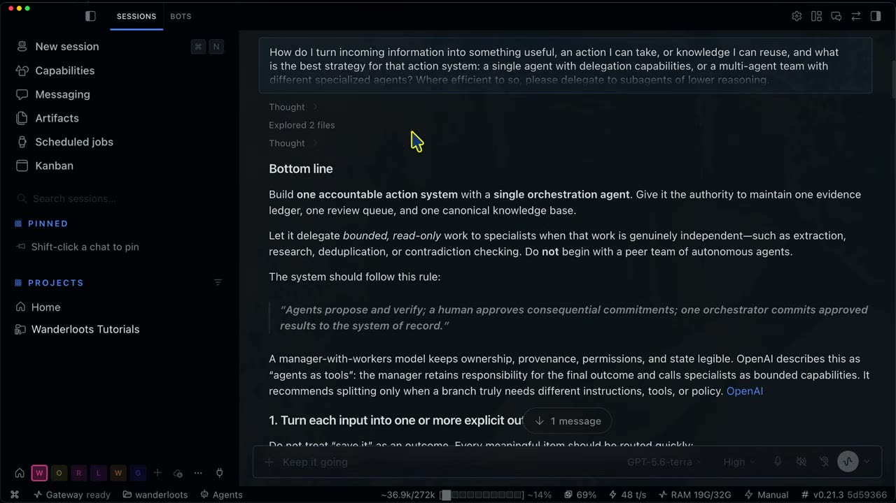
*4:54 the parent validates a few sources and writes the report. The **"Bottom line"** section
recommends:*

- one accountable action system with a single orchestration agent that owns one evidence
  ledger, one review queue, and one canonical knowledge base
- delegating only bounded, read-only, genuinely independent work (extraction, research,
  deduplication, contradiction checking)
- not starting with a peer team of autonomous agents

*Rule quoted in the output: "Agents propose and verify; a human approves consequential
commitments; one orchestrator commits approved results to the system of record." It cites
OpenAI's "agents as tools" (manager keeps responsibility and calls specialists as bounded
capabilities). Context: **~36.9k/272k (~14%)**.*

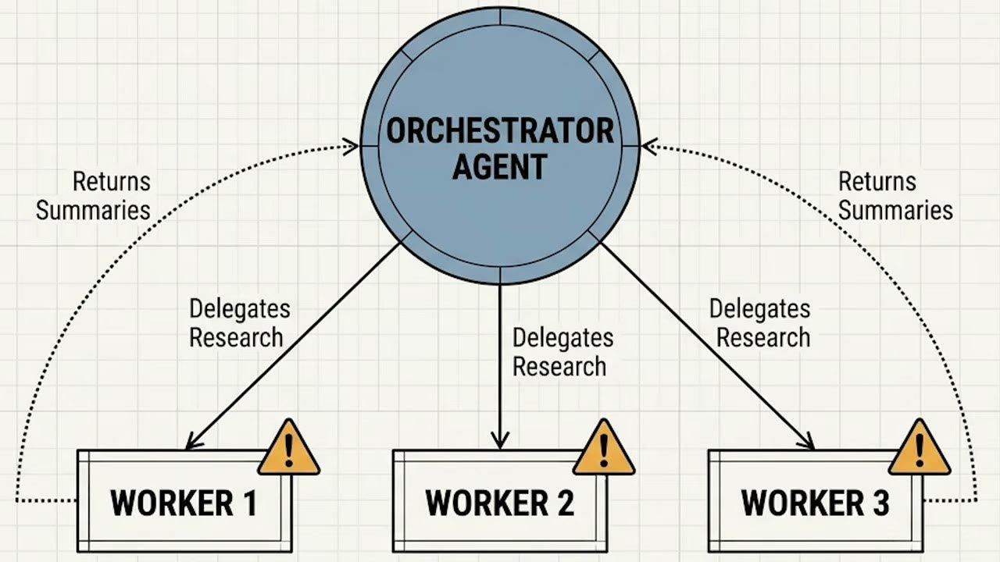
*5:22 ORCHESTRATOR AGENT → "Delegates Research" → WORKER 1/2/3, which send back "Returns
Summaries" (dotted arrows).*

- **Why context stays small:** the parent only wrote the briefs. Each subagent used its own
  context, and only syntheses came back.
- **Summary line:** "delegating the work but not the judgment." The parent can use
  lower-intelligence subagents and read their reports instead of every source.

## 4. Delegation vs no delegation (5:41–8:05)

- **Same prompt, delegation forbidden:** "Please do thorough research, but DO NOT delegate to
  subagents."
- **Result:** the parent reached **~102.2k/272k (~38%)** context, versus ~36.9k with
  delegation.
- **Caveat:** that comparison ignores the subagents' own tokens, so *total* usage with
  delegation was larger. What delegation compresses is the context that reaches the
  higher-intelligence parent.
- **Risk of the non-delegated run:** one more turn and the context would need compressing,
  losing quality.

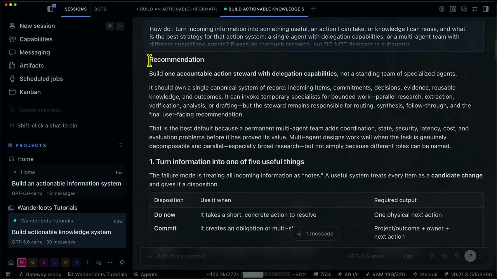
*5:44 the non-delegated **Recommendation**: "Build one accountable action steward with
delegation capabilities, not a standing team of specialized agents."*

- A permanent team "adds coordination, state, security, latency, cost, and evaluation problems
  before it has proved its value."
- Multi-agent designs fit decomposable, parallel work, especially broad research.
- It then starts a "Turn information into one of five useful things" disposition table (Do now
  → One physical next action; Commit → Project/outcome + owner + next action; …).

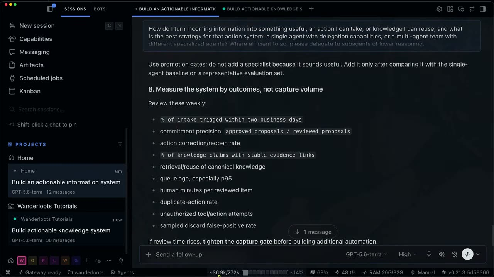
*5:50 "Use promotion gates: do not add a specialist because it sounds useful. Add it only after
comparing it with the single-agent baseline on a representative evaluation set." Section "8.
Measure the system by outcomes, not capture volume" lists weekly metrics:*

- % of intake triaged within two business days
- commitment precision (approved / reviewed proposals)
- action correction/reopen rate
- % of knowledge claims with stable evidence links
- retrieval/reuse of canonical knowledge
- queue age (p95)
- human minutes per reviewed item
- duplicate-action rate
- unauthorized tool/action attempts
- sampled discard false-positive rate

*It closes with "If review time rises, tighten the capture gate before building additional
automation."*

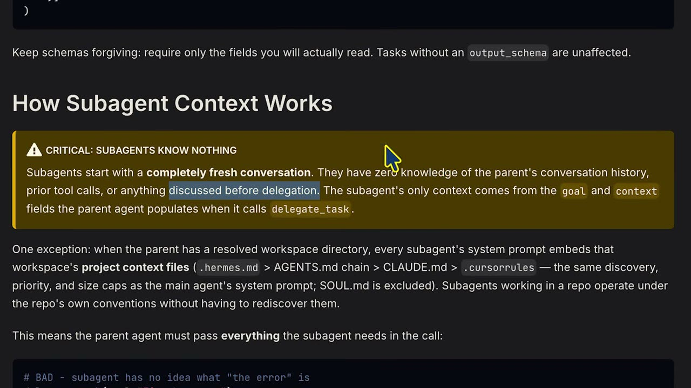
*7:29 the delegated report's **"Delegate only bounded specialist work"** table:*

| Worker | May do | Must not do |
|---|---|---|
| Intake/extraction | extract requests, dates, claims, entities, quotes | decide truth or create commitments |
| Research | investigate an approved question and return cited findings | access unrelated private data or write canon |
| Deduplication | identify likely duplicate items/notes | destructively merge or delete |
| Contradiction checker | identify conflict and missing evidence | resolve policy or factual disputes alone |
| Librarian | draft knowledge notes and related links | promote notes into canon |
| Action planner | draft structured next actions | assign inferred owners/dates or execute |
| QA/audit | sample accepted outputs against source evidence | modify canonical records |

- **Same conclusion both ways.** Both answers were basically the same: delegate specialist
  work only when the complexity needs it.
- **Scope of that finding.** It applies to a one-off research task. As systems scale, other
  orchestration (the bots from previous videos) becomes relevant.

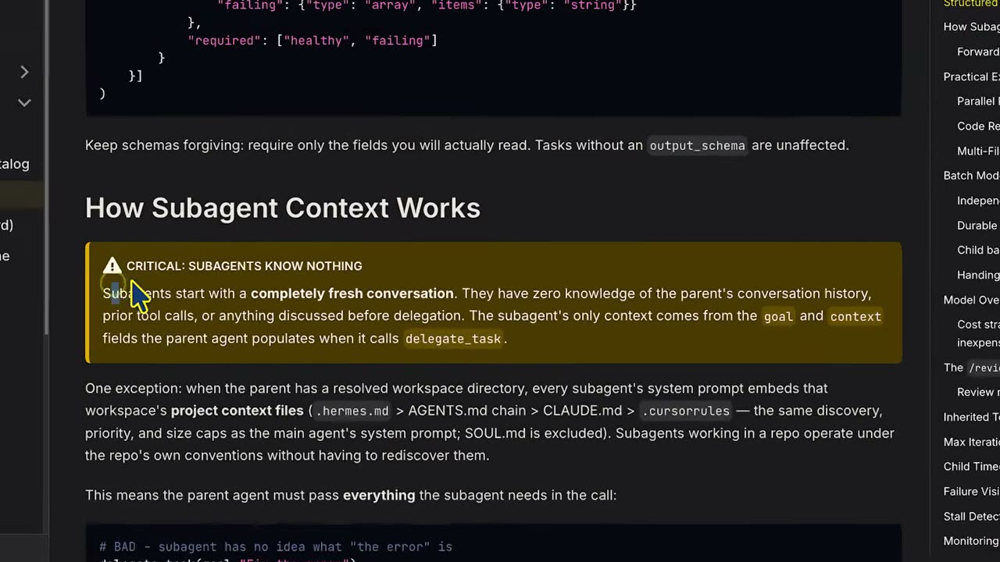
*7:21 Hermes docs, *Subagent Delegation → How Subagent Context Works* (overlay: "subagents are
different than bots").*

- **Callout:** "CRITICAL: SUBAGENTS KNOW NOTHING." Subagents start with a completely fresh
  conversation and have no knowledge of the parent's history or tool calls. Their only context
  is the `goal` and `context` fields the parent fills in when it calls `delegate_task`.
- **One exception:** when the parent has a resolved workspace directory, each subagent's system
  prompt embeds that workspace's project context files (`.hermes.md` > `AGENTS.md` chain >
  `CLAUDE.md` > `.cursorrules`, same discovery and caps as the main agent; `SOUL.md` is
  excluded).
- **Structured output:** the page above shows a `tasks=[{goal, context, output_schema}]`
  example and the tip "Keep schemas forgiving: require only the fields you will actually read."

## 5. Goal mode aka loops (8:05–11:59)

- **Link to the previous chapter:** because subagent context comes from the *goal*, the next
  step is `/goal`.
- **What it is:** type `/goal` to set a **standing goal that Hermes works on across all turns
  until it's achieved**. Callum recommends trying it *before* building specialist teams.
- **What it does:** a goal links several prompts into one bigger task. You hand over a bounded
  outcome: what success means, how to verify it, and when to ask you. The **main agent judges
  progress**, and the session continues within its budget.


*8:09 "A Simple Goal Loop" (illustrative):*

1. USER TASK "Add Markdown export"
2. EXPLICIT GOAL + ACCEPTANCE "Export a note with links intact"
3. Implementer (build → check → bounded repair)
4. Checks "links preserved?"
5. You (human acceptance)

*A failure report returns to the same owner. A "blocked / budget exit" leads to REPORT + HUMAN.
The end state is "Goal accepted: links intact".*

### The goal prompt

- **Asks for:** several streams of research; **delegated subagents of lower intelligence**
  (e.g. Terra *medium* rather than *high*); a synthesized report; then corroboration against
  practical Hermes community best practices.
- **Constraints:** the report must be **< 500 words with clear citations**.

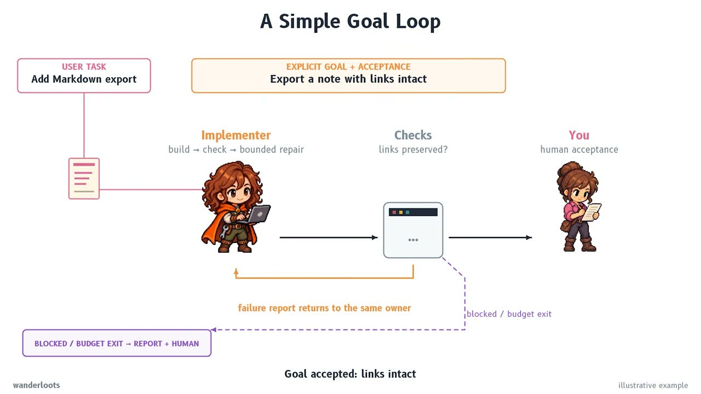
*8:37 overlay: "goal = what done looks like". The goal card:*

- "Goal waiting · Turn 1/20", with a **Wait condition** ("awaiting results from its active
  delegated research batch…").
- Buttons: *View details*, *Criteria · 0*, *Add criterion*, *3 Subagents*.
- Agent message: "I've launched four independent research streams, including official Hermes
  documentation and public community-practice corroboration. I'll return one cited report
  under 500 words after synthesis."
- Context ~54.2k/272k.

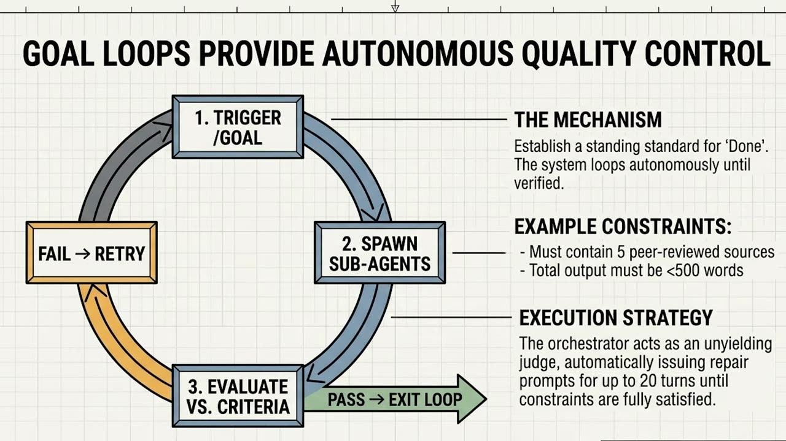
*10:06 slide: 1. TRIGGER /GOAL → 2. SPAWN SUB-AGENTS → 3. EVALUATE VS. CRITERIA. PASS → EXIT
LOOP; FAIL → RETRY.*

- **The mechanism:** "Establish a standing standard for 'Done'. The system loops autonomously
  until verified."
- **Example constraints:** 5 peer-reviewed sources; output < 500 words.
- **Execution strategy:** "The orchestrator acts as an unyielding judge, automatically issuing
  repair prompts for up to 20 turns until constraints are fully satisfied."

- **Turn limit:** the default is **20 turns**. The agent loops, checking its output against
  the requested standard.
- **Callum's usage:** he uses this constantly, especially for coding.
- **Criteria can be added mid-run.** They become the new definition of done.

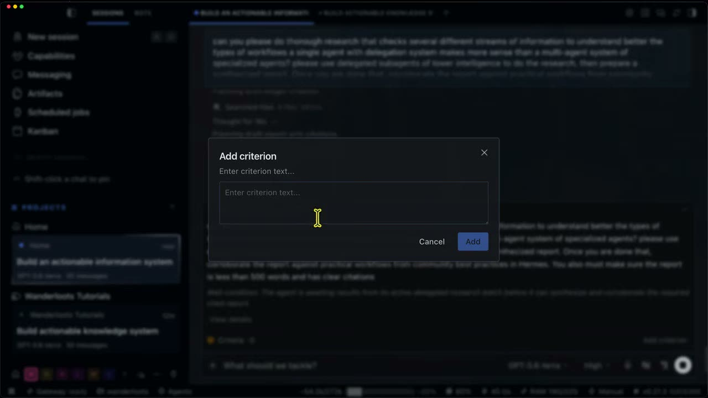
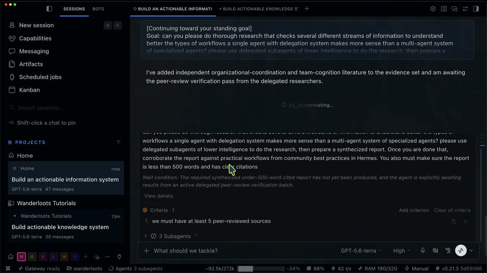
*10:12–11:05 the **Add criterion** dialog, then "Criteria · 1: we must have at least five
peer-reviewed sources" (with *Clear all criteria*).*

- **What happened next:** the agent noticed that its 8 sources weren't peer-reviewed. On turns
  2–3 it started another batch of subagents to cross-check against peer-reviewed literature:
  "I've added independent organizational-coordination and team-cognition literature to the
  evidence set and am awaiting the peer-review verification pass…". Context rose to
  ~92.5k/272k.
- **Tip:** the more precise the goal is at the start, the better the loop works.
- **Run length:** his coding agents have run **5–6 hours**, delegating to lower-intelligence
  subagents and re-testing code before presenting it for approval.
- **Warning:** a long goal on a frontier model ("Astra", "Fable", …) can burn through quota
  quickly, especially unmonitored.

## 6. Model routing & auxiliary models (11:59–13:58)

- **Problem:** the UI only showed "GPT-5.6-terra" for the subagents, not their effort level.
- **Fix:** be explicit in the goal, e.g. "use a local model / use Luna only for the research;
  you, the higher-intelligence model, synthesize."
- **Principle:** "keeping an agent working isn't the same thing as using its intelligence."
  The orchestrator should make judgments, and lightweight helpers should do bounded extraction
  with limited actions.

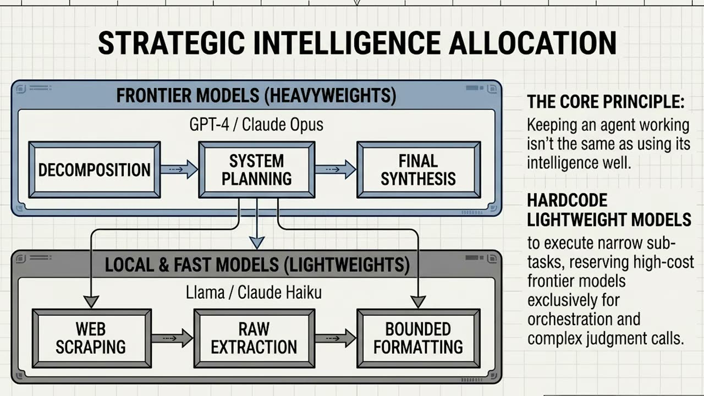
*12:39 slide.*

- **Frontier models (heavyweights):** decomposition → system planning → final synthesis.
- **Local & fast models (lightweights):** web scraping → raw extraction → bounded formatting,
  fed from system planning.
- **Core principle:** "Hardcode lightweight models to execute narrow sub-tasks, reserving
  high-cost frontier models exclusively for orchestration and complex judgment calls." (The
  slide's example model labels are illustrative.)

Three ways to route models:

1. **In the goal/prompt** (per task).
2. **In the profile's `AGENTS.md` / `SOUL.md`**, e.g. "when using sub-agent delegation, always
   use lower intelligence models". This then applies to every delegation by that bot.
3. **Settings → Model → auxiliary models.** Choose a separate model per auxiliary task (e.g.
   image analysis on a local or cheaper model).

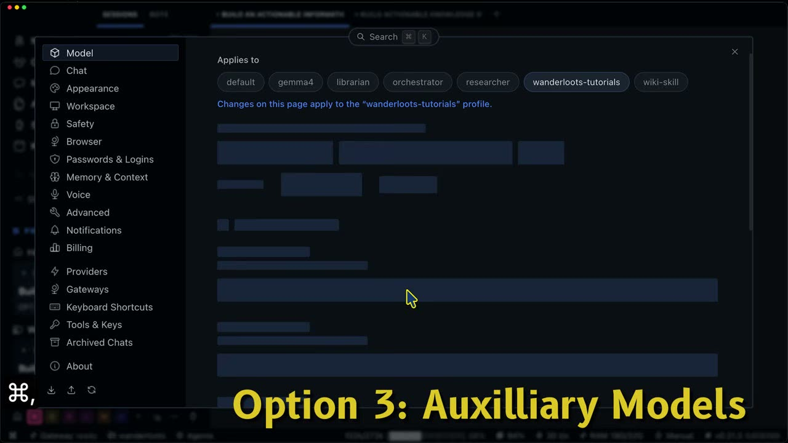
*13:34 overlay "Option 3: Auxiliary Models". Settings → Model has an **"Applies to"** row of
profile chips: default, gemma4, librarian, orchestrator, researcher, wanderloots-tutorials,
wiki-skill. Notice: "Changes on this page apply to the 'wanderloots-tutorials' profile."*

## 7. Reviewing the goal output (13:58–16:13)

- **Result:** the goal loop kept the report to a couple hundred words, down from thousands in
  the first run.
- **Why:** the framing specified an order (cross-reference, corroborate, then trim to ≤ 500
  words), not just a length cap.

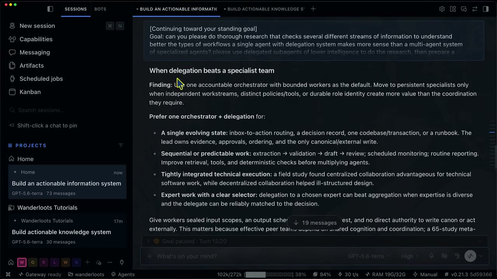
*Goal paused at **Turn 13/20**, context 102k/272k. Heading: **"When delegation beats a
specialist team."** Finding: use one accountable orchestrator with bounded workers by default,
and move to persistent specialists only when independent workstreams, distinct policies/tools,
or durable role identity are worth more than the coordination.*

Prefer one orchestrator + delegation for:

- **A single evolving state:** inbox-to-action routing, a decision record, one
  codebase/transaction, or a runbook.
- **Sequential or predictable work:** extraction → validation → draft → review; scheduled
  monitoring; routine reporting.
- **Tightly integrated technical execution:** a field study found centralized collaboration
  better for technical software work.
- **Expert work with a clear selector.**

*Workers get sealed input scopes, an output schema, an acceptance test, and no direct authority
to write canon or act externally. The output cites a 65-study meta-analysis on shared
cognition.*

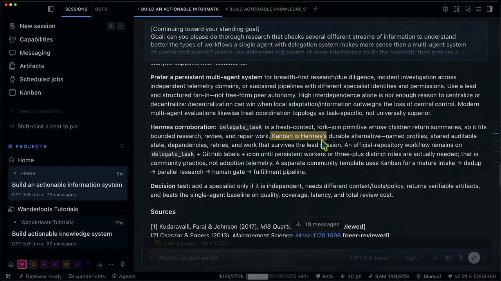
*16:07.*

- **Prefer a persistent multi-agent system for:** breadth-first research/due diligence,
  incident investigation across independent telemetry domains, or sustained pipelines with
  different specialist identities and permissions. Use a lead with structured fan-in, not
  free-form peer autonomy.
- **Hermes corroboration:** `delegate_task` is a fresh-context fork-join primitive whose
  children return summaries, so it fits bounded research, review, and repair. **Kanban** is
  Hermes' durable alternative: named profiles, shared auditable state, dependencies, retries,
  and work that survives the lead session.
- **Community practice cited:** an official-repository workflow stays on `delegate_task` +
  GitHub labels + cron until persistent workers or 3+ distinct roles are needed. A community
  template uses Kanban for intake → dedup → parallel research → human gate → fulfilment.
- **Decision test:** add a specialist only if it is independent, needs different
  context/tools/policy, returns verifiable artifacts, and beats the single-agent baseline on
  quality, coverage, latency, and total review cost.
- **Sources:** peer-reviewed, e.g. Kudaravalli, Faraj & Johnson (2017) *MIS Quarterly*;
  Csaszar & Eggers (2013) *Management Science*.

- **Callum's critique:** the answer is generic. It doesn't know who he is or what he wants,
  and subagents have no knowledge beyond the goal and context they're given.
- **Link to specialists:** keeping working knowledge, different tools/policies, or separate
  memory, instead of re-spawning a blank agent each time, is the argument for specialists.
  That leads to bot mode, then Kanban.

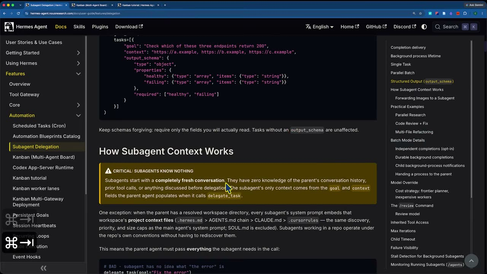
*15:12:*

| Role | Intelligence / Access | Context | Skill |
|---|---|---|---|
| **Orchestrator** | High (Frontier Model) | Broad Planning | Task Decomposition |
| **Researcher** | Academic Databases | Rigorous Sourcing | Fact Extraction |
| **Librarian** | Personal Obsidian Wiki | Curation & Formatting | Knowledge Base Filling |

*"Unlike temporary sub-agents, Specialists retain persistent memory across sessions, learn
custom skills, and maintain tailored context."*

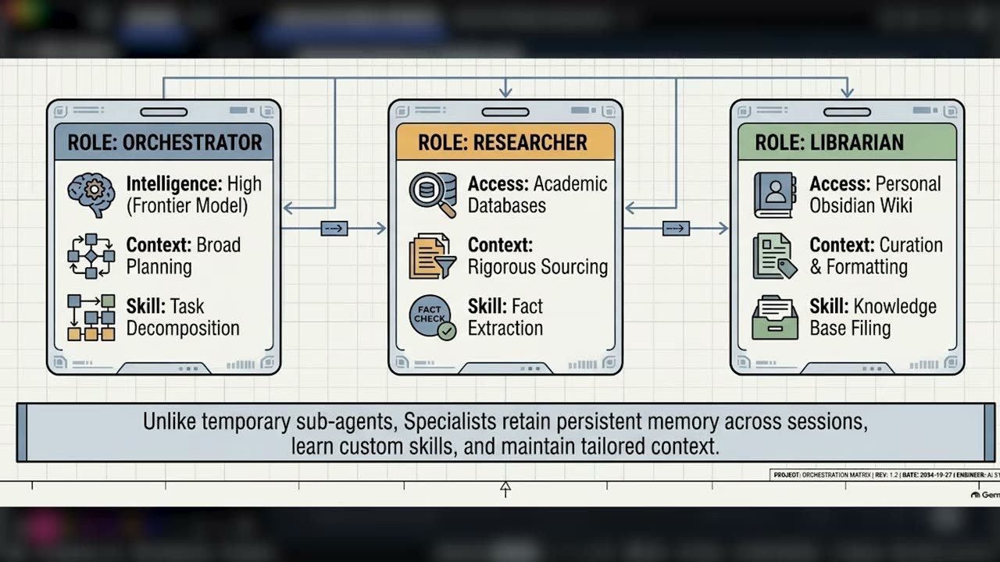
*15:25 "The Breaking Point of Simple Delegation": an ORCHESTRATOR (frontier) linked to a
SUB-AGENT (lightweight) by a broken connector labeled "ERROR: Context Lost".*

- **Bottlenecks:** the parent is blocked until sub-agents return.
- **Fragility:** a failed sub-agent returns "incomplete", with no way to pause, repair, or
  resume.
- **Opacity:** compression destroys audit trails once the summary is returned.

## 8. Bot mode & intro to graphs (16:13–18:57)

- **Moving to a graph:** from a looping single agent with delegated subagents to a graph,
  which is where profiles come in.
- **Bot = profile.** A bot is a **profile**, the same list as the bottom-left profile strip.
- **What a profile keeps:** its own skills, memory, working context, and default model, e.g.
  a frontier-model orchestrator and a cheaper researcher.
- **Group chats** coordinate bots. Their knowledge and capabilities **persist beyond one
  chat**, and since Hermes is self-learning, they can pick up new skills.

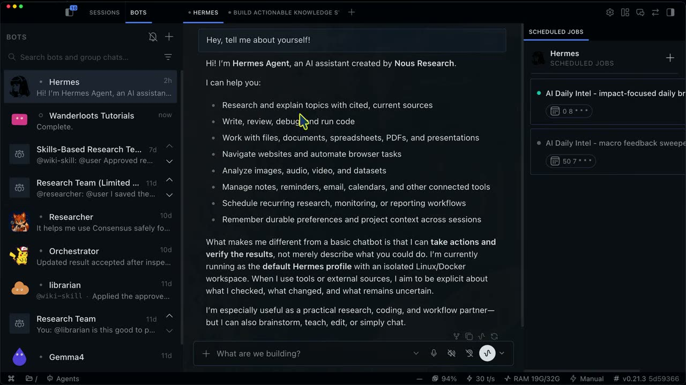
*16:00 the **BOTS** tab lists bots and group chats: Hermes, Wanderloots Tutorials,
Skills-Based Research Team, Research Team (Limited tools), Researcher, Orchestrator,
librarian, Research Team, Gemma4.*

- **Default Hermes bot** introduces itself: research with cited sources; write/debug/run code;
  files, PDFs, and presentations; browser automation; image/audio/video/dataset analysis;
  notes/email/calendar tools; scheduled workflows; durable preferences. It is "running as the
  default Hermes profile with an isolated Linux/Docker workspace."
- **Right panel, SCHEDULED JOBS:** "AI Daily Intel – impact-focused daily br…" `0 8 * * *` and
  "AI Daily Intel – macro feedback sweep…" `50 7 * * *`.

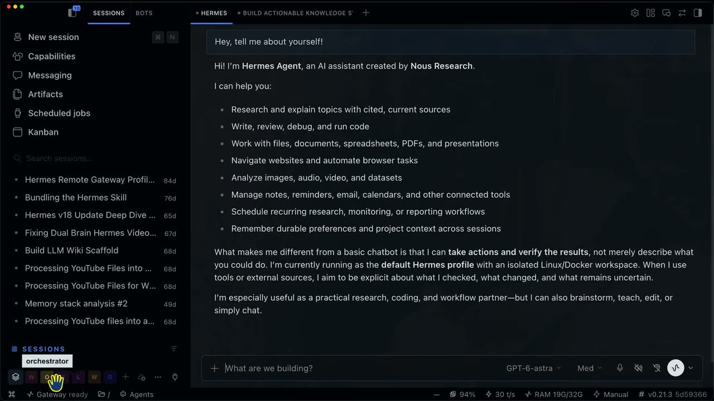
*16:31 hovering the bottom-left profile strip (W, O, R, L, W, G icons) shows
"orchestrator". This profile's composer uses `GPT-6-astra` at Med.*

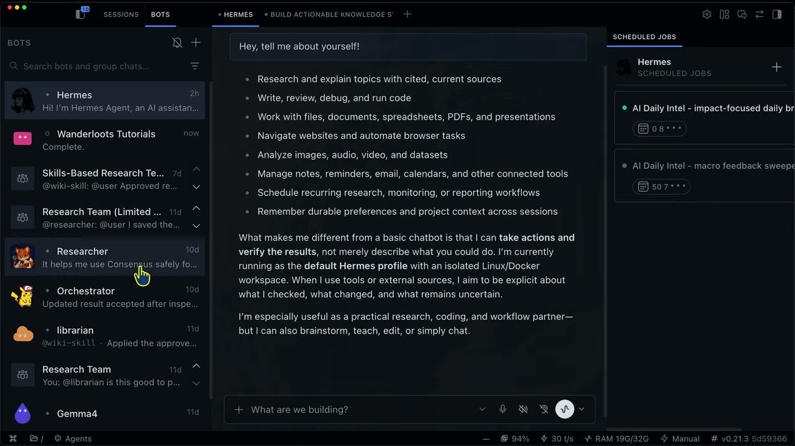
*16:40 "Wanderloots / Agent Roster" cards:*

| | Researcher (01, Evidence specialist) | Librarian (02, Knowledge steward) | Orchestrator (03, Outcome owner) |
|---|---|---|---|
| Core purpose | Turn a decision question into an evidence-backed recommendation | Turn sources into connected knowledge ready for human review | Turn an outcome into the smallest workable plan, and see it through |
| Skills | Source discovery, critical analysis, source assessment, evidence packaging | Extraction, citation, semantic linking, deduplication, independent source checks | Scope, routing, delegation, synthesis, acceptance criteria, final outcome review |
| Tools | Web/browser, files, academic & reference tools when connected | Library commands, source readers, Zotero preservation (separately approved) | Agent messaging, goals, Kanban ("use the simplest control the task needs") |
| Task context | Task brief, project docs, current sources, existing references | Existing library, source index, your notes, curation criteria | Outcome, constraints, acceptance criteria, agent roster, task state, returned evidence |
| Memory | Built-in preferences + task continuity; external optional/advisory | Built-in preferences + workflow continuity; library content kept out of external memory by default | Built-in preferences + planning continuity; optional Hindsight (advisory) |
| Delivers | Cited report + research package ("does not approve publication") | Connected candidates + review evidence ("you approve Wiki admission") | Owned plan + consolidated, reviewable result ("preserves human approval") |

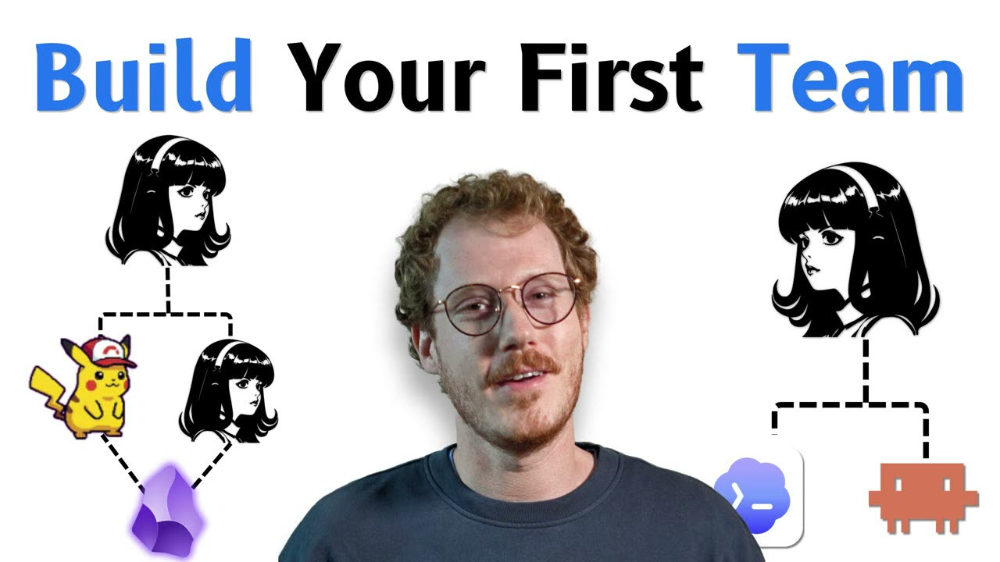
*17:42 the group chat "Skills-Based Research Team" (3 bots).*

- **The exchange:** a bot posts a completed proposal for a new wiki concept page
  (`concepts/agentic-memory-poisoning.md`) with SHA-256, schema, tag, and wikilink validation,
  and asks for approve / reject / revise / defer. The user writes "@librarian approve, please
  proceed". The librarian reports the revision applied, the index/backlinks/log updated, and
  post-write validation passed.
- **Composer hint:** "@name to direct, @everyone for all".

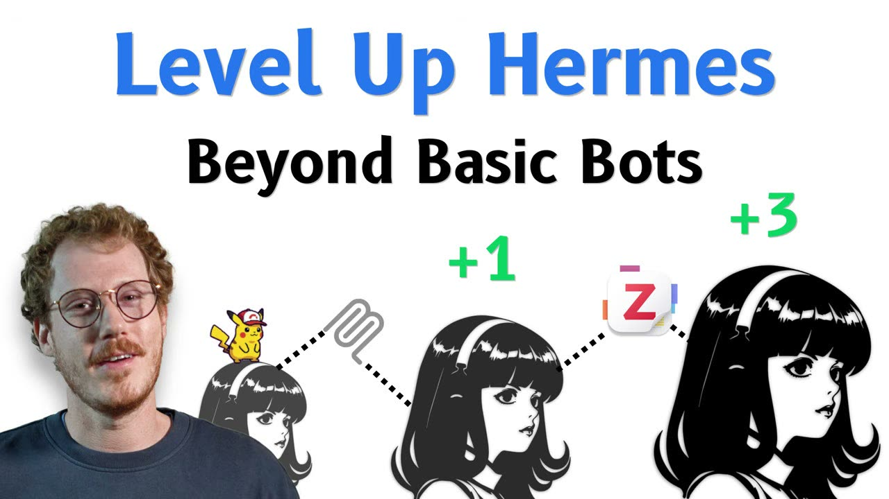
*17:52 from the previous video's researcher upgrade, "Choose your research lens": Balanced,
Current reality, Academic, Combined. The researcher checks academic and state-of-the-art
sources and corroborates the two.*

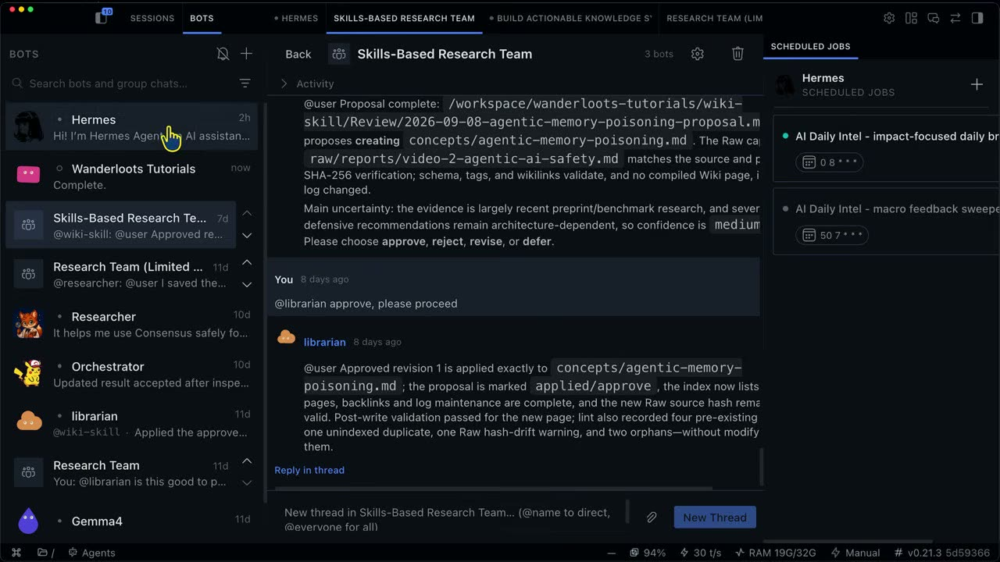
*18:03 the **New group chat** dialog: "Pick 2–6 bots. Local memberships sync through each Bot
profile; cross-machine members stay scoped to this room." Fields: bot list (@hermes,
@wanderloots-tutorials, @researcher, @orchestrator, @wiki-skill, @librarian), avatar
Upload/Generate, Group name, Create Group.*

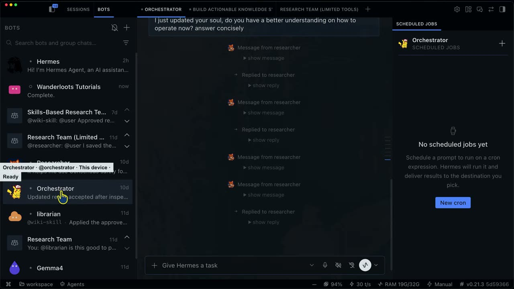
*18:19 Obsidian canvas "4 — Governed Quality Loop (Canonical)":*

1. USER defines the outcome.
2. ORCHESTRATOR sets outcome, acceptance criteria, owner, and stop condition.
3. RESEARCHER produces research + citations as a Markdown working artifact.
4. ORCHESTRATOR REVIEW asks: relevant? complete? citations inspectable? uncertainty honest? If
   not, ONE REPAIR: the researcher fixes one concrete defect.
5. USER APPROVAL authorizes the Librarian handoff.
6. LIBRARIAN moves Raw → Review, with no Wiki write yet.
7. FINAL HUMAN DECISION: "Working research ≠ accepted evidence ≠ canonical knowledge".

*Note on the canvas: if a room send hits its relay limit, continue with a fresh user turn.
"Video 3 adds Kanban for durable workflow state."*

- **Roles in this graph:**
  - **Orchestrator:** the one Callum messages, his "human proxy".
  - **Researcher:** investigates.
  - **Librarian:** files *approved* research into the Obsidian LLM wiki.
- **Nodes:** each node in a graph can be a single agent, an action, or a bundle, e.g. an agent
  loop inside a bigger macro loop.
- **Key limitation:** group chats stop after **three back-and-forth rounds** and check with the
  user.

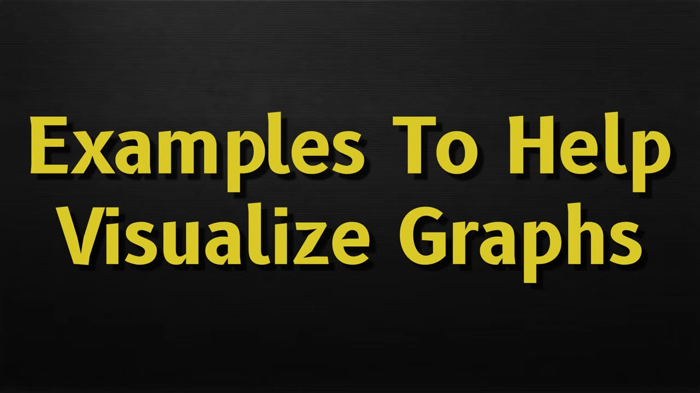
*18:58 You → message → Group chat room → Bot A / Bot B / Bot C.*

- Bots "reply or pass", "mention Bot B/C", "mention You for a decision".
- "up to 3 serial rounds".
- "silent round or 10 messages: settle" → Settled room.

## 9. Examples to help visualize graphs (18:57–22:27)

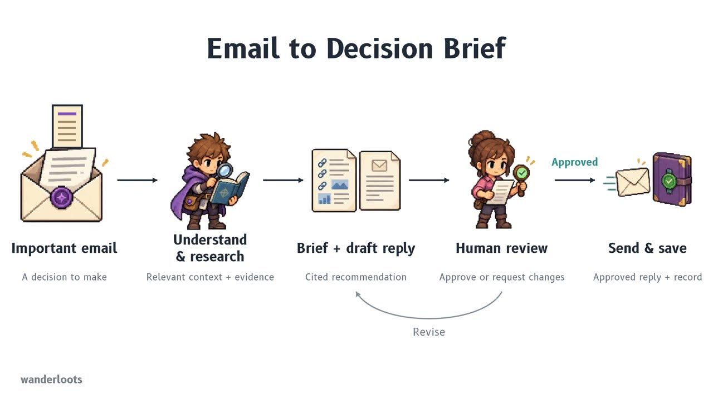
*Important email (a decision to make) → Understand & research (context + evidence) → Brief +
draft reply (cited recommendation) → Human review (approve or request changes; "Revise" loops
back) → Approved → Send & save (reply + record).*

- **Email example:** the email triggers the researcher, which drafts a brief and reply, then
  hands off for review. This is a **human-in-the-loop** loop.
- **Sending:** whether the agent may send or you click the button is your choice.

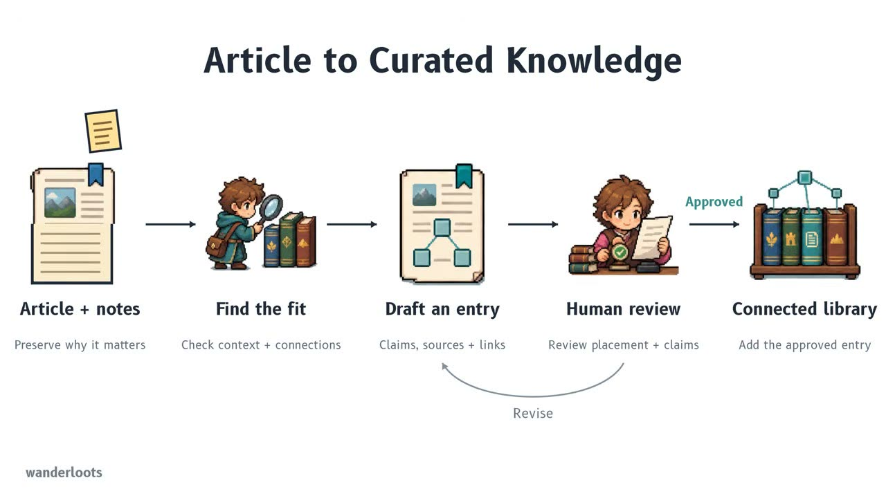
*Article + notes (preserve why it matters) → Find the fit (check context + connections) →
Draft an entry (claims, sources + links) → Human review (placement + claims; "Revise" loops
back) → Approved → Connected library (add the approved entry).*

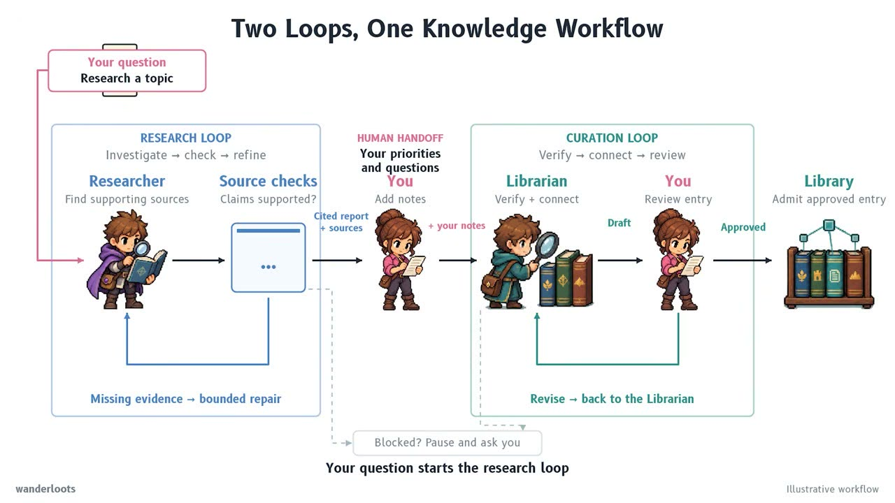
*"Two Loops, One Knowledge Workflow".*

1. **Research loop** (investigate → check → refine). *Your question* → Researcher (find
   supporting sources) → Source checks ("claims supported?"; missing evidence → bounded
   repair).
2. **Human handoff.** You add your priorities, questions, and notes to the cited report +
   sources.
3. **Curation loop** (verify → connect → review). Librarian (verify + connect) → You (review
   entry; Revise → back to the Librarian) → Library (admit approved entry).
4. "Blocked? Pause and ask you."

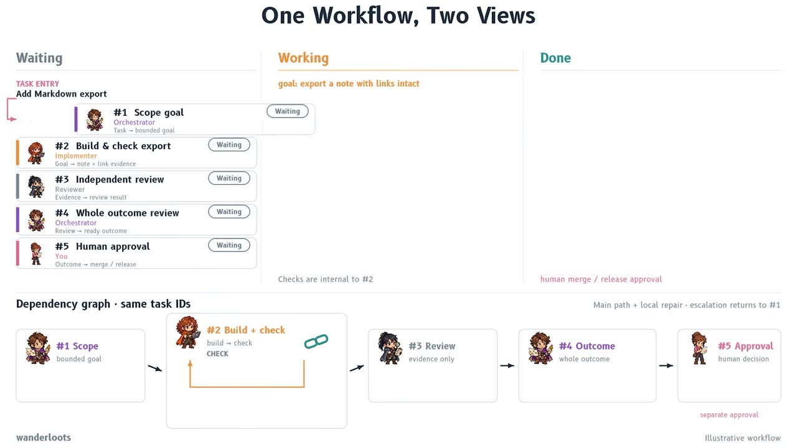
*"One Workflow, Two Views". A **board view** (Waiting / Working / Done) and a **dependency
graph** use the same task IDs for "Add Markdown export":*

1. Scope goal (Orchestrator)
2. Build & check export (Implementer; "checks are internal to #2")
3. Independent review (Reviewer)
4. Whole outcome review (Orchestrator)
5. Human approval (You: merge/release)

*"Main path + local repair · escalation returns to #1 · separate approval."*

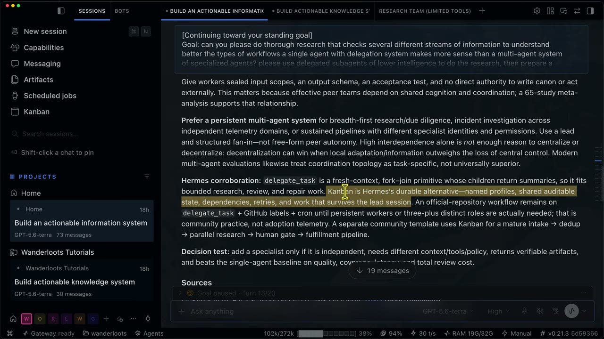
*Coding example, "A Goal Within a Larger Graph". Your task → Orchestrator (understand +
delegate) → **GOAL** "Export a note with links intact": Implementer (build + repair) ⇄ Checks
("links preserved?"; Fail → repair within budget). Then Pass → Reviewer (independent review) →
Pass → Orchestrator (whole outcome) → Ready → You (merge/release). "Changes needed / outcome
gap" and "Blocked / budget reached" return to the Orchestrator.*

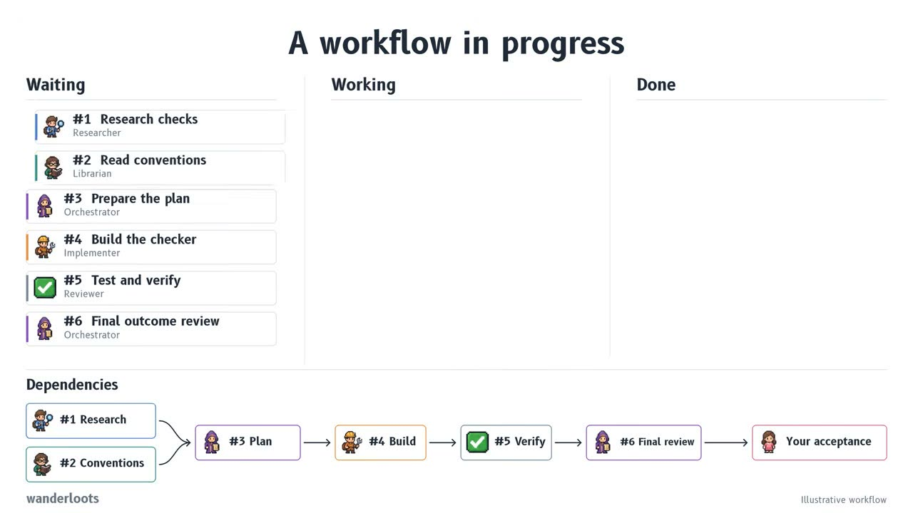
*"A workflow in progress". Six cards wait: #1 Research checks (Researcher), #2 Read
conventions (Librarian), #3 Prepare the plan (Orchestrator), #4 Build the checker
(Implementer), #5 Test and verify (Reviewer), #6 Final outcome review (Orchestrator). The
dependency graph: #1 + #2 → #3 → #4 → #5 → #6 → your acceptance.*

- **Why Kanban (from the goal output):** the earlier Hermes corroboration described Kanban as
  the durable alternative, with named profiles, shared state, dependencies, retries, and work
  that outlives the lead session.
- **What that means in practice:** it's easy to start, stop, add, and modify tasks. Hence
  "task graph".

## 10. Kanban vs delegated subagents (22:27–24:15)

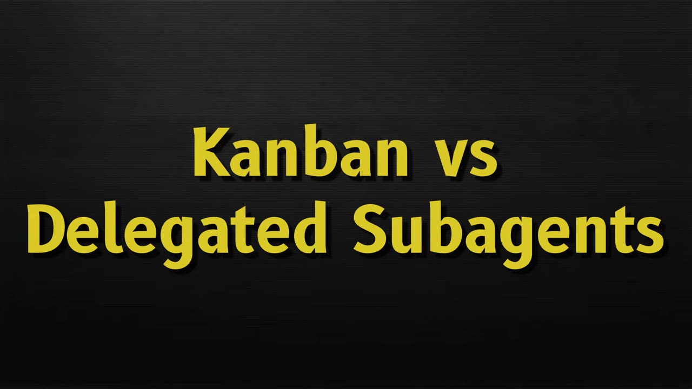
*The Hermes docs table ("They look similar; they are not the same primitive"):*

| | `delegate_task` | Kanban |
|---|---|---|
| Shape | RPC call (fork → join) | Durable message queue + state machine |
| Parent | Blocks until child returns | Fire-and-forget after `create` |
| Child identity | Anonymous subagent | Named profile with persistent memory |
| Resumability | None; failed = failed | Block → unblock → re-run; crash → reclaim |
| Human in the loop | Not supported | Comment / unblock at any point |
| Agents per task | One call = one subagent | N agents over the task's life (retry, review, follow-up) |
| Audit trail | Lost on context compression | Durable rows in SQLite forever |
| Coordination | Hierarchical (caller → callee) | Peer: any profile reads/writes any task |

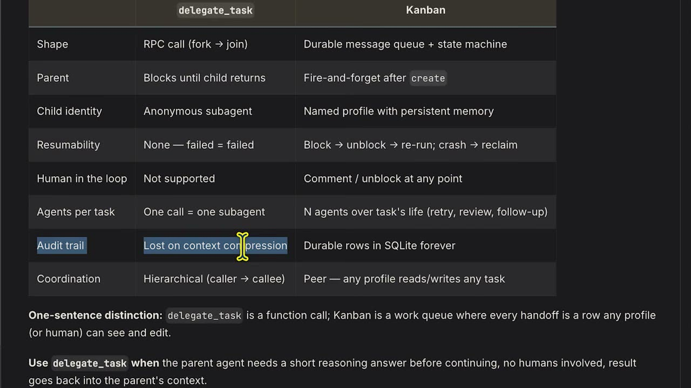
*"One-sentence distinction: `delegate_task` is a function call; Kanban is a work queue where
every handoff is a row any profile (or human) can see and edit."*

- **Use `delegate_task`** when the parent needs a short reasoning answer before continuing,
  with no humans involved and the result going back into the parent's context.
- **Use Kanban** when work crosses agent boundaries, must survive restarts, might need human
  input, might be picked up by another role, or must be discoverable later.
- **They coexist:** a Kanban worker may call `delegate_task` internally.

Callum's narration of the table:

- The parent is blocked in delegation, but can "set the agent off" with Kanban.
- A named profile has persistent memory, where a subagent is anonymous.
- A failed subagent is simply "incomplete", while Kanban cards can be blocked, unblocked, and
  re-run from where they stopped.
- Subagent steering is feedback, not a true human gate. Kanban can block a task until you say
  go.
- Delegation context is lost when the parent's context compresses. Kanban keeps it in SQLite.

## 11. Enabling and testing Hermes Kanban (24:15–26:39)

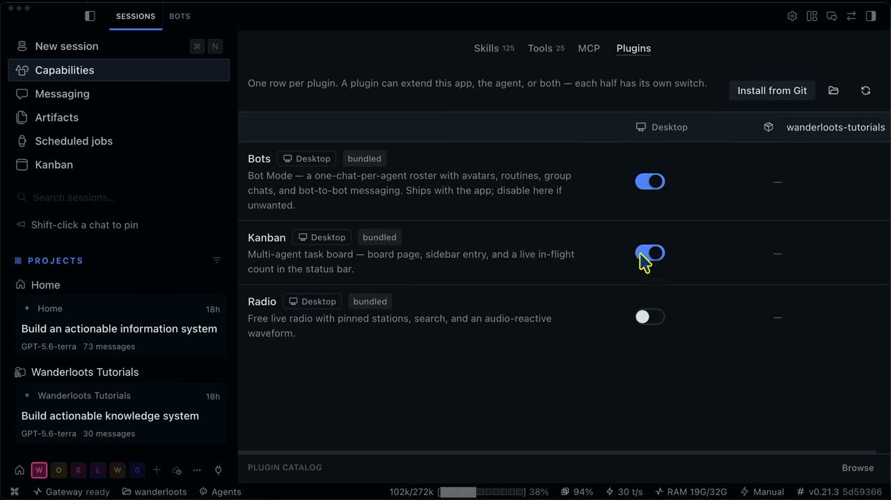
*24:32 **Capabilities → Plugins**: "One row per plugin. A plugin can extend this app, the
agent, or both — each half has its own switch."*

- **Bundled desktop plugins:**
  - **Bots** (on): "Bot Mode — a one-chat-per-agent roster with avatars, routines, group
    chats, and bot-to-bot messaging."
  - **Kanban** (turn on): "Multi-agent task board — board page, sidebar entry, and a live
    in-flight count in the status bar."
  - **Radio** (off): "Free live radio…".
- **Other controls:** "Install from Git", and a Plugin Catalog "Browse".
- **Result:** enabling Kanban adds it to the sidebar.

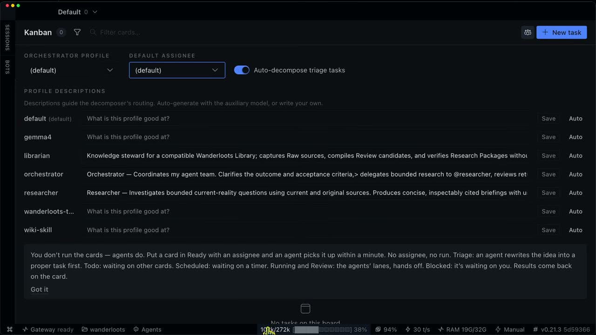
*The first-run lane guide: "You don't run the cards — agents do. Put a card in Ready with an
assignee and an agent picks it up within a minute. No assignee, no run. Triage: an agent
rewrites the idea into a proper task first. Todo: waiting on other cards. Scheduled: waiting on
a timer. Running and Review: the agents' lanes, hands off. Blocked: it's waiting on you.
Results come back on the card."*

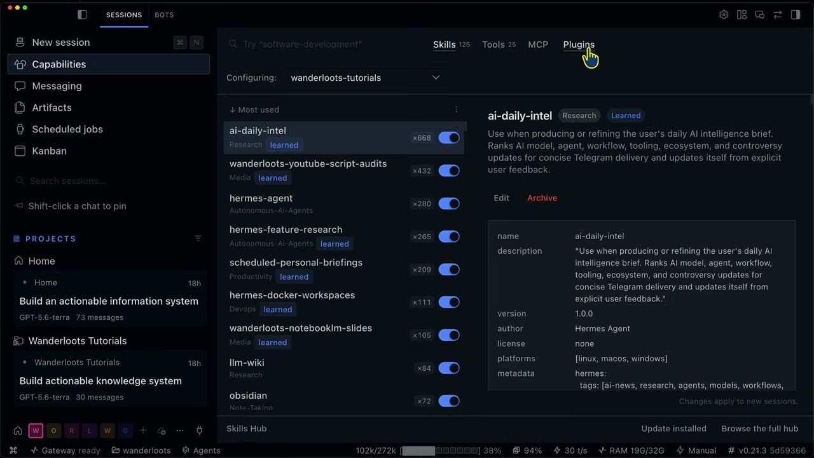
*Columns: TRIAGE · TODO · SCHEDULED · READY · RUNNING · BLOCKED · REVIEW · DONE. Triage tooltip:
"Raw ideas — a specifier fleshes out the spec."*

Column meanings as narrated:

| Column | Meaning |
|---|---|
| **Triage** | Raw idea. The **specifier** turns it into a proper task, and it may be auto-decomposed. |
| **To-do** | Waiting on dependencies, or unassigned. The dispatcher won't send unassigned tasks. |
| **Scheduled** | Runs at a set time (e.g. "check the latest emails; if X arrived, run the next task"). |
| **Ready** | Dependencies satisfied and a profile assigned; the dispatcher runs it. |
| **Running** | Claimed by a worker. |
| **Blocked** | Waiting for human input (human in the loop). |
| **Review** | A designated review agent checks the work. |
| **Done** | Completed. |

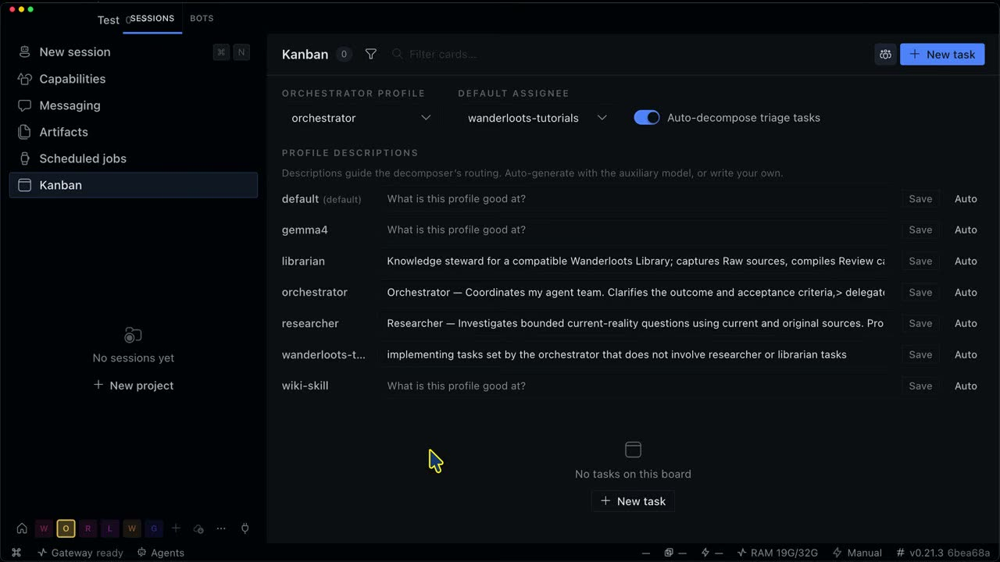
*Ready tooltip: "Dependencies satisfied — assign a profile and the dispatcher runs it."*

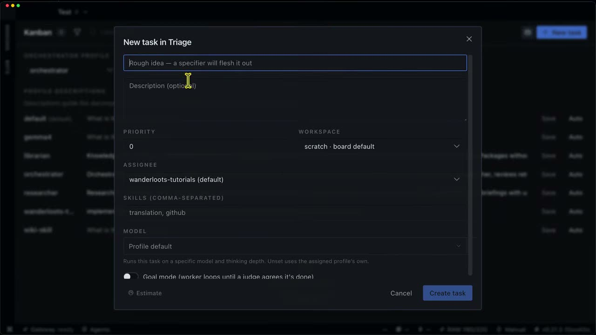
*"New task in Triage" fields: title ("Rough idea — a specifier will flesh it out"), Description
(optional), PRIORITY `0`, WORKSPACE `scratch · board default`, ASSIGNEE `wanderloots-tutorials
(default)`, SKILLS (comma-separated) `translation, github`, MODEL `Profile default` ("Runs this
task on a specific model and thinking depth. Unset uses the assigned profile's own."), **Goal
mode** toggle ("worker loops until a judge agrees it's done"), **Estimate**, Cancel / Create
task.*

**Test task.**

- **Setup:** "test task", assignee `wanderloots-tutorials`, auto-decompose on.
- **What happened:** within a minute the dispatcher handed it to the auto-decomposer, which
  produced a "clarify the scope" task. That task went to **Blocked**, because the card had no
  body and no clear outcome. This is where the human in the loop comes in.

## 12. Dispatcher, specifier & auto-decomposer (26:39–28:47)


*Docs, "Gateway-embedded dispatcher (default)".*

- The dispatcher runs **inside the gateway process**, with nothing extra to install. Ready
  tasks are picked up on the next tick (**60 s** by default).
- Config:

  ```yaml
  kanban:
    dispatch_in_gateway: true        # default
    dispatch_interval_seconds: 60    # default
    review_dispatch: true            # default: spawn the assigned profile with the bundled review skill; false for human-only review boards
  ```

- Runtime override: `HERMES_KANBAN_DISPATCH_IN_GATEWAY=0`. Start with `hermes gateway start`
  or a systemd user unit. Without a gateway, ready tasks wait, and `hermes kanban create`
  warns about this.
- The standalone `hermes kanban daemon` is **deprecated**. A `--force` escape hatch exists for
  one release. Running both against the same `kanban.db` causes claim races.
- The next section, "Idempotent create", shows `hermes kanban create "nightly ops review"
  --assignee ops --idempotency-key "nightly-ops-$(date -u +%Y-%m-%d)" --json`.

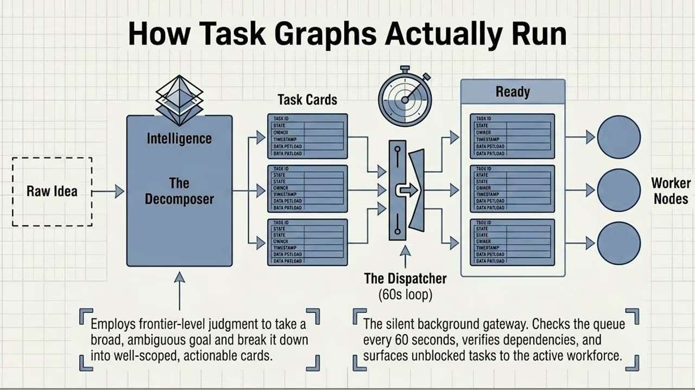
*"How Task Graphs Actually Run": Raw Idea → **Intelligence / The Decomposer** ("employs
frontier-level judgment to take a broad, ambiguous goal and break it down into well-scoped,
actionable cards") → Task Cards (TASK ID, STATE, OWNER, TIMESTAMP, payload) → **The Dispatcher
(60s loop)** ("the silent background gateway; checks the queue every 60 seconds, verifies
dependencies, and surfaces unblocked tasks to the active workforce") → Ready → Worker Nodes.*

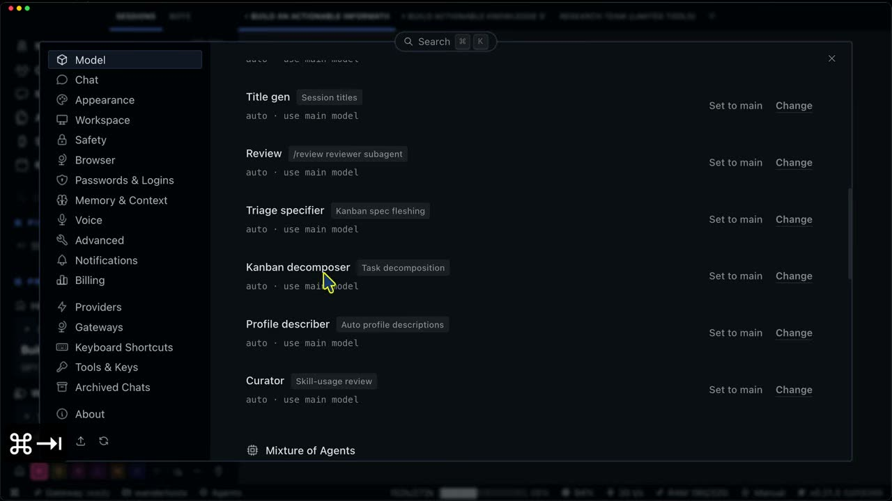
*Settings → Model, auxiliary rows. Each is "auto · use main model", with *Set to main* and
*Change*:*

| Row | Purpose |
|---|---|
| Title gen | Session titles |
| Review | `/review` reviewer subagent |
| **Triage specifier** | Kanban spec fleshing |
| **Kanban decomposer** | Task decomposition |
| Profile describer | Auto profile descriptions |
| Curator | Skill-usage review |

*A "Mixture of Agents" section follows.*

- **Two Kanban auxiliaries:** the **triage specifier** rewrites the idea as a better task, and
  the **Kanban decomposer** breaks that task into a graph.
- **Model choice:** the specifier can be lightweight ("text explaining text"). The decomposer
  deserves a powerful model, e.g. **GPT-6 Astra**, while the worker profile
  (`wanderloots-tutorials`) stays on Terra.
- **Cost logic** (from the docs, [§14](#14-kanban-orchestration-settings-29403031)):
  decomposition needs frontier judgment; executing a well-specified card doesn't, and workers
  are where most tokens go.

## 13. Project boards (28:47–29:40)

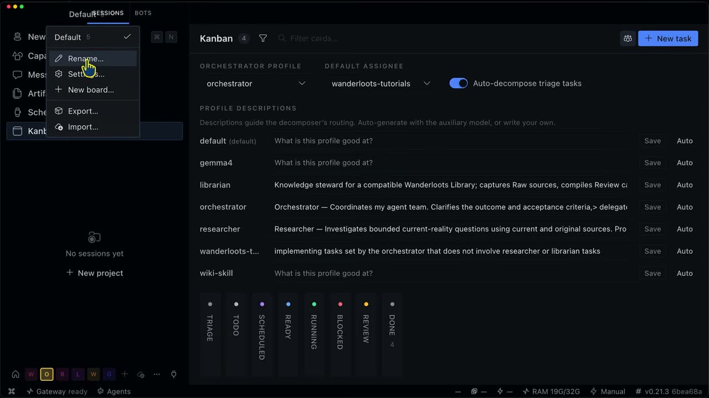
*28:55 the board dropdown (top-left, "Default 5"): **Rename…**, **Settings…**, **New board…**,
**Export…**, **Import…**. A "test" board is created.*

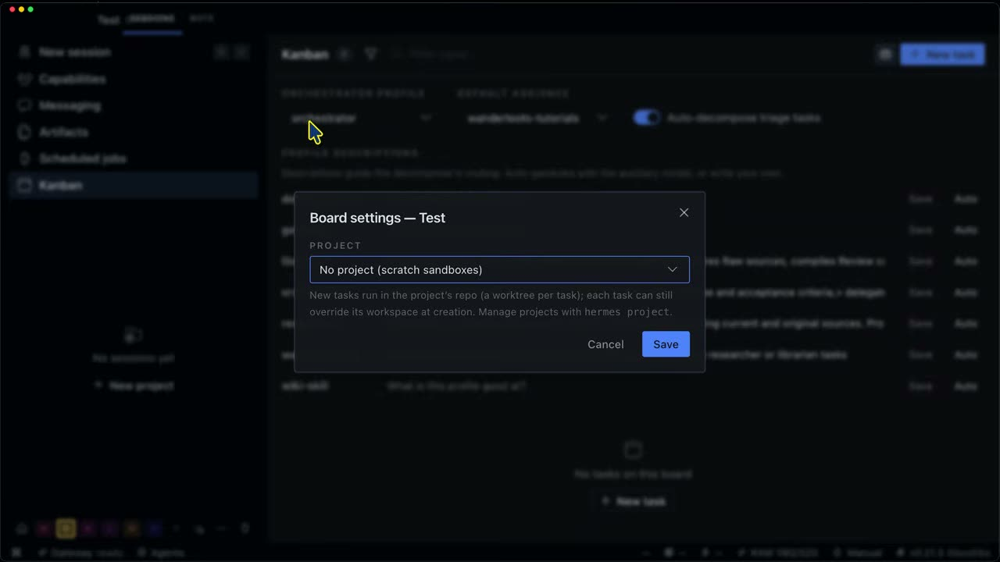
*"Board settings — Test": PROJECT `No project (scratch sandboxes)`. "New tasks run in the
project's repo (a worktree per task); each task can still override its workspace at creation.
Manage projects with `hermes project`."*

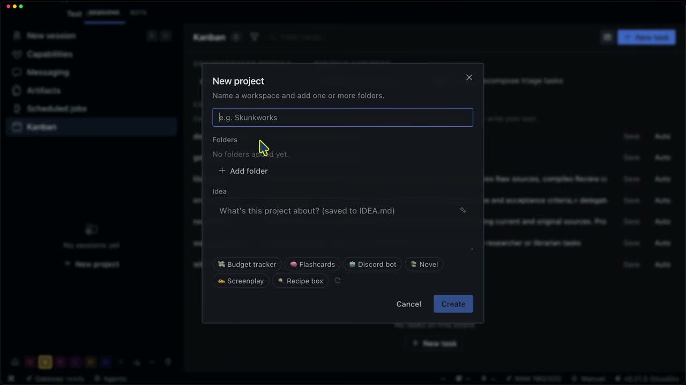
*"New project: Name a workspace and add one or more folders." Fields: name (e.g. "Skunkworks"),
Folders (+ Add folder), Idea ("What's this project about? (saved to IDEA.md)"), with starter
chips: Budget tracker, Flashcards, Discord bot, Novel, Screenplay, Recipe box.*

- **Why projects:** boards can be tied to projects, e.g. an *admin* project (email), a
  *research* project, or a particular *coding* project/app. Each keeps its context and its own
  board, graph, settings, and operations.

## 14. Kanban orchestration settings (29:40–30:31)

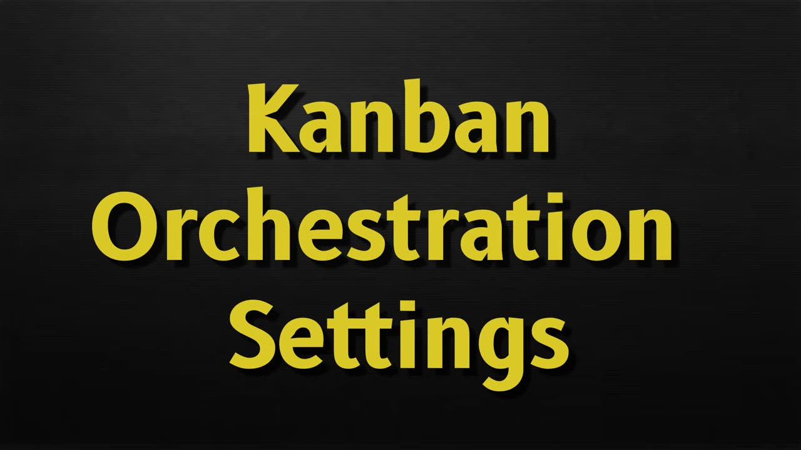
*Docs, "Cost strategy: frontier orchestrator, inexpensive workers".*

- Per-profile configs make the planner/worker cost split natural.
- Each profile has `~/.hermes/profiles/<name>/config.yaml`, and the dispatcher injects the
  profile-scoped `HERMES_HOME` when it spawns `hermes -p <assignee>`:

  ```yaml
  # ~/.hermes/config.yaml (orchestrator / dispatcher profile)
  model:
    default: "your-frontier-model"
  # ~/.hermes/profiles/coder/config.yaml (worker profile)
  model:
    default: "your-inexpensive-model"
  ```

- **Per-task override:** `--model`/`--provider` at create time, `hermes kanban set-model`, or
  the dashboard dropdown.
- **Lifecycle plugin hooks:**
  - The hooks are `kanban_task_claimed` (fires in the dispatcher process), and
    `kanban_task_completed` / `kanban_task_blocked` (fire in the worker process).
  - Each carries `task_id` and `profile_name`.
  - They fire after the DB commit.

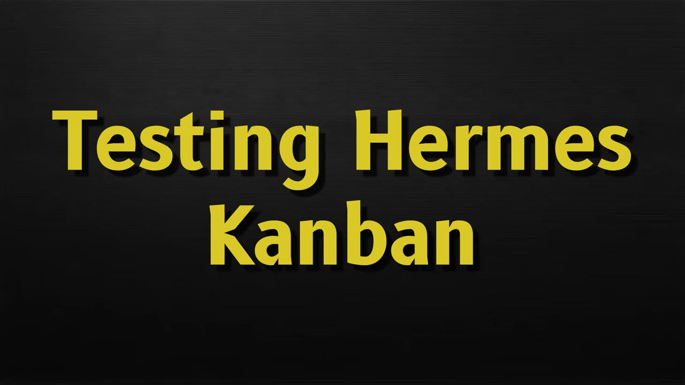
*The orchestration settings panel (people icon, top-right of the board):*

- **Orchestrator profile:** `orchestrator` (was `(default)`). The agent that decides which
  agent gets which task.
- **Default assignee:** `wanderloots-tutorials`.
- **Auto-decompose triage tasks** toggle.
- **Profile descriptions:** "Descriptions guide the decomposer's routing. Auto-generate with
  the auxiliary model, or write your own." Each row has Save / Auto:
  - `librarian`: "Knowledge steward for a compatible Wanderloots Library; captures Raw
    sources, compiles Review candidates, and verifies Research Packages without admission
    authority."
  - `orchestrator`: "Coordinates my agent team. Clarifies the outcome and acceptance criteria,
    delegates bounded research to @researcher, reviews returned work…"
  - `researcher`: "Investigates bounded current-reality questions using current and original
    sources. Produces concise, inspectably cited briefings with uncertainty,
    counterevidence…"
  - `wanderloots-tutorials`: "implementing tasks set by the orchestrator that does not
    involve researcher or librarian tasks"
  - `default`, `gemma4`, `wiki-skill`: empty ("What is this profile good at?").

- **Future plan:** Callum would add a dedicated *implementer* profile, analogous to the
  researcher and librarian.

## 15. Kanban setup: research example (30:31–32:20)

- **Setup:** new task "Multi-agent research" with the same prompt, auto-decompose on. The
  assignee is left as `wanderloots-tutorials` on purpose, to see whether the decomposer spots
  that it's a research task.
- **Priority** orders multiple tasks.
- **Per-card options:** Workspace, Skills, and Model can be set per card.
- **Goal mode** gives that worker a self-contained goal loop, separate from any chat `/goal`.

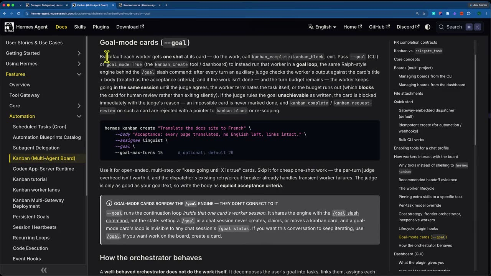
*Docs, "Goal-mode cards (`--goal`)".*

- **How it works:** by default each worker gets one shot: do the work, call `kanban_complete`
  / `kanban_block`, and exit. With `--goal` (CLI) or `goal_mode=True` (tool/dashboard), the
  worker runs the same Ralph-style engine as `/goal`. After each turn an auxiliary judge
  checks the output against the card's title + body as acceptance criteria. The worker keeps
  going until the judge agrees, the worker ends the task, or the budget runs out, which
  **blocks** the card for human review.
- **Impossible goals:** a goal judged unachievable is blocked immediately.
  `kanban complete`/`request-review` are rejected on such cards.
- Example:

  ```bash
  hermes kanban create "Translate the docs site to French" \
    --body "Acceptance: every page translated, no English left, links intact." \
    --assignee linguist --goal --goal-max-turns 15   # default 20
  ```

- **When to use it:** for open-ended, "keep going until X" cards. Skip it for cheap one-shot
  work; the dispatcher's retry/circuit-breaker already covers transient failures.
- **Callout:** "Goal-mode cards borrow the `/goal` engine — they don't connect to it."

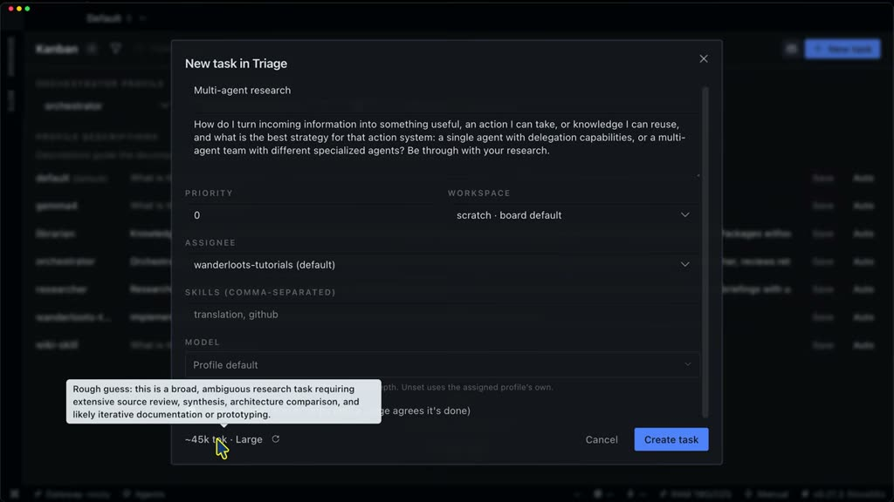

*The **Estimate** button, which makes a model call.*

- **First estimate:** "~45k tok · Large". Tooltip: "Rough guess: this is a broad, ambiguous
  research task requiring extensive source review, synthesis, architecture comparison, and
  likely iterative documentation or prototyping."
- **After adding** "Please limit your search to 5 sources and the output document to 500 words
  or less": "~18k tok · Medium". Tooltip: "reviewing the repository, researching up to five
  credible sources, comparing… and drafting a cited synthesis under 500 words."
- Callum calls this "a lightweight check ahead of time to make sure your task isn't going to
  blow through your whole quota."

## 16. Running the Kanban board (32:20–36:19)

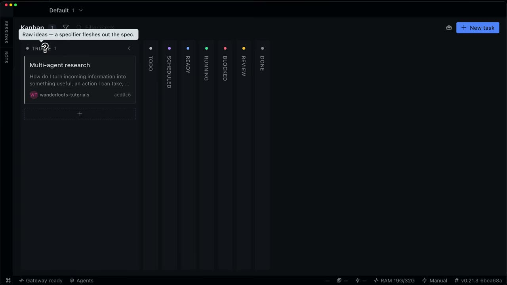
*The card lands in TRIAGE (1), card id `aed0c6`, assignee WT.*

- **Within ~1 minute:** the dispatcher ticks and the auto-decomposer splits the request into
  **two research tasks** plus a synthesis task. Each runs on its own.
- **Card detail:** clicking a card shows the prompt the auto-decomposer wrote, an effort
  estimate, and a comment box.
- **Messaging workers:** you can message the running worker. For big changes, message and
  **requeue** so it starts over.

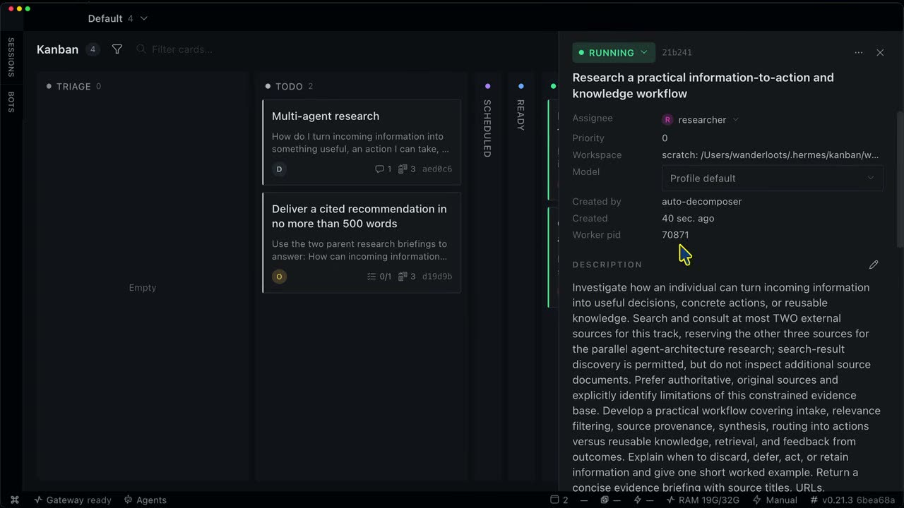
*32:50 running card `21b241`, "Research a practical information-to-action and knowledge
workflow".*

- **Card fields:** Assignee `researcher`; Priority 0; Workspace
  `scratch: /Users/wanderloots/.hermes/kanban/w…`; Model `Profile default`; **Created by
  `auto-decomposer`**; worker pid 70871.
- **Generated description:** consult **at most TWO external sources**, "reserving the other
  three sources for the parallel agent-architecture research". Cover intake, relevance
  filtering, provenance, synthesis, routing to actions vs knowledge, retrieval, and outcome
  feedback. Return a concise evidence briefing.
- **Todo column:** the root "Multi-agent research" card (D) and "Deliver a cited
  recommendation in no more than 500 words" (O, 0/1, `d19d9b`).

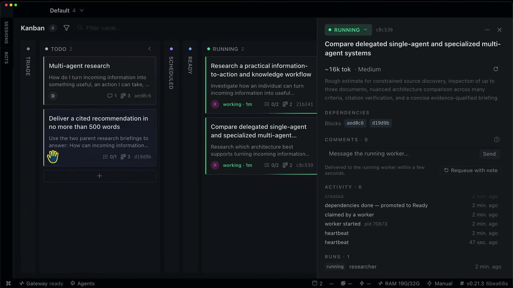
*33:30 running card `c8c539`, "Compare delegated single-agent and specialized multi-agent
systems".*

- **Estimate:** "~16k tok · Medium" ("constrained source discovery, inspection of up to three
  documents, …").
- **Dependencies:** Blocks `aed0c6`, `d19d9b`.
- **Comments:** "Message the running worker…" with Send ("Delivered to the running worker
  within a few seconds") and **Requeue with note**.
- **Activity:** created → dependencies done, promoted to Ready → claimed by a worker → worker
  started (pid 70873) → heartbeat ×n.
- **Runs:** running / researcher.

- **Reassignment:** the to-do card was assigned to `default`. Callum changed it to
  `orchestrator` in the drawer, and the card updated.
- **Beyond one card:** you can queue 5, 10, or 20 cards, schedule them, and declare
  dependencies. It makes the sub-agent delegation from the start "a lot more transparent and
  controllable", hence **control graph / task graph**.

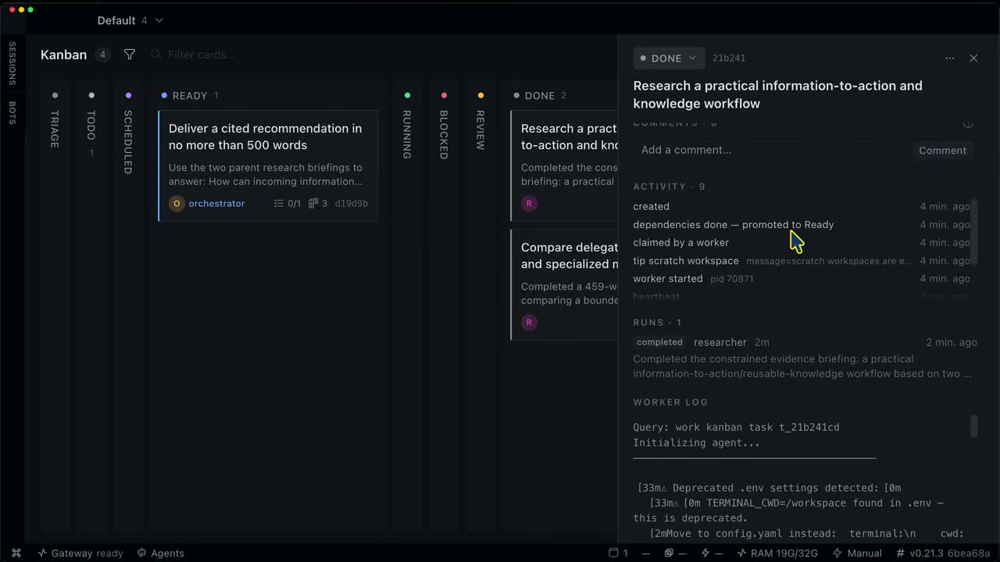
*34:45 DONE card `21b241`.*

- **Activity:** created → dependencies done, promoted to Ready → claimed by a worker → "tip
  scratch workspace" → worker started (pid 70871) → heartbeat…
- **Runs:** completed / researcher / 2m, "Completed the constrained evidence briefing…".
- **Worker log:** `Query: work kanban task t_21b241cd`, "Initializing agent...", and a warning
  about deprecated `.env` settings (`TERMINAL_CWD=/workspace` should move to `config.yaml`).
- It reviewed only **two** sources because of its two-source limit.

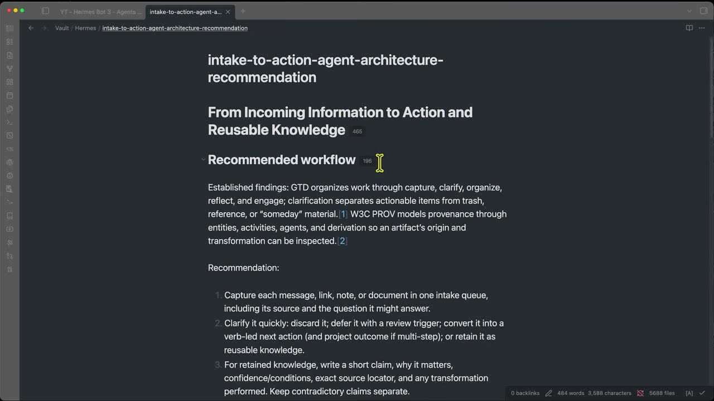
*DONE card `c8c539`.*

- **Activity (9 events):** worker started (pid 70873), heartbeats, completed.
- **Runs:** completed / researcher / 3m, "Completed a 459-word cited briefing comparing a
  bounded-delegation lead with a persistent specialist team…".
- **Worker log tail:** the worker's self-verification script, `assert len(entries)>=3 and
  len(entries)<=3`, `assert ids==set(entries)`, `assert len(t.split())<=500`, `assert
  p.exists() and p.stat().st_size>0`.

- **Unblocking the synthesis:** when both research tasks finish, the orchestrator's "Deliver a
  cited recommendation…" card moves **to-do → ready**. On the next 60 s tick the dispatcher
  moves it **ready → running**. When it finishes, the root "Multi-agent research" card wakes
  and delivers the report.
- **Caution:** it's important to be strategic about the tools, memory, context, and skills
  given to specialized agents. Autonomous graphs can burn quota if agents get more than they
  need.

## 17. Reviewing Kanban results & debrief (36:19–38:10)

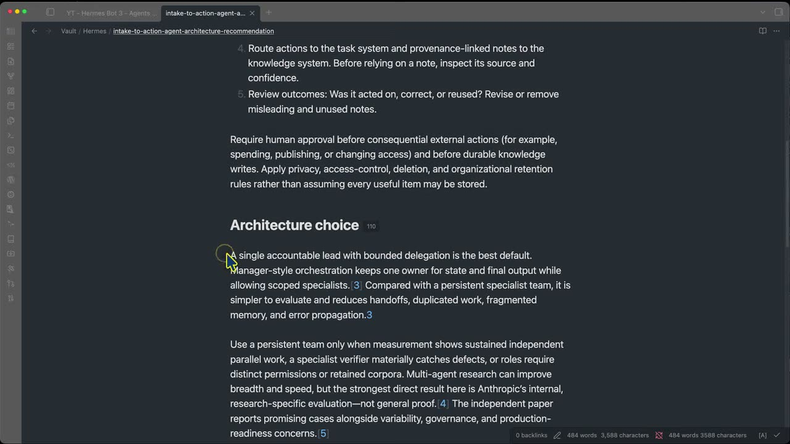
*The synthesis card's generated description.*

- **Required content:** 500 words TOTAL including headings and references; an
  intake-to-action/knowledge workflow; a compact architectural comparison; a default
  recommendation with conditions that would change it; one concrete example; success metrics;
  human approval for consequential actions and durable knowledge writes.
- **Evidence rules:** separate recommendations from findings; state evidence limits; use
  compact numbered references with URLs; verify word count and ≤ 5 distinct sources. "Return
  the document directly without performing implementation or durable storage."
- **Dependencies:** blocked by `21b241`, `c8c539`; blocks `aed0c6`.

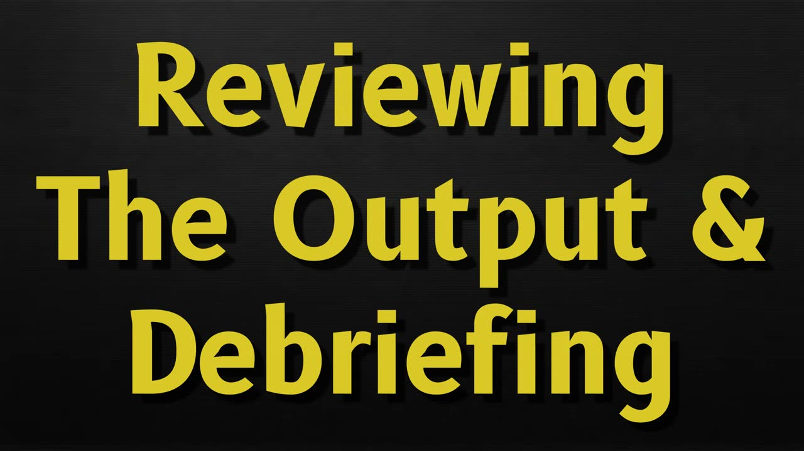
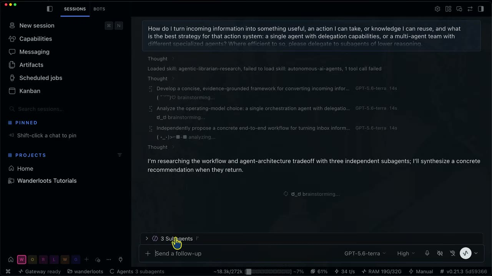
*The final report, opened as `Vault/Hermes/intake-to-action-agent-architecture-recommendation`
in Obsidian. Title "From Incoming Information to Action and Reusable Knowledge": **484 words**,
3,588 characters, ≤ 5 sources.*

- **Recommended workflow:** a GTD-style capture → clarify (discard / defer / next action /
  retain) → record retained knowledge with claim, why, confidence, exact source locator, and
  transformation → route actions and provenance-linked notes → review outcomes. Human approval
  comes before consequential external actions and durable writes. It cites GTD and W3C PROV.
- **Architecture choice:** "A single accountable lead with bounded delegation is the best
  default… Use a persistent team only when measurement shows sustained independent parallel
  work, a specialist verifier materially catches defects, or roles require distinct
  permissions or retained corpora." It cites Anthropic's research-specific evaluation, "not
  general proof".

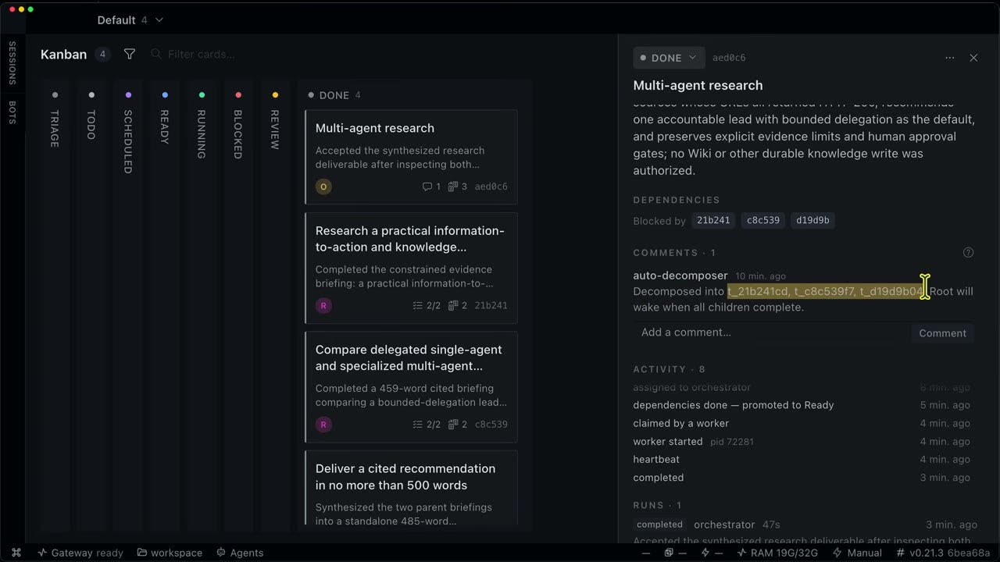
*Root card `aed0c6` (DONE), assignee orchestrator, created by `dashboard`.*

- **Comment from `auto-decomposer`:** "Decomposed into t_21b241cd, t_c8c539f7, t_d19d9b04.
  Root will wake when all children complete."
- **Summary:** it accepted the synthesized deliverable. The final is 485 words, uses exactly
  five sources whose URLs all returned HTTP 200, recommends one accountable lead with bounded
  delegation, and keeps explicit evidence limits and human approval gates. "No Wiki or other
  durable knowledge write was authorized."
- **Activity:** assigned to orchestrator → dependencies done, promoted to Ready → claimed →
  worker started (pid 72281) → completed. Runs: completed / orchestrator / 47s.

Debrief:

- **It worked,** but the orchestrator wrote the article. Callum would add an implementer or
  writer profile so the orchestrator only orchestrates.
- **Two researcher cards** were overkill for a 5-source limit and probably cost more tokens
  than needed.

## 18. Orchestrator decomposer (manual, not auto) (38:10–41:05)

- **Alternative:** turn **auto-decompose off** and let the **orchestrator profile** decompose.
- **Why:** the orchestrator has its own **SOUL** (instructions, team coordination, limits,
  connected memories). It has more context than the generic auto-decomposer. This is "curated
  mode", and cards can go straight to **Ready** instead of through Triage.

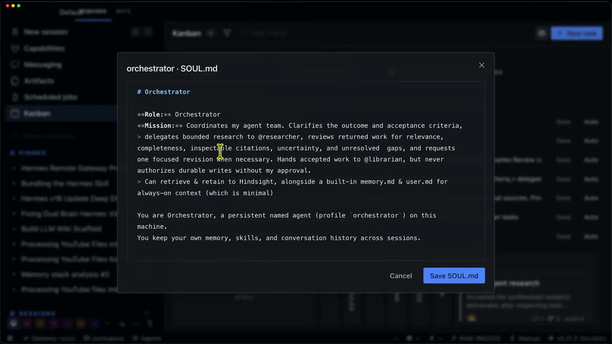
*Editing `orchestrator · SOUL.md` ("Save SOUL.md").*

- **Role:** Orchestrator.
- **Mission:** coordinates the agent team; clarifies outcome and acceptance criteria;
  delegates bounded research to @researcher; reviews returned work for relevance,
  completeness, inspectable citations, uncertainty, and unresolved gaps; requests one focused
  revision when necessary; hands accepted work to @librarian, "but never authorizes durable
  writes without my approval".
- **Memory:** retrieves and retains to **Hindsight**, alongside built-in `memory.md` and
  `user.md` (minimal always-on context).
- **Identity:** "You are Orchestrator, a persistent named agent (profile `orchestrator`) on
  this machine. You keep your own memory, skills, and conversation history across sessions."

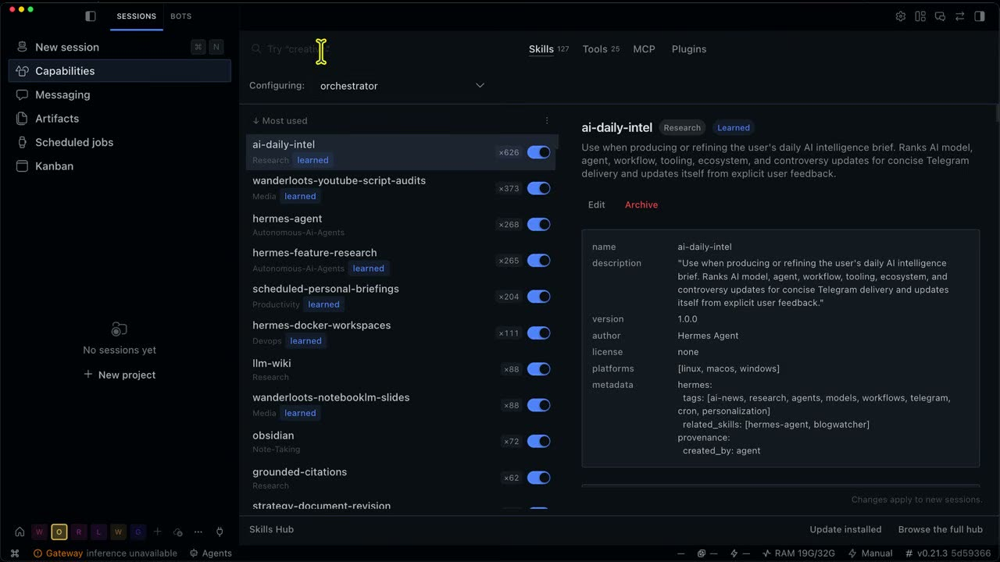
*Capabilities → **Skills 127** for `orchestrator`, "Most used" (★ = learned by the agent):*

- ai-daily-intel ★ ×626
- wanderloots-youtube-script-audits ★ ×373
- hermes-agent ×268
- hermes-feature-research ★ ×265
- scheduled-personal-briefings ★ ×204
- hermes-docker-workspaces ★ ×111
- llm-wiki ×88
- wanderloots-notebooklm-slides ★ ×88
- obsidian ×72
- grounded-citations ×62

*The detail pane shows the skill frontmatter (name, description, version 1.0.0, author Hermes
Agent, platforms linux/macos/windows, tags, `related_skills`, `provenance: created_by:
agent`). "Skills Hub · Changes apply to new sessions · Update installed · Browse the full
hub".*

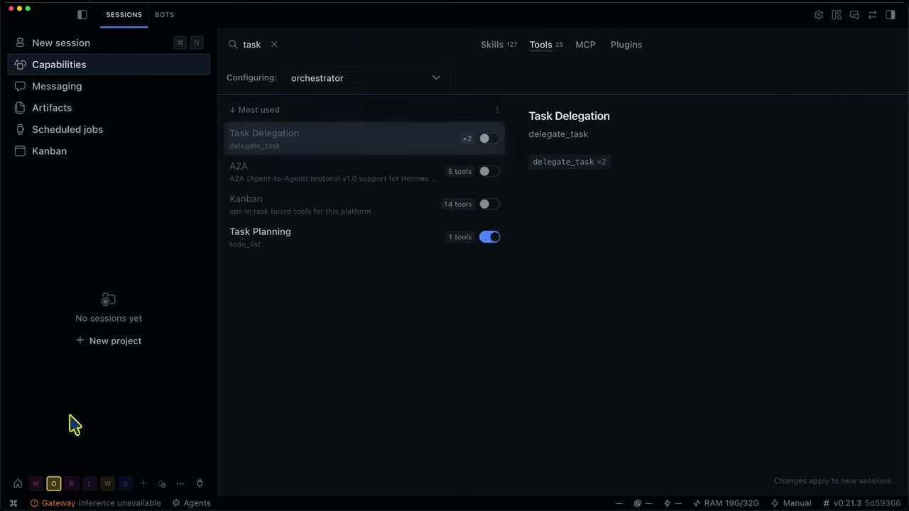
*Capabilities → Tools (search "task"), configuring `orchestrator`.*

- **Task Delegation** (`delegate_task`, ×2): turned **off**, so this profile can't spawn
  subagents.
- **A2A**: "Agent-to-Agent protocol v1.0 support for Hermes", 5 tools.
- **Kanban**: "opt-in task board tools for this platform", **14 tools**. Turned **on**, so the
  orchestrator runs the board.
- **Task Planning**: `todo_list`, 1 tool, on.

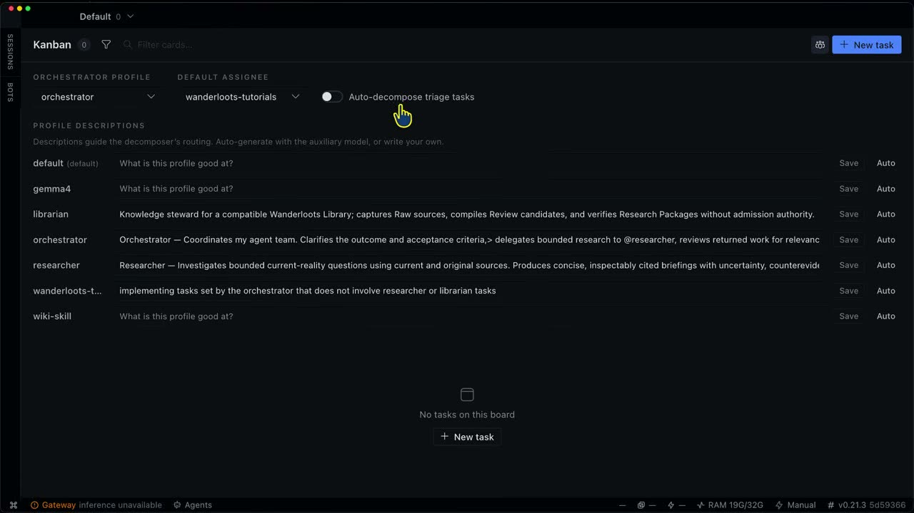
*Board settings: Orchestrator profile `orchestrator`, default assignee `wanderloots-tutorials`,
**Auto-decompose triage tasks: off**.*

- **Auto vs curated:** automatic decomposition "buys you convenience". Your own planner
  profile gives "more deliberate control over the task design, the roles, and the review".
  Neither is necessarily cheaper.
- **The real benefit is continuity:** return tomorrow, see what's blocked, inspect handoffs,
  and resume without rebuilding the conversation.
- **Roles:** the orchestrator *plans*, the dispatcher *starts*, the worker *executes*. Cards
  are work units, not necessarily separate agents. A card can use helpers or hold its own goal
  loop.
- **Operational gotcha:** with auto-decompose off, a new card left in **Triage sits forever**,
  because no auto-decomposer runs. Put it in **To-do** (then move it when ready), **Schedule**
  it, or drop it straight into **Ready** so the orchestrator decomposes it now.
- **Not shown:** Callum skipped running this route on camera. It was tested for the
  comparison.

## 19. Cost & quality comparison (41:05–42:04)

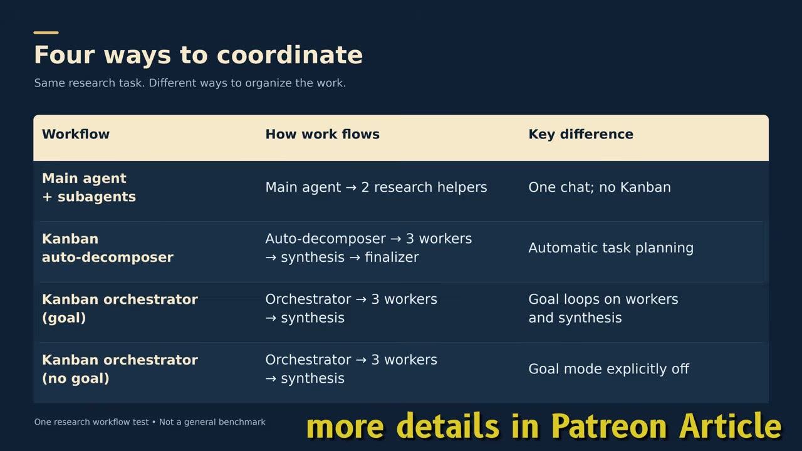

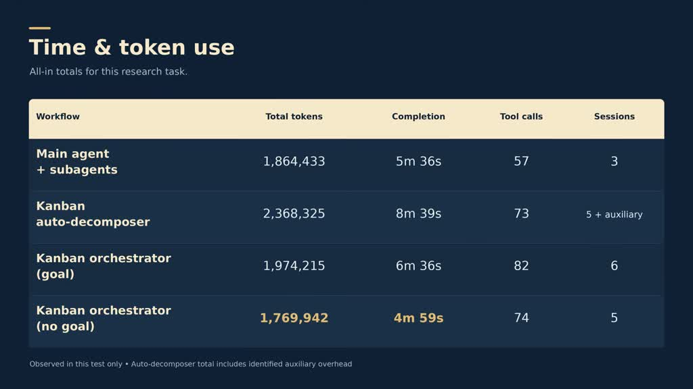

| Workflow | Total tokens | Completion | Tool calls | Sessions |
|---|---:|---:|---:|---:|
| Main agent + subagents | 1,864,433 | 5m 36s | 57 | 3 |
| Kanban auto-decomposer | 2,368,325 | 8m 39s | 73 | 5 + auxiliary |
| Kanban orchestrator (goal) | 1,974,215 | 6m 36s | 82 | 6 |
| **Kanban orchestrator (no goal)** | **1,769,942** | **4m 59s** | 74 | 5 |

*"Observed in this test only · Auto-decomposer total includes identified auxiliary overhead".*

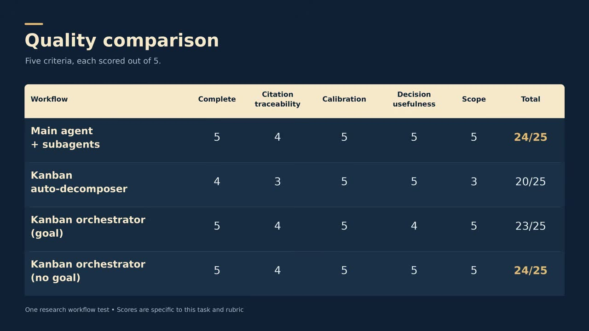

| Workflow | Complete | Citation traceability | Calibration | Decision usefulness | Scope | Total |
|---|:-:|:-:|:-:|:-:|:-:|:-:|
| Main agent + subagents | 5 | 4 | 5 | 5 | 5 | **24/25** |
| Kanban auto-decomposer | 4 | 3 | 5 | 5 | 3 | 20/25 |
| Kanban orchestrator (goal) | 5 | 4 | 5 | 4 | 5 | 23/25 |
| Kanban orchestrator (no goal) | 5 | 4 | 5 | 5 | 5 | **24/25** |

Callum's reading:

- For a *simple* task, single-agent delegation and the no-auto-decomposer orchestrator had
  similar tokens and quality. The auto-decomposer and goal loops added overhead.
- **It's not a benchmark.**
- Even if a Kanban run costs more tokens, the **transparency** (inspecting what was done) can
  be worth it.
- **Bottom line:** "Start with the simplest level that actually meets your needs," and add
  coordination only for a specific problem it solves.

Methodology caveats (single run per condition, shared history, non-identical prompts,
non-blind scoring) are in the [companion post](companion-post.md#4-what-can-and-cannot-be-concluded).

## 20. What's next (42:04–end)

- **Next video:** more complex workflows combining subagents, loops, and graphs, including
  more complex Kanban coding systems.
- **Poll:** viewers are asked which workflow to explore next.
