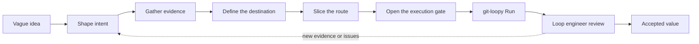
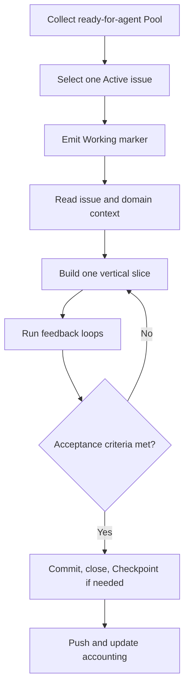

# Loop Engineering Workflow

> The complete path from a vague idea to accepted value. The loop engineer leads
> planning and review; git-loopy executes the ready work in bounded, observable
> Iterations.



The skills are composable, not a mandatory ceremony. A small, already-clear
change can begin at a well-written issue. Ambiguous or cross-cutting work should
move through the full path so intent, evidence, and decisions survive into each
fresh execution context.

## Planning phase: human-led

The loop engineer owns intent, domain language, issue slicing, acceptance
criteria, guardrails, and the decision to delegate. The planning phase turns
uncertainty into durable context and a Pool of issues that an autonomous agent
can execute without inventing product decisions.

### 1. Capture and shape intent

Use [`/intake`](../.copilot/skills/intake/SKILL.md) when the starting point is a
pile of notes, screenshots, or bundled requests. It preserves the source
material and produces a grill-ready brief; skip it when the idea is already
coherent.

Then choose the smallest planning path that can reach shared understanding:

- [`/grill-me`](../.copilot/skills/grill-me/SKILL.md) for a general plan or
  decision that does not need repository-backed vocabulary.
- [`/grill-with-docs`](../.copilot/skills/grill-with-docs/SKILL.md) for
  repository or domain work where terms and architectural decisions must
  persist in `CONTEXT.md` and `docs/adr/`.
- [`/wayfinder`](../.copilot/skills/wayfinder/SKILL.md) when planning itself is
  too large or foggy for one useful context. It creates a shared map of
  decision tickets and works the frontier until the route is clear.

#### `/grill-me` or `/grill-with-docs`: pick the right one

Use `/grill-with-docs` when the artifact will outlive the conversation and the
terms you settle will shape later code, issues, or decisions. Use `/grill-me`
when the value is the immediate decision and maintaining a repository glossary
would add no leverage.

On a greenfield project, start with `/grill-me` until a few terms recur. Move to
`/grill-with-docs` when there is real vocabulary to preserve; defining a
glossary before the domain has a shape only freezes guesses.

### 2. Buy evidence where discussion is not enough

Do not settle factual or behavioral questions by confidence alone:

- [`/research`](../.copilot/skills/research/SKILL.md) investigates factual
  uncertainty against high-trust primary sources and records cited findings.
- [`/prototype`](../.copilot/skills/prototype/SKILL.md) builds a throwaway logic
  or UI artifact when a runnable answer is cheaper than another round of prose.
- [`/handoff`](../.copilot/skills/handoff/SKILL.md) preserves a human-driven
  planning thread when it must cross sessions.

Feed the result back into the grill or Wayfinder map. Evidence narrows the
decision tree; it does not bypass human judgment.

### 3. Record the destination with `/to-spec`

Once the loop engineer and agent agree on the outcome, run
[`/to-spec`](../.copilot/skills/to-spec/SKILL.md) in the same planning context.
It synthesizes the discussion into a durable spec on the configured issue
tracker, including the problem, user stories, implementation decisions, testing
seams, and explicit exclusions.

The spec is the destination. `CONTEXT.md` supplies the shared language and ADRs
record consequential decisions; the spec says what this effort must make true.

### 4. Create the route with `/to-tickets`

Run [`/to-tickets`](../.copilot/skills/to-tickets/SKILL.md) to turn the spec into
dependency-aware tracer bullets. Each ticket should:

- deliver a narrow but complete path through every affected layer;
- be independently demonstrable or verifiable;
- fit inside one fresh execution context;
- state `## What to build`, `## Acceptance criteria`, and its blockers.

The spec is where the work is going; tickets are the route. Do not split work
into schema, service, and UI batches that only become useful when recombined.

### 5. Open the execution gate with `/triage`

[`/triage`](../.copilot/skills/triage/SKILL.md) verifies that an issue is
actionable and applies the repository's `ready-for-agent` label. That label is
an explicit delegation decision. It means the issue has enough context,
acceptance criteria, and cleared dependencies for an autonomous Iteration.

Whether `/to-tickets` applies the label after an approved breakdown or
`/triage` applies it later, the loop engineer owns the gate. The label vocabulary
is configured in [`docs/agents/triage-labels.md`](agents/triage-labels.md).

## Execution phase: autonomous

git-loopy owns repeatable execution. The loop engineer chooses the Config and
guardrails, starts a Run, supervises it through the Dashboard and Summary, and
judges the pushed result.

### 6. Start a Run

The Python reference Orchestrator is the currently available member of the
Runner family:

```bash
# Unlimited Iterations.
uv run --project git-loopy/python git-loopy

# Stop after at most 50 Iterations.
uv run --project git-loopy/python git-loopy 50
```

The Runner family is designed around one
[Wrapper contract](wrapper-contract.md). Shell, PowerShell, and Rust
Orchestrators are planned; the Python implementation is the reference today.
Installation, Config, environment variables, and observability are documented
in the [Runner family reference](runners.md).

### 7. Complete one Iteration

One serial Iteration makes one bounded attempt at one Active issue:

1. **Collect the Pool.** The Orchestrator collects open `ready-for-agent`
   issues and keeps those with the required build and acceptance sections.
2. **Declare the Active issue.** The agent selects exactly one Pool member and
   emits its Working marker so timing and output are attributed immediately.
3. **Recover the domain.** The fresh agent reads the issue, recent commits,
   `AGENTS.md`, `CONTEXT.md`, and relevant ADRs instead of relying on memory from
   an earlier Iteration.
4. **Execute in vertical slices.** The prompt routes hard bugs to
   `/diagnosing-bugs`, uncertain behavior to `/prototype`, implementation to
   `/tdd`, and refactors through `/codebase-design`.
5. **Run feedback loops.** The agent runs the repository's applicable tests,
   type checks, lint, and build commands before declaring the issue complete.
6. **Persist completion.** The agent commits with a close keyword, closes the
   issue, and leaves the worktree clean. If anything remains, the Orchestrator
   records a close-keyword-free Checkpoint so work is not lost.
7. **Push and account.** The Orchestrator pushes new commits, updates the
   Dashboard and Summary, and records a Strike when the Iteration made no
   meaningful progress.



### 8. Repeat, then judge

The next Iteration starts with a fresh context and re-collects the Pool. The Run
continues until ready work is exhausted, an Iteration cap is reached, the loop
engineer Stops it, or Strikes trip the stuck-work guardrail.

The loop engineer then reviews the pushed commits against the spec, issue
acceptance criteria, repository standards, and their own judgment. They accept
the value, reopen an issue, or create a new sliced issue and send it through the
gate again. Autonomous execution does not outsource accountability.

## Where `/implement` fits

The reference skills workflow ends an interactive path with
[`/implement`](../.copilot/skills/implement/SKILL.md), which drives one
human-selected spec or ticket through `/tdd`, `/code-review`, and commit. Use it
when a person is staying in the session and choosing the work directly.

git-loopy is the autonomous execution path. Its prompt performs the equivalent
orchestration one Active issue per Iteration, while deliberately leaving
human-only planning skills outside the unattended Run.

## Durable state between Iterations

Fresh contexts are a feature. State survives through a small set of reviewable
artifacts:

- `CONTEXT.md` and ADRs preserve language and decisions.
- Specs and issues preserve intent, dependencies, and acceptance criteria.
- Commits preserve implementation progress.
- Issue state records which slices are ready, active, or closed.

This is the Memento Model in practice: improve the artifacts rather than asking
an ever-growing conversation to remember the project.

---

**Next:**
- [`docs/concepts.md`](concepts.md) - the Smart Zone and Memento Model.
- [`docs/runners.md`](runners.md) - invocation and per-Iteration behavior.
- [`docs/customization.md`](customization.md) - Config, prompt, skills, and
  repository feedback loops.
- [`docs/skills-setup.md`](skills-setup.md) - installing and configuring the
  vendored skills.
- Back to [`README.md`](../README.md).
